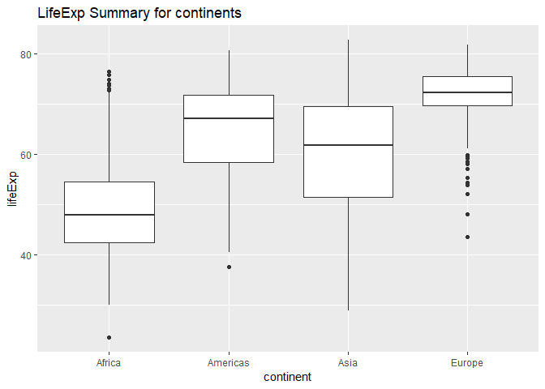
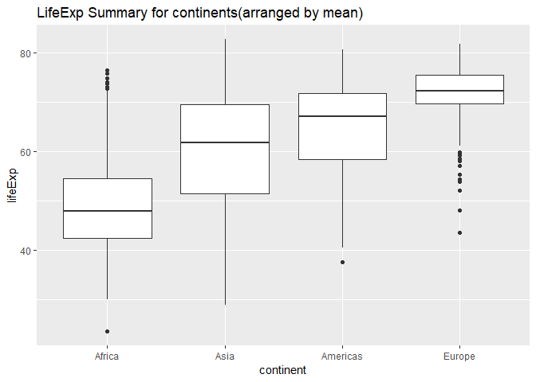
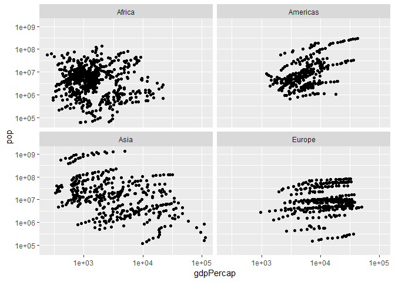
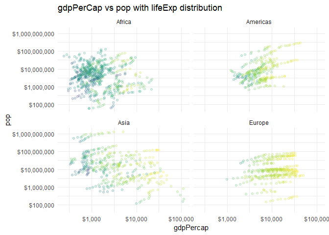
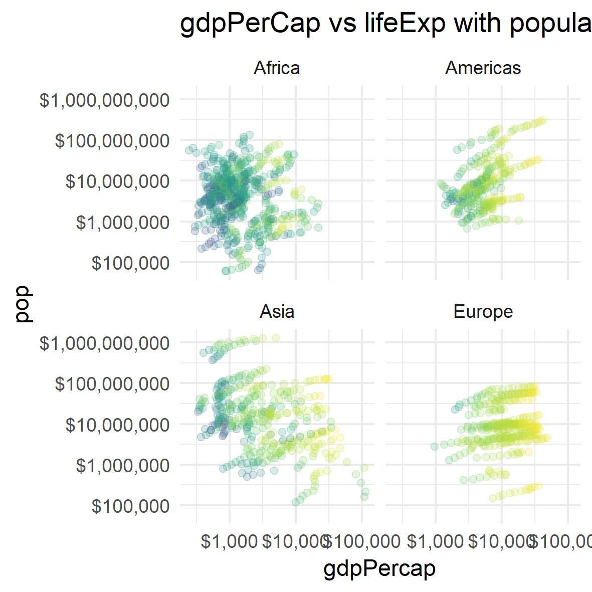

### Load Packages:

```r
suppressPackageStartupMessages(library(tidyverse))
suppressPackageStartupMessages(library(gapminder))
suppressPackageStartupMessages(library(forcats))
suppressPackageStartupMessages(library(knitr))
suppressPackageStartupMessages(library(scales))
suppressPackageStartupMessages(library(plotly))
```

### Part 1: Factor Management

First lets refresh our memory about how many observations and levels(for categorical variables) are there in gapminder data frame

**Peeking into data**


```r
str(gapminder) 
```

```
## Classes 'tbl_df', 'tbl' and 'data.frame':	1704 obs. of  6 variables:
##  $ country  : Factor w/ 142 levels "Afghanistan",..: 1 1 1 1 1 1 1 1 1 1 ...
##  $ continent: Factor w/ 5 levels "Africa","Americas",..: 3 3 3 3 3 3 3 3 3 3 ...
##  $ year     : int  1952 1957 1962 1967 1972 1977 1982 1987 1992 1997 ...
##  $ lifeExp  : num  28.8 30.3 32 34 36.1 ...
##  $ pop      : int  8425333 9240934 10267083 11537966 13079460 14880372 12881816 13867957 16317921 22227415 ...
##  $ gdpPercap: num  779 821 853 836 740 ...
```
Number of observations: 1704

Number of Variables: 6

Levels of continent: 5

Levels of country: 142

**Exploring Oceania**

Let us see how much data does Oceania contribute.


```r
Oceania_data <- gapminder %>% 
  filter(continent == "Oceania")
dim(Oceania_data)
```

```
## [1] 24  6
```

```r
knitr::kable(unique(Oceania_data$country))
```


|x           |
|:-----------|
|Australia   |
|New Zealand |

So, Oceania has 24 observations and 2 countries

**Dropping Oceania**


```r
gap_wo_oceania <- gapminder %>%
    filter(!continent == "Oceania")
levels(gap_wo_oceania$continent)
```

```
## [1] "Africa"   "Americas" "Asia"     "Europe"   "Oceania"
```

```r
str(gapminder)
```

```
## Classes 'tbl_df', 'tbl' and 'data.frame':	1704 obs. of  6 variables:
##  $ country  : Factor w/ 142 levels "Afghanistan",..: 1 1 1 1 1 1 1 1 1 1 ...
##  $ continent: Factor w/ 5 levels "Africa","Americas",..: 3 3 3 3 3 3 3 3 3 3 ...
##  $ year     : int  1952 1957 1962 1967 1972 1977 1982 1987 1992 1997 ...
##  $ lifeExp  : num  28.8 30.3 32 34 36.1 ...
##  $ pop      : int  8425333 9240934 10267083 11537966 13079460 14880372 12881816 13867957 16317921 22227415 ...
##  $ gdpPercap: num  779 821 853 836 740 ...
```


As we can see in output of str() function, number of observations have been reduced to 1680. However, levels of continent and country are still the same due to the [stealthy nature of factors](http://stat545.com/block029_factors.html#dropping-unused-levels).

**Dropping levels**

```r
gap_wo_oceania <- gapminder %>%
    filter(!continent == "Oceania") %>% 
    droplevels() #using droplevel() to drop all unused factors in data frame
str(gap_wo_oceania)
```

```
## Classes 'tbl_df', 'tbl' and 'data.frame':	1680 obs. of  6 variables:
##  $ country  : Factor w/ 140 levels "Afghanistan",..: 1 1 1 1 1 1 1 1 1 1 ...
##  $ continent: Factor w/ 4 levels "Africa","Americas",..: 3 3 3 3 3 3 3 3 3 3 ...
##  $ year     : int  1952 1957 1962 1967 1972 1977 1982 1987 1992 1997 ...
##  $ lifeExp  : num  28.8 30.3 32 34 36.1 ...
##  $ pop      : int  8425333 9240934 10267083 11537966 13079460 14880372 12881816 13867957 16317921 22227415 ...
##  $ gdpPercap: num  779 821 853 836 740 ...
```

Here Oceania has been dropped along with the unused levels

**Reodering the data**

Next we will reorder the levels based on lifeExp(quantitative variable) and see the difference between plot obtained from raw data and arranged data.


```r
#rearranging continent levels based on mean of lifeExp
gap_arrange <- gap_wo_oceania %>% 
  mutate(continent = fct_reorder(continent,lifeExp,mean)) #fct_reorder2 to be used in line charts and color aesthetic
#plot of raw data
ggplot(gap_wo_oceania,aes(continent,lifeExp)) +
  geom_boxplot() +
  labs(title = "LifeExp Summary for continents")
```

<!-- -->

```r
#plot of data arranged by mean lifeExp
ggplot(gap_arrange,aes(continent,lifeExp)) +
  geom_boxplot() +
  labs(title = "LifeExp Summary for continents(arranged by mean)")
```

<!-- -->

As we can see above by rearranging the levels by meam, boxplot looks better as we reduce the randomness.

### Part 2: File I/O

**Data**

First I will take take a subset of data and fiddle with it before writing to the file


```r
gap_subset <- gapminder %>% 
  filter(year == 2007, lifeExp > 60) %>%
  arrange(lifeExp) %>%
  droplevels() #dropping unused levels
knitr::kable(head(gap_subset))
```


country       continent    year   lifeExp        pop   gdpPercap
------------  ----------  -----  --------  ---------  ----------
Ghana         Africa       2007    60.022   22873338    1327.609
Haiti         Americas     2007    60.916    8502814    1201.637
Myanmar       Asia         2007    62.069   47761980     944.000
Yemen, Rep.   Asia         2007    62.698   22211743    2280.770
Senegal       Africa       2007    63.062   12267493    1712.472
Nepal         Asia         2007    63.785   28901790    1091.360

**Writing CSV**

```r
write_csv(gap_subset,"gapminder_filtered.csv")
```

**Reading CSV**

```r
gap_sub_csv <- read_csv("gapminder_filtered.csv")
```

```
## Parsed with column specification:
## cols(
##   country = col_character(),
##   continent = col_character(),
##   year = col_integer(),
##   lifeExp = col_double(),
##   pop = col_integer(),
##   gdpPercap = col_double()
## )
```

```r
knitr::kable(head(gap_sub_csv))
```


country       continent    year   lifeExp        pop   gdpPercap
------------  ----------  -----  --------  ---------  ----------
Ghana         Africa       2007    60.022   22873338    1327.609
Haiti         Americas     2007    60.916    8502814    1201.637
Myanmar       Asia         2007    62.069   47761980     944.000
Yemen, Rep.   Asia         2007    62.698   22211743    2280.770
Senegal       Africa       2007    63.062   12267493    1712.472
Nepal         Asia         2007    63.785   28901790    1091.360

As we can see above order of the data has been maintained while writing and reading. However, factor variables(country and continent) have been converted to character while reading as mentioned in parse message above.

### Part 3: Visualization design

Graph at earlier stage:


```r
gap_wo_oceania %>% #using data without oceania
  ggplot(aes(gdpPercap, pop)) +
  geom_point() +
  scale_x_log10() +
  scale_y_log10() +
  facet_wrap(~continent)
```

<!-- -->

Modifying the graph:


```r
(p <- gap_wo_oceania %>%
   ggplot(aes(gdpPercap, pop)) +
   geom_point(aes(colour=lifeExp), alpha=0.2) +
   #specification for x-axis
   scale_x_log10(labels=dollar_format()) +
   scale_color_viridis_c(
     trans   = "log10",
     breaks  = 10^(1:10),
     labels  = comma_format()
     ) +
   facet_wrap(~ continent) +
   #specification for y-axis
   scale_y_log10(labels=dollar_format(),
     breaks  = 10^(1:1000)
     )+
   theme_minimal() +
   labs(title="gdpPerCap vs pop with lifeExp distribution"))
```

<!-- -->

As compared to the earlier graph, this plot has more information about the data as it colors the graph based on lifeExp. Using the visualization techniques discussed this week, we can make the graphs more visually appealing.

Here is the same plot using plotly


```r
ggplotly(p)
```

<!--html_preserve--><div id="htmlwidget-621bcc2ee0446cdf61cd" style="width:672px;height:480px;" class="plotly html-widget"></div>
<script type="application/json" data-for="htmlwidget-621bcc2ee0446cdf61cd">{"x":{"data":[{"x":[3.38899023661283,3.47913979306149,3.40667928226323,3.51148118797499,3.62145295412403,3.69111835304969,3.75930214419082,3.75445219758492,3.70098190930978,3.68099642996904,3.72329476297017,3.79402544509666,3.54661795189398,3.58296517468395,3.63035430744579,3.74215745838396,3.73824830136585,3.47837128685849,3.44042946825891,3.38564350176307,3.41959985855871,3.35738990072978,3.44299486472841,3.68099065562682,3.02643201267174,2.98209072830676,2.97749454099889,3.01528907661539,3.03574858899122,3.0124834262036,3.10649605993551,3.08843946061065,3.07598748511783,3.09095437371205,3.1376319237991,3.1587498285201,2.93005260502055,2.96295267666482,2.99284235191855,3.08447235438054,3.35480181759101,3.50716177034781,3.6581204004364,3.79280364302125,3.90059168250955,3.93687260656924,4.04153499514417,4.09933015629768,2.7350039250647,2.79041428219618,2.85884507694668,2.90027237094209,2.93183198403372,2.87121498358872,2.9069803921906,2.9600249053708,2.96930069398315,2.97602652785581,3.01604889021829,3.08530235219712,2.5305793268568,2.57928573342662,2.55047690303059,2.61592640520288,2.66661110417941,2.74515544499733,2.74788021332769,2.79366386151668,2.80051079288172,2.66568898634557,2.64972760326105,2.63353984732021,3.06917494642867,3.11828063526517,3.1460062427396,3.1785318256936,3.22637987429751,3.25125676748187,3.37437863193569,3.41541813933915,3.25361983641433,3.22899991504306,3.28645904069983,3.31007599301138,3.02991544783555,3.07585499245729,3.07666547148941,3.055399974834,3.02938916574454,3.04507811557752,2.98079982845335,2.92679315360252,2.87384674161361,2.86952877630843,2.86846257656144,2.848814873635,3.07139072908185,3.11677225896846,3.14295781270513,3.078025414328,3.04300997815182,3.05460729073385,2.90195287418202,2.97881306150959,3.0245120611648,3.00214936075992,3.06302615119746,3.23148583131337,3.04257194357223,3.08319741285422,3.14818551888514,3.27323969635094,3.28725912183523,3.06915101836112,3.1028109193649,3.11924955698062,3.09583419189709,3.06952684870363,3.03173620582114,2.99394204506796,2.89239645809614,2.95706119338084,2.95246048690214,2.93530228406906,2.95659870133898,2.90078062155373,2.82849737175522,2.82786972355356,2.66059911189776,2.49441679392038,2.38231585779586,2.44334414004637,3.32748591742422,3.36456160814328,3.39177871758455,3.4278007842362,3.50693136290256,3.51310821042633,3.68837599182428,3.62337283343022,3.60381960628358,3.54209863597563,3.54208587107434,3.56021253312911,3.14257551331311,3.1763505784756,3.23776219463864,3.31218803864046,3.3762485776605,3.40101028408395,3.41542580890366,3.33384129986139,3.21697665293553,3.25194598771714,3.21716819554958,3.18885823537455,3.42643472038373,3.45711993862626,3.48014918173533,3.48001420697493,3.5675218560883,3.48879895792208,3.4593122666122,3.45940795439924,3.37605771815862,3.27761310666527,3.28063774424357,3.31858116595608,3.15192805015693,3.16403007052858,3.22874310379055,3.25884808894596,3.30621225628536,3.44490216214739,3.54453058661607,3.58944252170786,3.57918376418673,3.62046730436524,3.67711438920957,3.74672610693845,2.57477544261792,2.62950787320791,2.76555081847731,2.96170388787321,2.82763562139798,2.98162238872728,2.96746623070101,2.9853801296046,3.05386754026351,3.44939828336542,3.88668785576092,4.08472243900371,2.51711742361593,2.53676277284848,2.58092023750837,2.67098294312012,2.71123696616486,2.7039391611549,2.72005659037713,2.71694951956546,2.76556314189948,2.96069466450231,2.88386008738691,2.80710831941093,2.55888402796697,2.57852937710095,2.62268684184979,2.71274954741178,2.75300357040352,2.74570576546197,2.76182319473139,2.75871612386372,2.6246465700016,2.71255660559339,2.72431973268524,2.83935583435696,3.63280908763635,3.69689766098945,3.82160910341721,3.9221419590145,4.0569790716354,4.3373708614867,4.17936108310694,4.07424608914852,4.13104599073842,4.16799164788718,4.0976637773612,4.12078722664154,2.68594823378004,2.71677662693916,2.77789803790876,2.866159048101,2.87857167693004,2.94682314869669,2.92210736069778,2.78650927173848,2.82322924186296,2.81539852861878,2.81992910214529,2.87665060639063,2.95966086373133,3.01851806374316,3.07556196728497,3.05142157041711,3.07122775728131,2.99704718642708,2.94252025259964,2.9278865449821,2.96616997457778,3.00227227244485,3.0460987641022,3.1230701584329,2.7077374684251,2.76062376883101,2.83656061764481,2.8504989181547,2.87020850531013,2.94185210799775,2.93310767500262,2.9061046169924,2.90001104610526,2.93924449533036,2.97569992380538,2.9743524119827,2.47690451520437,2.63527303936051,2.71769909935403,2.85465858235922,2.91393278384802,2.88350583493768,2.92330825997355,2.86712285728205,2.87247087397084,2.90127544770125,2.76019978828656,2.76285235400399,2.93122434615365,2.9751735977866,2.95277616187639,3.02396669067389,3.08719911842289,3.10298675433845,3.12976263075549,3.13415697268215,3.12772718265169,3.13369376454073,3.10975220702562,3.16531831968284,2.47544775548677,2.52633554851624,2.61468700310939,2.69778626600553,2.69599061663994,2.87237164152654,2.90160166798988,2.88873715307069,2.99011066701996,3.07413887871439,3.10557305073264,3.19571467604724,2.76010041014319,2.79307061233617,2.80222292500175,2.8534570617051,2.90471849473935,2.8063987207202,2.75754752664772,2.7042482283709,2.80388226962819,2.78474132397179,2.72548886123795,2.61753222691212,3.3779521224475,3.53760307678312,3.82975589956553,4.27352793571109,4.32245699990115,4.34145849934605,4.23965666469638,4.07079822499023,3.98408327350739,3.97623283925911,3.97930600659322,4.08125724466051,3.15926985690029,3.20117930789905,3.21573987623756,3.2132646189128,3.2426812799066,3.18871158763867,3.11490397011402,3.06274813043252,3.01731561829776,2.99400722584187,2.95164689546985,3.01902074595738,2.56722061382276,2.6194792285491,2.6313433883056,2.69505661348785,2.76687513271374,2.82166002181421,2.80126916141876,2.80312742070559,2.75066265731529,2.84027915663416,2.82309788536057,2.88044194586588,2.65546209483727,2.69053468590187,2.6956343031275,2.73640438110395,2.76445177786469,2.83657428165302,2.79099835840843,2.83516501572141,2.86865288619247,2.89776889255363,2.97836759855668,3.0181100381011,2.87105655940933,2.9274320948441,3.02362115947219,3.15263845040986,3.20053636361687,3.17536457562432,3.17059909832327,3.15277850725301,3.13397610708267,3.17118101643639,3.19838750516,3.25603221652431,3.29401531949067,3.30835905811707,3.40296041844707,3.39364320442555,3.41085888284625,3.56948896052176,3.56679535645849,3.67975366815973,3.78234746668706,3.87073770932658,3.95529396031038,4.03969130967891,3.22742481432583,3.21537376481553,3.19488977990255,3.23326137313525,3.28560118066049,3.37486193965761,3.43178504352554,3.44012901072245,3.46953444021768,3.47452247332618,3.51301713676457,3.58208328429303,2.67073373159289,2.69511975956618,2.7456105755398,2.7533295728751,2.86028876598719,2.70098023955392,2.66484066673129,2.59092670732778,2.61373278431849,2.674260312831,2.80182746971617,2.91576148434958,3.38449327691663,3.41854125692006,3.50149957999136,3.57906238390086,3.57357715768681,3.58843821514052,3.62232807621186,3.56746530390834,3.5803019261087,3.59101162654969,3.60984240389245,3.68224081186337,2.88188621742309,2.92195861872286,2.99902874983636,3.02299917399278,2.97964361601112,2.90789326381397,2.95890876211224,2.82497147594026,2.76431269690493,2.76365646909402,2.77892830470623,2.79216530171644,3.03232934535076,3.04162657384042,3.06104795881945,3.00625808906951,3.23003712693577,3.29709308978461,3.19782446420713,3.14145904337212,3.20947432219226,3.21083767029686,3.20824953517551,3.30405457229069,3.43439088585181,3.44239381791495,3.50156906572439,3.60435305365754,3.70308997040009,3.6354640490023,3.72158140489893,3.72455254077511,3.78541923515268,3.7833275723403,3.80045348050506,3.88480230343241,2.69313213434862,2.7326264457828,2.77631833699871,2.70839006005204,2.77127922362731,2.82612704524949,2.94525712122136,2.92839135411027,2.86750790712676,2.77081116034997,2.89523119595633,2.93605531183875,2.94427711610338,2.93487042298656,3.03001289415532,3.14139978526705,3.18553797733498,3.23994022438144,3.27651192139224,3.18084970494792,3.15496469789093,3.12680523801102,3.13132745151062,3.20369500466057,3.16147491028024,3.19524993956246,3.21879503886367,3.20747403709274,3.20349851230071,3.19361683040004,3.18140907159466,3.15888114005758,3.13605414921486,3.14375414181744,3.18173936247833,3.23362351372365,2.94437790363822,3.00194321238603,3.04791313314348,3.08136295976889,3.13154160135448,3.12978175413031,3.16584082156006,3.11208453770577,3.02885429685477,2.75940201863393,2.84478133195124,2.93577962517273,3.05528268506973,3.09973152894849,3.13655833769812,3.10881294051872,3.09849701920418,3.16166517152032,3.07070525448101,3.0387174850598,2.96706113282447,2.9687613813918,2.94550887210244,2.96667714274902,3.6744289754842,3.73934320902181,3.76108019138226,3.85214303897666,3.89019529671504,3.90464260358686,3.93289295216963,3.89353004313794,3.85884201450444,3.87385446413688,3.88710768676435,3.96706370233863,3.20843897238107,3.24805596435105,3.29216604939941,3.22737183535753,3.22001723642861,3.34301221488094,3.2777338865932,3.17834925734412,3.17382617503834,3.21277623758705,3.29959408660236,3.41537321502711,3.06008434430642,3.09506760786377,3.26862058610807,3.41715630666173,3.5269639825025,3.57765383934322,3.59055027810034,3.60041086772391,3.55059794550389,3.58846986354341,3.61575199166669,3.65451158423759,2.85530714889989,2.84418854883211,2.8585394877151,2.92850782101237,2.96188838986882,2.9833972607425,2.94163196835205,2.92003044384127,2.91681305580586,2.89717949512568,2.95379554061093,3.04433674769752,2.93440181335381,2.96656798667935,3.02838204533119,3.16955593013409,3.21739449350165,3.185478974435,3.1285859858649,3.07997721529327,3.01464606448196,2.99223836297973,2.94754182937497,2.94594592049266,3.16686674390612,3.14464657403142,3.22018740756113,3.28608807651144,3.43985132551065,3.49427662628827,3.55147844259796,3.58097276778054,3.6367606403025,3.68813482189578,3.75761582753152,3.85082524675123,2.86614165405515,2.88894911919509,2.88494920253419,2.95852495345071,2.97805987911551,2.92620510614229,2.83395387358472,2.79079476079839,2.80900103244787,2.91198761298453,2.96741738829156,3.02382022004224,3.05971061802448,3.117919523609,3.16218363938167,3.24970632372554,3.24883076794115,3.20103869689067,3.14881190625883,3.08397360825901,3.08310276771926,3.02993292165226,3.03003835364569,3.10421784482941,2.6094707348536,2.71497005472619,2.72203485911935,2.75571868821708,2.90274359447453,2.83606300605042,2.89699720519387,2.84890145668142,2.84099685568797,2.89897184798542,2.82739423308876,2.67182915731664],"y":[6.96752574613712,7.01160664034358,7.04143011183358,7.1058676578263,7.16910951335731,7.2343351250894,7.30176231497069,7.36651552213284,7.41992888084797,7.46347513404264,7.49536589327344,7.52287721656107,6.6265554079668,6.65909444498897,6.68358866742919,6.71994988161962,6.77047334792827,6.78976926501636,6.84611334953093,6.89620809603613,6.9413120288019,6.99453815979773,7.03607393730644,7.09413823998002,6.24012847773177,6.28446976219229,6.33282107645852,6.38512953915715,6.44113042142646,6.50082177384565,6.56129259815656,6.62775368042963,6.69737504242919,6.78290813352648,6.84671513021004,6.90732072997002,5.64572479450059,5.67636342033079,5.70991752674834,5.74314979398494,5.79193684313993,5.89291342194146,5.98692706749976,6.06114474482709,6.12795117144345,6.18654273993779,6.21228004866574,6.21461366394489,6.6503054828175,6.6733357717205,6.69193261773755,6.70994251157312,6.73511052291325,6.77008388287876,6.82181448254144,6.88004438167938,6.94832996260673,7.01505962802152,7.08817894879199,7.15613110074939,6.38838862218185,6.42610735865857,6.47157259113298,6.5225731985131,6.54777261387962,6.58369911492085,6.66090435415411,6.70978055049252,6.76411902003206,6.78686565779265,6.84640379781482,6.92378810053229,6.69975684074036,6.72915855071603,6.76295098118135,6.80178130654891,6.8464007050132,6.90090570212809,6.96618074706382,7.03264563148691,7.09576791631131,7.15216014742365,7.20221544864886,7.24788230035865,6.11115997847779,6.14372783229503,6.18283618711295,6.23895841781421,6.28494030777863,6.33596571819383,6.39392092196181,6.45331971633019,6.51389967917715,6.56779223787517,6.60724189854992,6.64038582203128,6.42853357842654,6.46162681529076,6.49836804230162,6.54356732448137,6.5909608093781,6.64229235117709,6.68798513206095,6.74028016570267,6.8081715942054,6.87863730476889,6.94624287870982,7.0102493566886,5.18734019730403,5.23281321104984,5.28259719177025,5.33721558868279,5.39798690994346,5.4839280380787,5.54238094993132,5.59672241822872,5.65746603867589,5.72261911678774,5.78843848336592,5.85184516716021,7.14921926666049,7.19250980374736,7.24270125304506,7.29974852335585,7.36187262076696,7.42293224927191,7.4863808119963,7.55000374638691,7.61984583472999,7.67941868365656,7.74335179077992,7.81027795519092,5.93190769692172,5.97333940512241,6.02032978686767,6.07179366724102,6.12725321096791,6.18660859127013,6.24913351421949,6.31472968182451,6.38184996023779,6.44730489110657,6.52228705045551,6.57985330671495,6.47378160641993,6.51851393987789,6.58347173806734,6.67622431812136,6.78331001900936,6.87271402657027,6.95549297149663,7.03185658648023,7.10627917556362,7.1651245892076,7.21092621377446,7.25559590992049,4.80036647764795,4.85643281688861,4.95375002990202,5.10590853108124,5.25248408793581,5.35925477063616,5.48570865292662,5.49279529875572,5.58450762067273,5.62108068490912,5.65071151080098,5.69580902513884,7.34680872487696,7.39810919421538,7.44983785855992,7.50080145865517,7.54167179621539,7.58865106405237,7.65974331265715,7.72262620715801,7.77380251504197,7.82042670200481,7.86517837896841,7.90452373730654,5.33638767901733,5.36721051055,5.39658289168338,5.41474611911525,5.44342415514163,5.28482536765805,5.45558025189532,5.53306502403475,5.58865035858952,5.64342405158837,5.69515495717055,5.74130999680612,6.15798835518153,6.18825642389041,6.22183606803233,6.26014750216083,6.35414437264668,6.40013061493553,6.42115904075209,6.4647814132677,6.56448142026727,6.6083461813111,6.64491742803783,6.69077932681486,7.31933389478515,7.35823216073628,7.4004580649461,7.44498574183574,7.48813274670474,7.53929945196972,7.58105895936102,7.63346370861396,7.71674234309204,7.77714615137789,7.83216898898593,7.88372891302894,5.62397457664,5.6383934020777,5.65864185893221,5.68931241162019,5.73076370877679,5.84903040170673,5.87729876539575,5.94467855400209,5.99376193941916,6.05161128107404,6.11371077545809,6.16282329311148,5.45380741046123,5.50940416025869,5.57289482588338,5.64305076817916,5.71357537763682,5.78409925342191,5.8546235984208,5.92860373122321,6.01088653646509,6.09193659360614,6.16368781680451,6.22746479723151,6.74671210033326,6.80558838788069,6.8665973206007,6.92891858583456,6.97100293698616,7.02276202695727,7.05691772759602,7.15131164414379,7.21162073342294,7.26524925959009,7.31282769721921,7.35932954760618,6.42557481144139,6.45889849854138,6.49693006300405,6.53799755972619,6.58108304833432,6.6260349191377,6.67306673153873,6.75206858631787,6.84451283737628,6.90573297054884,6.94486833202951,6.99772765642009,5.76391667420496,5.77894311545582,5.79783514658429,5.77908181437386,5.79613079341966,5.87228916401412,5.91697321212342,5.96732515595039,6.02157709561709,6.07689810443337,6.12465385458589,6.16791990635052,6.81050443834126,6.8724347731407,6.93844752021858,7.00823862017366,7.08079905222586,7.16138010240921,7.24702640533812,7.32629656779201,7.39829666116093,7.45123096616273,7.49674762118049,7.55157413233565,5.87433509531582,5.9102710634655,5.95092099879778,5.99842500150516,6.04796723884833,6.09743918232429,6.1497753308773,6.20390278111006,6.25604269446766,6.29728394791475,6.31106946715846,6.30376804182622,5.93616576539831,5.98942756840406,6.0464155558939,6.10700838308686,6.17103219768149,6.23137196514752,6.29156308496099,6.35591372969481,6.28170906739621,6.3425657770176,6.44942455259035,6.50432702535642,6.00848477034802,6.07975196812375,6.15892399743571,6.24532114120293,6.3392281744514,6.43485349718646,6.52427587924427,6.57976588161217,6.63993459733493,6.67757684302571,6.72985983361943,6.78081498907337,6.67787255752094,6.7144705053602,6.75612804411101,6.80171617983389,6.85018229081493,6.90347883214607,6.96243928128576,7.02401918694833,7.08672971337532,7.15122007404683,7.21678527388394,7.2825689612243,6.46505581763798,6.50802281369525,6.55974005372486,6.61776042525655,6.67495267265565,6.75106698711954,6.81310206670097,6.89347030426574,7.00061838574289,7.01786734385295,7.07278260197673,7.12473497213005,6.58412398026817,6.62755878797858,6.67120728858724,6.71703906922298,6.76553131687936,6.81235502971794,6.84498982516516,6.88275261072888,6.92511682140578,6.97243353655058,7.02449289219757,7.08033042371904,6.00968710134933,6.03215601898966,6.05947139981958,6.09009644132769,6.12476042212193,6.16336654258104,6.21008726268248,6.26511040115056,6.32622624919753,6.38823285600406,6.45161114775242,6.51455638533942,5.71311741041061,5.78519881494663,5.84572793042374,5.89724705482368,5.93009997829725,5.9604826693343,5.9965291836754,6.01814396241505,6.03989059009904,6.06062910309191,6.07925579353521,6.09721634313392,6.99735217252876,7.05714669363314,7.11583023238709,7.16938919875667,7.221692462344,7.26474561554951,7.30532406393518,7.36148979630021,7.41159006182817,7.45529417562337,7.49370591151299,7.52836609514419,6.80931159092074,6.84745142224187,6.89147858141322,6.93856520363438,6.99165112169354,7.0464119653654,7.09992992639026,7.11031867985504,7.11928001241239,7.22019530445076,7.26655576740447,7.29997894823402,5.68648522290098,5.73884395451133,5.79336565770843,5.84919821742885,5.91475662440908,5.98990612104353,6.04100164412964,6.10659337685266,6.19152171431086,6.24914110014716,6.29494060455964,6.31282873272415,6.52884833848798,6.56728333595991,6.61023502772704,6.65648745449226,6.70417300344228,6.75450780260811,6.80869619301437,6.86526024513701,6.92390780544925,6.985258113044,7.04691072535505,7.11041679974562,7.52007847401955,7.57023158392065,7.62191697384512,7.67474866869504,7.73029834901568,7.79385442793126,7.863557054218,7.91143206006005,7.97018058493844,8.0261565723839,8.07882379767959,8.13043401139359,5.4111144185509,5.4895366294821,5.55497345833324,5.61702551688288,5.66429684695365,5.69204895234674,5.71417043331956,5.74976336153626,5.79392372474342,5.83557009353988,5.87156184455055,5.90205404583329,6.40396545717876,6.45056962870611,6.48447665375735,6.53795490101023,6.60120369615139,6.66811295233277,6.74095963137428,6.80273029367217,6.86273962167221,6.85809082390862,6.89500246969012,6.94746254318299,4.77823086374099,4.78763755687842,4.81521236229935,4.84995350703073,4.88420042050358,4.93849971114474,4.99384608158126,5.044586793349,5.1000636731628,5.16318523665565,5.23139822162385,5.30011484224232,6.44021444242906,6.48494681196389,6.53532488675443,6.5983352983194,6.66168928674331,6.72105633191164,6.78871852968558,6.85560073721922,6.9194923059028,6.97933499903089,7.03623102236306,7.08875581883863,6.33107262976512,6.36091097230166,6.39232667809594,6.42523904776034,6.45924362591161,6.49705369473499,6.53964332348391,6.58758806585918,6.62949971095576,6.66069589936919,6.72909121267887,6.78849093071106,6.40260421074857,6.44410962280971,6.48857228968401,6.53514709344007,6.58434943268676,6.63885510823266,6.76558600861528,6.84022268561847,6.78531552441583,6.82174365005204,6.88948714867967,6.95993640464649,7.15426979707928,7.20821417929208,7.263793593061,7.32216388763219,7.37904812881308,7.43344870522264,7.49331901268085,7.5554980580634,7.6016706781716,7.63179882193074,7.64771171613305,7.64343123760215,6.92965731349312,6.98915567935941,7.04856714040835,7.10435492500744,7.1642641733162,7.23312272306214,7.30892819353485,7.39315316233631,7.45067376999802,7.50732588451326,7.56926032265823,7.62626776328567,5.46276175434332,5.51420363388328,5.56820876662311,5.62396218875473,5.68133622890418,5.74148645186029,5.81284720521472,5.89173142523593,5.98333034292843,6.02304081815506,6.05318181632637,6.05425520783425,6.92027598111223,6.97556166382455,7.03598807795967,7.10062250068829,7.16751207363324,7.23374633433163,7.29763757851811,7.36249434982856,7.42497098434565,7.48695286240977,7.53899800662847,7.58137658942442,6.08604396238785,6.13272224217956,6.18415120731195,6.23943712991253,6.3130972466815,6.36334530514449,6.42238708894688,6.49889803932422,6.57374778360031,6.63557321030542,6.69700062388255,6.75599514620266,6.5620232802545,6.59669043142279,6.63210809650462,6.68006215734791,6.72456314640526,6.77851742336737,6.8282794323,6.88789713883037,6.9305964120052,6.96528022453235,6.98992012277496,7.01183077309534,6.76528079436483,6.8244838652981,6.8858583947908,6.949404352765,7.00818633044377,7.05909964525043,7.11191413856371,7.1842100339509,7.26131498100365,7.32654586937172,7.39339739566789,7.46494235466252,6.42683645380351,6.47943133719774,6.53415307418506,6.5910646070265,6.65383908629035,6.71738337439805,6.78535881074153,6.86167811645122,6.92330428705953,6.97394895610435,7.02513420308035,7.06989129058869,6.48867858893804,6.56185716164189,6.63121397862703,6.69857305154169,6.76798172463701,6.82230586751881,6.88289572099202,6.96456216345074,7.02955989505928,7.05709330948426,7.07651530660474,7.09029837588409],"text":["lifeExp: 1.634245<br />gdpPercap:   2449.0082<br />pop:    9279525","lifeExp: 1.659774<br />gdpPercap:   3013.9760<br />pop:   10270856","lifeExp: 1.683974<br />gdpPercap:   2550.8169<br />pop:   11000948","lifeExp: 1.711022<br />gdpPercap:   3246.9918<br />pop:   12760499","lifeExp: 1.736540<br />gdpPercap:   4182.6638<br />pop:   14760787","lifeExp: 1.763533<br />gdpPercap:   4910.4168<br />pop:   17152804","lifeExp: 1.787942<br />gdpPercap:   5745.1602<br />pop:   20033753","lifeExp: 1.818219<br />gdpPercap:   5681.3585<br />pop:   23254956","lifeExp: 1.830871<br />gdpPercap:   5023.2166<br />pop:   26298373","lifeExp: 1.839805<br />gdpPercap:   4797.2951<br />pop:   29072015","lifeExp: 1.851222<br />gdpPercap:   5288.0404<br />pop:   31287142","lifeExp: 1.859144<br />gdpPercap:   6223.3675<br />pop:   33333216","lifeExp: 1.477338<br />gdpPercap:   3520.6103<br />pop:    4232095","lifeExp: 1.505136<br />gdpPercap:   3827.9405<br />pop:    4561361","lifeExp: 1.531479<br />gdpPercap:   4269.2767<br />pop:    4826015","lifeExp: 1.556122<br />gdpPercap:   5522.7764<br />pop:    5247469","lifeExp: 1.578960<br />gdpPercap:   5473.2880<br />pop:    5894858","lifeExp: 1.596410<br />gdpPercap:   3008.6474<br />pop:    6162675","lifeExp: 1.601430<br />gdpPercap:   2756.9537<br />pop:    7016384","lifeExp: 1.601038<br />gdpPercap:   2430.2083<br />pop:    7874230","lifeExp: 1.609028<br />gdpPercap:   2627.8457<br />pop:    8735988","lifeExp: 1.612392<br />gdpPercap:   2277.1409<br />pop:    9875024","lifeExp: 1.612816<br />gdpPercap:   2773.2873<br />pop:   10866106","lifeExp: 1.630743<br />gdpPercap:   4797.2313<br />pop:   12420476","lifeExp: 1.582325<br />gdpPercap:   1062.7522<br />pop:    1738315","lifeExp: 1.605930<br />gdpPercap:    959.6011<br />pop:    1925173","lifeExp: 1.629593<br />gdpPercap:    949.4991<br />pop:    2151895","lifeExp: 1.652101<br />gdpPercap:   1035.8314<br />pop:    2427334","lifeExp: 1.672227<br />gdpPercap:   1085.7969<br />pop:    2761407","lifeExp: 1.691877<br />gdpPercap:   1029.1613<br />pop:    3168267","lifeExp: 1.706752<br />gdpPercap:   1277.8976<br />pop:    3641603","lifeExp: 1.718809<br />gdpPercap:   1225.8560<br />pop:    4243788","lifeExp: 1.731742<br />gdpPercap:   1191.2077<br />pop:    4981671","lifeExp: 1.738598<br />gdpPercap:   1232.9753<br />pop:    6066080","lifeExp: 1.735647<br />gdpPercap:   1372.8779<br />pop:    7026113","lifeExp: 1.753797<br />gdpPercap:   1441.2849<br />pop:    8078314","lifeExp: 1.677808<br />gdpPercap:    851.2411<br />pop:     442308","lifeExp: 1.695639<br />gdpPercap:    918.2325<br />pop:     474639","lifeExp: 1.711976<br />gdpPercap:    983.6540<br />pop:     512764","lifeExp: 1.726711<br />gdpPercap:   1214.7093<br />pop:     553541","lifeExp: 1.748374<br />gdpPercap:   2263.6111<br />pop:     619351","lifeExp: 1.773194<br />gdpPercap:   3214.8578<br />pop:     781472","lifeExp: 1.788762<br />gdpPercap:   4551.1421<br />pop:     970347","lifeExp: 1.803607<br />gdpPercap:   6205.8839<br />pop:    1151184","lifeExp: 1.797579<br />gdpPercap:   7954.1116<br />pop:    1342614","lifeExp: 1.720622<br />gdpPercap:   8647.1423<br />pop:    1536536","lifeExp: 1.668703<br />gdpPercap:  11003.6051<br />pop:    1630347","lifeExp: 1.705248<br />gdpPercap:  12569.8518<br />pop:    1639131","lifeExp: 1.504811<br />gdpPercap:    543.2552<br />pop:    4469979","lifeExp: 1.542900<br />gdpPercap:    617.1835<br />pop:    4713416","lifeExp: 1.577653<br />gdpPercap:    722.5120<br />pop:    4919632","lifeExp: 1.609562<br />gdpPercap:    794.8266<br />pop:    5127935","lifeExp: 1.639397<br />gdpPercap:    854.7360<br />pop:    5433886","lifeExp: 1.664049<br />gdpPercap:    743.3870<br />pop:    5889574","lifeExp: 1.682344<br />gdpPercap:    807.1986<br />pop:    6634596","lifeExp: 1.695105<br />gdpPercap:    912.0631<br />pop:    7586551","lifeExp: 1.701222<br />gdpPercap:    931.7528<br />pop:    8878303","lifeExp: 1.701775<br />gdpPercap:    946.2950<br />pop:   10352843","lifeExp: 1.704579<br />gdpPercap:   1037.6452<br />pop:   12251209","lifeExp: 1.718460<br />gdpPercap:   1217.0330<br />pop:   14326203","lifeExp: 1.591410<br />gdpPercap:    339.2965<br />pop:    2445618","lifeExp: 1.607809<br />gdpPercap:    379.5646<br />pop:    2667518","lifeExp: 1.623714<br />gdpPercap:    355.2032<br />pop:    2961915","lifeExp: 1.638968<br />gdpPercap:    412.9775<br />pop:    3330989","lifeExp: 1.644015<br />gdpPercap:    464.0995<br />pop:    3529983","lifeExp: 1.661907<br />gdpPercap:    556.1033<br />pop:    3834415","lifeExp: 1.676428<br />gdpPercap:    559.6032<br />pop:    4580410","lifeExp: 1.683146<br />gdpPercap:    621.8188<br />pop:    5126023","lifeExp: 1.650657<br />gdpPercap:    631.6999<br />pop:    5809236","lifeExp: 1.656347<br />gdpPercap:    463.1151<br />pop:    6121610","lifeExp: 1.675412<br />gdpPercap:    446.4035<br />pop:    7021078","lifeExp: 1.695307<br />gdpPercap:    430.0707<br />pop:    8390505","lifeExp: 1.585720<br />gdpPercap:   1172.6677<br />pop:    5009067","lifeExp: 1.606682<br />gdpPercap:   1313.0481<br />pop:    5359923","lifeExp: 1.629848<br />gdpPercap:   1399.6074<br />pop:    5793633","lifeExp: 1.651268<br />gdpPercap:   1508.4531<br />pop:    6335506","lifeExp: 1.672550<br />gdpPercap:   1684.1465<br />pop:    7021028","lifeExp: 1.693331<br />gdpPercap:   1783.4329<br />pop:    7959865","lifeExp: 1.723956<br />gdpPercap:   2367.9833<br />pop:    9250831","lifeExp: 1.740244<br />gdpPercap:   2602.6642<br />pop:   10780667","lifeExp: 1.734912<br />gdpPercap:   1793.1633<br />pop:   12467171","lifeExp: 1.717662<br />gdpPercap:   1694.3375<br />pop:   14195809","lifeExp: 1.697717<br />gdpPercap:   1934.0114<br />pop:   15929988","lifeExp: 1.702689<br />gdpPercap:   2042.0952<br />pop:   17696293","lifeExp: 1.549775<br />gdpPercap:   1071.3107<br />pop:    1291695","lifeExp: 1.573614<br />gdpPercap:   1190.8443<br />pop:    1392284","lifeExp: 1.596322<br />gdpPercap:   1193.0688<br />pop:    1523478","lifeExp: 1.617818<br />gdpPercap:   1136.0566<br />pop:    1733638","lifeExp: 1.638060<br />gdpPercap:   1070.0133<br />pop:    1927260","lifeExp: 1.670014<br />gdpPercap:   1109.3743<br />pop:    2167533","lifeExp: 1.683902<br />gdpPercap:    956.7530<br />pop:    2476971","lifeExp: 1.703162<br />gdpPercap:    844.8764<br />pop:    2840009","lifeExp: 1.693692<br />gdpPercap:    747.9055<br />pop:    3265124","lifeExp: 1.663381<br />gdpPercap:    740.5063<br />pop:    3696513","lifeExp: 1.636568<br />gdpPercap:    738.6906<br />pop:    4048013","lifeExp: 1.650706<br />gdpPercap:    706.0165<br />pop:    4369038","lifeExp: 1.580834<br />gdpPercap:   1178.6659<br />pop:    2682462","lifeExp: 1.600766<br />gdpPercap:   1308.4956<br />pop:    2894855","lifeExp: 1.620303<br />gdpPercap:   1389.8176<br />pop:    3150417","lifeExp: 1.639496<br />gdpPercap:   1196.8106<br />pop:    3495967","lifeExp: 1.658669<br />gdpPercap:   1104.1040<br />pop:    3899068","lifeExp: 1.675623<br />gdpPercap:   1133.9850<br />pop:    4388260","lifeExp: 1.694754<br />gdpPercap:    797.9081<br />pop:    4875118","lifeExp: 1.708004<br />gdpPercap:    952.3861<br />pop:    5498955","lifeExp: 1.713692<br />gdpPercap:   1058.0643<br />pop:    6429417","lifeExp: 1.712422<br />gdpPercap:   1004.9614<br />pop:    7562011","lifeExp: 1.703506<br />gdpPercap:   1156.1819<br />pop:    8835739","lifeExp: 1.704588<br />gdpPercap:   1704.0637<br />pop:   10238807","lifeExp: 1.609754<br />gdpPercap:   1102.9909<br />pop:     153936","lifeExp: 1.627980<br />gdpPercap:   1211.1485<br />pop:     170928","lifeExp: 1.648038<br />gdpPercap:   1406.6483<br />pop:     191689","lifeExp: 1.667191<br />gdpPercap:   1876.0296<br />pop:     217378","lifeExp: 1.689699<br />gdpPercap:   1937.5777<br />pop:     250027","lifeExp: 1.707050<br />gdpPercap:   1172.6030<br />pop:     304739","lifeExp: 1.723727<br />gdpPercap:   1267.1001<br />pop:     348643","lifeExp: 1.739778<br />gdpPercap:   1315.9808<br />pop:     395114","lifeExp: 1.762971<br />gdpPercap:   1246.9074<br />pop:     454429","lifeExp: 1.782902<br />gdpPercap:   1173.6182<br />pop:     527982","lifeExp: 1.799161<br />gdpPercap:   1075.8116<br />pop:     614382","lifeExp: 1.813928<br />gdpPercap:    986.1479<br />pop:     710960","lifeExp: 1.592654<br />gdpPercap:    780.5423<br />pop:   14100005","lifeExp: 1.609082<br />gdpPercap:    905.8602<br />pop:   15577932","lifeExp: 1.624509<br />gdpPercap:    896.3146<br />pop:   17486434","lifeExp: 1.644005<br />gdpPercap:    861.5932<br />pop:   19941073","lifeExp: 1.662654<br />gdpPercap:    904.8961<br />pop:   23007669","lifeExp: 1.679464<br />gdpPercap:    795.7573<br />pop:   26480870","lifeExp: 1.679283<br />gdpPercap:    673.7478<br />pop:   30646495","lifeExp: 1.675888<br />gdpPercap:    672.7748<br />pop:   35481645","lifeExp: 1.658469<br />gdpPercap:    457.7192<br />pop:   41672143","lifeExp: 1.629277<br />gdpPercap:    312.1884<br />pop:   47798986","lifeExp: 1.652884<br />gdpPercap:    241.1659<br />pop:   55379852","lifeExp: 1.667098<br />gdpPercap:    277.5519<br />pop:   64606759","lifeExp: 1.624396<br />gdpPercap:   2125.6214<br />pop:     854885","lifeExp: 1.653724<br />gdpPercap:   2315.0566<br />pop:     940458","lifeExp: 1.685159<br />gdpPercap:   2464.7832<br />pop:    1047924","lifeExp: 1.716337<br />gdpPercap:   2677.9396<br />pop:    1179760","lifeExp: 1.739628<br />gdpPercap:   3213.1527<br />pop:    1340458","lifeExp: 1.745270<br />gdpPercap:   3259.1790<br />pop:    1536769","lifeExp: 1.753545<br />gdpPercap:   4879.5075<br />pop:    1774735","lifeExp: 1.759441<br />gdpPercap:   4201.1949<br />pop:    2064095","lifeExp: 1.751533<br />gdpPercap:   4016.2395<br />pop:    2409073","lifeExp: 1.723964<br />gdpPercap:   3484.1644<br />pop:    2800947","lifeExp: 1.724030<br />gdpPercap:   3484.0620<br />pop:    3328795","lifeExp: 1.742898<br />gdpPercap:   3632.5578<br />pop:    3800610","lifeExp: 1.607208<br />gdpPercap:   1388.5947<br />pop:    2977019","lifeExp: 1.628072<br />gdpPercap:   1500.8959<br />pop:    3300000","lifeExp: 1.652536<br />gdpPercap:   1728.8694<br />pop:    3832408","lifeExp: 1.675320<br />gdpPercap:   2052.0505<br />pop:    4744870","lifeExp: 1.697238<br />gdpPercap:   2378.2011<br />pop:    6071696","lifeExp: 1.719116<br />gdpPercap:   2517.7365<br />pop:    7459574","lifeExp: 1.732257<br />gdpPercap:   2602.7102<br />pop:    9025951","lifeExp: 1.737630<br />gdpPercap:   2156.9561<br />pop:   10761098","lifeExp: 1.716371<br />gdpPercap:   1648.0738<br />pop:   12772596","lifeExp: 1.681160<br />gdpPercap:   1786.2654<br />pop:   14625967","lifeExp: 1.670543<br />gdpPercap:   1648.8008<br />pop:   16252726","lifeExp: 1.684199<br />gdpPercap:   1544.7501<br />pop:   18013409","lifeExp: 1.541729<br />gdpPercap:   2669.5295<br />pop:      63149","lifeExp: 1.572035<br />gdpPercap:   2864.9691<br />pop:      71851","lifeExp: 1.598714<br />gdpPercap:   3020.9893<br />pop:      89898","lifeExp: 1.624014<br />gdpPercap:   3020.0505<br />pop:     127617","lifeExp: 1.647050<br />gdpPercap:   3694.2124<br />pop:     178848","lifeExp: 1.667630<br />gdpPercap:   3081.7610<br />pop:     228694","lifeExp: 1.688527<br />gdpPercap:   2879.4681<br />pop:     305991","lifeExp: 1.699317<br />gdpPercap:   2880.1026<br />pop:     311025","lifeExp: 1.712683<br />gdpPercap:   2377.1562<br />pop:     384156","lifeExp: 1.725560<br />gdpPercap:   1895.0170<br />pop:     417908","lifeExp: 1.727322<br />gdpPercap:   1908.2609<br />pop:     447416","lifeExp: 1.738709<br />gdpPercap:   2082.4816<br />pop:     496374","lifeExp: 1.622141<br />gdpPercap:   1418.8224<br />pop:   22223309","lifeExp: 1.647813<br />gdpPercap:   1458.9153<br />pop:   25009741","lifeExp: 1.672024<br />gdpPercap:   1693.3359<br />pop:   28173309","lifeExp: 1.692785<br />gdpPercap:   1814.8807<br />pop:   31681188","lifeExp: 1.708735<br />gdpPercap:   2024.0081<br />pop:   34807417","lifeExp: 1.726882<br />gdpPercap:   2785.4936<br />pop:   38783863","lifeExp: 1.748235<br />gdpPercap:   3503.7296<br />pop:   45681811","lifeExp: 1.776679<br />gdpPercap:   3885.4607<br />pop:   52799062","lifeExp: 1.803962<br />gdpPercap:   3794.7552<br />pop:   59402198","lifeExp: 1.827479<br />gdpPercap:   4173.1818<br />pop:   66134291","lifeExp: 1.843893<br />gdpPercap:   4754.6044<br />pop:   73312559","lifeExp: 1.853321<br />gdpPercap:   5581.1810<br />pop:   80264543","lifeExp: 1.537592<br />gdpPercap:    375.6431<br />pop:     216964","lifeExp: 1.556097<br />gdpPercap:    426.0964<br />pop:     232922","lifeExp: 1.573858<br />gdpPercap:    582.8420<br />pop:     249220","lifeExp: 1.590920<br />gdpPercap:    915.5960<br />pop:     259864","lifeExp: 1.607627<br />gdpPercap:    672.4123<br />pop:     277603","lifeExp: 1.623497<br />gdpPercap:    958.5668<br />pop:     192675","lifeExp: 1.640104<br />gdpPercap:    927.8253<br />pop:     285483","lifeExp: 1.659574<br />gdpPercap:    966.8968<br />pop:     341244","lifeExp: 1.677105<br />gdpPercap:   1132.0550<br />pop:     387838","lifeExp: 1.683452<br />gdpPercap:   2814.4808<br />pop:     439971","lifeExp: 1.693270<br />gdpPercap:   7703.4959<br />pop:     495627","lifeExp: 1.712473<br />gdpPercap:  12154.0897<br />pop:     551201","lifeExp: 1.555433<br />gdpPercap:    328.9406<br />pop:    1438760","lifeExp: 1.580320<br />gdpPercap:    344.1619<br />pop:    1542611","lifeExp: 1.603772<br />gdpPercap:    380.9958<br />pop:    1666618","lifeExp: 1.625199<br />gdpPercap:    468.7950<br />pop:    1820319","lifeExp: 1.644852<br />gdpPercap:    514.3242<br />pop:    2260187","lifeExp: 1.648701<br />gdpPercap:    505.7538<br />pop:    2512642","lifeExp: 1.642366<br />gdpPercap:    524.8758<br />pop:    2637297","lifeExp: 1.667014<br />gdpPercap:    521.1341<br />pop:    2915959","lifeExp: 1.698892<br />gdpPercap:    582.8585<br />pop:    3668440","lifeExp: 1.727362<br />gdpPercap:    913.4708<br />pop:    4058319","lifeExp: 1.742254<br />gdpPercap:    765.3500<br />pop:    4414865","lifeExp: 1.763727<br />gdpPercap:    641.3695<br />pop:    4906585","lifeExp: 1.532474<br />gdpPercap:    362.1463<br />pop:   20860941","lifeExp: 1.564275<br />gdpPercap:    378.9042<br />pop:   22815614","lifeExp: 1.602700<br />gdpPercap:    419.4564<br />pop:   25145372","lifeExp: 1.624437<br />gdpPercap:    516.1186<br />pop:   27860297","lifeExp: 1.638639<br />gdpPercap:    566.2439<br />pop:   30770372","lifeExp: 1.648458<br />gdpPercap:    556.8084<br />pop:   34617799","lifeExp: 1.652401<br />gdpPercap:    577.8607<br />pop:   38111756","lifeExp: 1.669168<br />gdpPercap:    573.7413<br />pop:   42999530","lifeExp: 1.682064<br />gdpPercap:    421.3535<br />pop:   52088559","lifeExp: 1.693745<br />gdpPercap:    515.8894<br />pop:   59861301","lifeExp: 1.705222<br />gdpPercap:    530.0535<br />pop:   67946797","lifeExp: 1.723841<br />gdpPercap:    690.8056<br />pop:   76511887","lifeExp: 1.568237<br />gdpPercap:   4293.4765<br />pop:     420702","lifeExp: 1.591053<br />gdpPercap:   4976.1981<br />pop:     434904","lifeExp: 1.607337<br />gdpPercap:   6631.4592<br />pop:     455661","lifeExp: 1.649315<br />gdpPercap:   8358.7620<br />pop:     489004","lifeExp: 1.687440<br />gdpPercap:  11401.9484<br />pop:     537977","lifeExp: 1.722552<br />gdpPercap:  21745.5733<br />pop:     706367","lifeExp: 1.752540<br />gdpPercap:  15113.3619<br />pop:     753874","lifeExp: 1.779524<br />gdpPercap:  11864.4084<br />pop:     880397","lifeExp: 1.787928<br />gdpPercap:  13522.1575<br />pop:     985739","lifeExp: 1.781475<br />gdpPercap:  14722.8419<br />pop:    1126189","lifeExp: 1.754050<br />gdpPercap:  12521.7139<br />pop:    1299304","lifeExp: 1.753851<br />gdpPercap:  13206.4845<br />pop:    1454867","lifeExp: 1.477121<br />gdpPercap:    485.2307<br />pop:     284320","lifeExp: 1.506031<br />gdpPercap:    520.9267<br />pop:     323150","lifeExp: 1.530148<br />gdpPercap:    599.6503<br />pop:     374020","lifeExp: 1.554574<br />gdpPercap:    734.7829<br />pop:     439593","lifeExp: 1.583289<br />gdpPercap:    756.0868<br />pop:     517101","lifeExp: 1.621612<br />gdpPercap:    884.7553<br />pop:     608274","lifeExp: 1.658774<br />gdpPercap:    835.8096<br />pop:     715523","lifeExp: 1.692538<br />gdpPercap:    611.6589<br />pop:     848406","lifeExp: 1.721349<br />gdpPercap:    665.6244<br />pop:    1025384","lifeExp: 1.747109<br />gdpPercap:    653.7302<br />pop:    1235767","lifeExp: 1.763735<br />gdpPercap:    660.5856<br />pop:    1457766","lifeExp: 1.774137<br />gdpPercap:    752.7497<br />pop:    1688359","lifeExp: 1.634971<br />gdpPercap:    911.2989<br />pop:    5581001","lifeExp: 1.651074<br />gdpPercap:   1043.5615<br />pop:    6391288","lifeExp: 1.667004<br />gdpPercap:   1190.0411<br />pop:    7355248","lifeExp: 1.681892<br />gdpPercap:   1125.6972<br />pop:    8490213","lifeExp: 1.697883<br />gdpPercap:   1178.2237<br />pop:    9354120","lifeExp: 1.713961<br />gdpPercap:    993.2240<br />pop:   10538093","lifeExp: 1.730330<br />gdpPercap:    876.0326<br />pop:   11400338","lifeExp: 1.746081<br />gdpPercap:    847.0061<br />pop:   14168101","lifeExp: 1.759675<br />gdpPercap:    925.0602<br />pop:   16278738","lifeExp: 1.767571<br />gdpPercap:   1005.2458<br />pop:   18418288","lifeExp: 1.766807<br />gdpPercap:   1111.9846<br />pop:   20550751","lifeExp: 1.778310<br />gdpPercap:   1327.6089<br />pop:   22873338","lifeExp: 1.526456<br />gdpPercap:    510.1965<br />pop:    2664249","lifeExp: 1.538549<br />gdpPercap:    576.2670<br />pop:    2876726","lifeExp: 1.553312<br />gdpPercap:    686.3737<br />pop:    3140003","lifeExp: 1.570508<br />gdpPercap:    708.7595<br />pop:    3451418","lifeExp: 1.589302<br />gdpPercap:    741.6662<br />pop:    3811387","lifeExp: 1.610255<br />gdpPercap:    874.6859<br />pop:    4227026","lifeExp: 1.632366<br />gdpPercap:    857.2504<br />pop:    4710497","lifeExp: 1.658507<br />gdpPercap:    805.5725<br />pop:    5650262","lifeExp: 1.686422<br />gdpPercap:    794.3484<br />pop:    6990574","lifeExp: 1.711428<br />gdpPercap:    869.4498<br />pop:    8048834","lifeExp: 1.729780<br />gdpPercap:    945.5836<br />pop:    8807818","lifeExp: 1.748242<br />gdpPercap:    942.6542<br />pop:    9947814","lifeExp: 1.511883<br />gdpPercap:    299.8503<br />pop:     580653","lifeExp: 1.524902<br />gdpPercap:    431.7905<br />pop:     601095","lifeExp: 1.537668<br />gdpPercap:    522.0344<br />pop:     627820","lifeExp: 1.550130<br />gdpPercap:    715.5806<br />pop:     601287","lifeExp: 1.562126<br />gdpPercap:    820.2246<br />pop:     625361","lifeExp: 1.573626<br />gdpPercap:    764.7260<br />pop:     745228","lifeExp: 1.594691<br />gdpPercap:    838.1240<br />pop:     825987","lifeExp: 1.615371<br />gdpPercap:    736.4154<br />pop:     927524","lifeExp: 1.636147<br />gdpPercap:    745.5399<br />pop:    1050938","lifeExp: 1.651985<br />gdpPercap:    796.6645<br />pop:    1193708","lifeExp: 1.658050<br />gdpPercap:    575.7047<br />pop:    1332459","lifeExp: 1.666406<br />gdpPercap:    579.2317<br />pop:    1472041","lifeExp: 1.626032<br />gdpPercap:    853.5409<br />pop:    6464046","lifeExp: 1.650171<br />gdpPercap:    944.4383<br />pop:    7454779","lifeExp: 1.680780<br />gdpPercap:    896.9664<br />pop:    8678557","lifeExp: 1.704614<br />gdpPercap:   1056.7365<br />pop:   10191512","lifeExp: 1.728832<br />gdpPercap:   1222.3600<br />pop:   12044785","lifeExp: 1.749388<br />gdpPercap:   1267.6132<br />pop:   14500404","lifeExp: 1.769126<br />gdpPercap:   1348.2258<br />pop:   17661452","lifeExp: 1.773340<br />gdpPercap:   1361.9369<br />pop:   21198082","lifeExp: 1.772945<br />gdpPercap:   1341.9217<br />pop:   25020539","lifeExp: 1.735655<br />gdpPercap:   1360.4850<br />pop:   28263827","lifeExp: 1.707502<br />gdpPercap:   1287.5147<br />pop:   31386842","lifeExp: 1.733278<br />gdpPercap:   1463.2493<br />pop:   35610177","lifeExp: 1.624674<br />gdpPercap:    298.8462<br />pop:     748747","lifeExp: 1.653666<br />gdpPercap:    335.9971<br />pop:     813338","lifeExp: 1.678946<br />gdpPercap:    411.8006<br />pop:     893143","lifeExp: 1.685670<br />gdpPercap:    498.6390<br />pop:     996380","lifeExp: 1.696941<br />gdpPercap:    496.5816<br />pop:    1116779","lifeExp: 1.717737<br />gdpPercap:    745.3695<br />pop:    1251524","lifeExp: 1.740978<br />gdpPercap:    797.2631<br />pop:    1411807","lifeExp: 1.757244<br />gdpPercap:    773.9932<br />pop:    1599200","lifeExp: 1.775865<br />gdpPercap:    977.4863<br />pop:    1803195","lifeExp: 1.744747<br />gdpPercap:   1186.1480<br />pop:    1982823","lifeExp: 1.649267<br />gdpPercap:   1275.1846<br />pop:    2046772","lifeExp: 1.629328<br />gdpPercap:   1569.3314<br />pop:    2012649","lifeExp: 1.585235<br />gdpPercap:    575.5730<br />pop:     863308","lifeExp: 1.596443<br />gdpPercap:    620.9700<br />pop:     975950","lifeExp: 1.607476<br />gdpPercap:    634.1952<br />pop:    1112796","lifeExp: 1.618425<br />gdpPercap:    713.6036<br />pop:    1279406","lifeExp: 1.629552<br />gdpPercap:    803.0055<br />pop:    1482628","lifeExp: 1.641117<br />gdpPercap:    640.3224<br />pop:    1703617","lifeExp: 1.651782<br />gdpPercap:    572.1996<br />pop:    1956875","lifeExp: 1.663013<br />gdpPercap:    506.1139<br />pop:    2269414","lifeExp: 1.610681<br />gdpPercap:    636.6229<br />pop:    1912974","lifeExp: 1.625529<br />gdpPercap:    609.1740<br />pop:    2200725","lifeExp: 1.641008<br />gdpPercap:    531.4824<br />pop:    2814651","lifeExp: 1.659707<br />gdpPercap:    414.5073<br />pop:    3193942","lifeExp: 1.630662<br />gdpPercap:   2387.5481<br />pop:    1019729","lifeExp: 1.655993<br />gdpPercap:   3448.2844<br />pop:    1201578","lifeExp: 1.679501<br />gdpPercap:   6757.0308<br />pop:    1441863","lifeExp: 1.700937<br />gdpPercap:  18772.7517<br />pop:    1759224","lifeExp: 1.722412<br />gdpPercap:  21011.4972<br />pop:    2183877","lifeExp: 1.759230<br />gdpPercap:  21951.2118<br />pop:    2721783","lifeExp: 1.793476<br />gdpPercap:  17364.2754<br />pop:    3344074","lifeExp: 1.821081<br />gdpPercap:  11770.5898<br />pop:    3799845","lifeExp: 1.837304<br />gdpPercap:   9640.1385<br />pop:    4364501","lifeExp: 1.854640<br />gdpPercap:   9467.4461<br />pop:    4759670","lifeExp: 1.861755<br />gdpPercap:   9534.6775<br />pop:    5368585","lifeExp: 1.868950<br />gdpPercap:  12057.4993<br />pop:    6036914","lifeExp: 1.564441<br />gdpPercap:   1443.0117<br />pop:    4762912","lifeExp: 1.589559<br />gdpPercap:   1589.2027<br />pop:    5181679","lifeExp: 1.611171<br />gdpPercap:   1643.3871<br />pop:    5703324","lifeExp: 1.632265<br />gdpPercap:   1634.0473<br />pop:    6334556","lifeExp: 1.651772<br />gdpPercap:   1748.5630<br />pop:    7082430","lifeExp: 1.670997<br />gdpPercap:   1544.2286<br />pop:    8007166","lifeExp: 1.689921<br />gdpPercap:   1302.8787<br />pop:    9171477","lifeExp: 1.693287<br />gdpPercap:   1155.4419<br />pop:   10568642","lifeExp: 1.717787<br />gdpPercap:   1040.6762<br />pop:   12210395","lifeExp: 1.740189<br />gdpPercap:    986.2959<br />pop:   14165114","lifeExp: 1.758048<br />gdpPercap:    894.6371<br />pop:   16473477","lifeExp: 1.774101<br />gdpPercap:   1044.7701<br />pop:   19167654","lifeExp: 1.559380<br />gdpPercap:    369.1651<br />pop:    2917802","lifeExp: 1.570625<br />gdpPercap:    416.3698<br />pop:    3221238","lifeExp: 1.584444<br />gdpPercap:    427.9011<br />pop:    3628608","lifeExp: 1.596454<br />gdpPercap:    495.5148<br />pop:    4147252","lifeExp: 1.620823<br />gdpPercap:    584.6220<br />pop:    4730997","lifeExp: 1.641147<br />gdpPercap:    663.2237<br />pop:    5637246","lifeExp: 1.659365<br />gdpPercap:    632.8039<br />pop:    6502825","lifeExp: 1.676300<br />gdpPercap:    635.5174<br />pop:    7824747","lifeExp: 1.693903<br />gdpPercap:    563.2000<br />pop:   10014249","lifeExp: 1.676648<br />gdpPercap:    692.2758<br />pop:   10419991","lifeExp: 1.653299<br />gdpPercap:    665.4231<br />pop:   11824495","lifeExp: 1.683974<br />gdpPercap:    759.3499<br />pop:   13327079","lifeExp: 1.527437<br />gdpPercap:    452.3370<br />pop:    3838168","lifeExp: 1.547861<br />gdpPercap:    490.3822<br />pop:    4241884","lifeExp: 1.567450<br />gdpPercap:    496.1743<br />pop:    4690372","lifeExp: 1.585314<br />gdpPercap:    545.0099<br />pop:    5212416","lifeExp: 1.601810<br />gdpPercap:    581.3689<br />pop:    5828158","lifeExp: 1.620282<br />gdpPercap:    686.3953<br />pop:    6491649","lifeExp: 1.642623<br />gdpPercap:    618.0141<br />pop:    6998256","lifeExp: 1.666181<br />gdpPercap:    684.1716<br />pop:    7634008","lifeExp: 1.684738<br />gdpPercap:    739.0144<br />pop:    8416215","lifeExp: 1.698127<br />gdpPercap:    790.2580<br />pop:    9384984","lifeExp: 1.714481<br />gdpPercap:    951.4098<br />pop:   10580176","lifeExp: 1.736133<br />gdpPercap:   1042.5816<br />pop:   12031795","lifeExp: 1.607916<br />gdpPercap:    743.1159<br />pop:    1022556","lifeExp: 1.626730<br />gdpPercap:    846.1203<br />pop:    1076852","lifeExp: 1.645894<br />gdpPercap:   1055.8960<br />pop:    1146757","lifeExp: 1.665478<br />gdpPercap:   1421.1452<br />pop:    1230542","lifeExp: 1.685177<br />gdpPercap:   1586.8518<br />pop:    1332786","lifeExp: 1.706308<br />gdpPercap:   1497.4922<br />pop:    1456688","lifeExp: 1.729157<br />gdpPercap:   1481.1502<br />pop:    1622136","lifeExp: 1.749311<br />gdpPercap:   1421.6036<br />pop:    1841240","lifeExp: 1.765914<br />gdpPercap:   1361.3698<br />pop:    2119465","lifeExp: 1.781253<br />gdpPercap:   1483.1361<br />pop:    2444741","lifeExp: 1.794118<br />gdpPercap:   1579.0195<br />pop:    2828858","lifeExp: 1.807291<br />gdpPercap:   1803.1515<br />pop:    3270065","lifeExp: 1.707451<br />gdpPercap:   1967.9557<br />pop:     516556","lifeExp: 1.764094<br />gdpPercap:   2034.0380<br />pop:     609816","lifeExp: 1.779928<br />gdpPercap:   2529.0675<br />pop:     701016","lifeExp: 1.789277<br />gdpPercap:   2475.3876<br />pop:     789309","lifeExp: 1.798954<br />gdpPercap:   2575.4842<br />pop:     851334","lifeExp: 1.812445<br />gdpPercap:   3710.9830<br />pop:     913025","lifeExp: 1.824197<br />gdpPercap:   3688.0377<br />pop:     992040","lifeExp: 1.837210<br />gdpPercap:   4783.5869<br />pop:    1042663","lifeExp: 1.843513<br />gdpPercap:   6058.2538<br />pop:    1096202","lifeExp: 1.849640<br />gdpPercap:   7425.7053<br />pop:    1149818","lifeExp: 1.857055<br />gdpPercap:   9021.8159<br />pop:    1200206","lifeExp: 1.862137<br />gdpPercap:  10956.9911<br />pop:    1250882","lifeExp: 1.632184<br />gdpPercap:   1688.2036<br />pop:    9939217","lifeExp: 1.657276<br />gdpPercap:   1642.0023<br />pop:   11406350","lifeExp: 1.680553<br />gdpPercap:   1566.3535<br />pop:   13056604","lifeExp: 1.701870<br />gdpPercap:   1711.0448<br />pop:   14770296","lifeExp: 1.723144<br />gdpPercap:   1930.1950<br />pop:   16660670","lifeExp: 1.746089<br />gdpPercap:   2370.6200<br />pop:   18396941","lifeExp: 1.775610<br />gdpPercap:   2702.6204<br />pop:   20198730","lifeExp: 1.797108<br />gdpPercap:   2755.0470<br />pop:   22987397","lifeExp: 1.815531<br />gdpPercap:   2948.0473<br />pop:   25798239","lifeExp: 1.830332<br />gdpPercap:   2982.1019<br />pop:   28529501","lifeExp: 1.842703<br />gdpPercap:   3258.4956<br />pop:   31167783","lifeExp: 1.852260<br />gdpPercap:   3820.1752<br />pop:   33757175","lifeExp: 1.495350<br />gdpPercap:    468.5260<br />pop:    6446316","lifeExp: 1.528647<br />gdpPercap:    495.5868<br />pop:    7038035","lifeExp: 1.558240<br />gdpPercap:    556.6864<br />pop:    7788944","lifeExp: 1.581073<br />gdpPercap:    566.6692<br />pop:    8680909","lifeExp: 1.605607<br />gdpPercap:    724.9178<br />pop:    9809596","lifeExp: 1.628338<br />gdpPercap:    502.3197<br />pop:   11127868","lifeExp: 1.631393<br />gdpPercap:    462.2114<br />pop:   12587223","lifeExp: 1.632062<br />gdpPercap:    389.8762<br />pop:   12891952","lifeExp: 1.646247<br />gdpPercap:    410.8968<br />pop:   13160731","lifeExp: 1.665994<br />gdpPercap:    472.3461<br />pop:   16603334","lifeExp: 1.643709<br />gdpPercap:    633.6179<br />pop:   18473780","lifeExp: 1.624096<br />gdpPercap:    823.6856<br />pop:   19951656","lifeExp: 1.620396<br />gdpPercap:   2423.7804<br />pop:     485831","lifeExp: 1.655388<br />gdpPercap:   2621.4481<br />pop:     548080","lifeExp: 1.684720<br />gdpPercap:   3173.2156<br />pop:     621392","lifeExp: 1.708922<br />gdpPercap:   3793.6948<br />pop:     706640","lifeExp: 1.731323<br />gdpPercap:   3746.0809<br />pop:     821782","lifeExp: 1.751564<br />gdpPercap:   3876.4860<br />pop:     977026","lifeExp: 1.770616<br />gdpPercap:   4191.1005<br />pop:    1099010","lifeExp: 1.784154<br />gdpPercap:   3693.7313<br />pop:    1278184","lifeExp: 1.792385<br />gdpPercap:   3804.5380<br />pop:    1554253","lifeExp: 1.770182<br />gdpPercap:   3899.5243<br />pop:    1774766","lifeExp: 1.711630<br />gdpPercap:   4072.3248<br />pop:    1972153","lifeExp: 1.723505<br />gdpPercap:   4811.0604<br />pop:    2055080","lifeExp: 1.573382<br />gdpPercap:    761.8794<br />pop:    3379468","lifeExp: 1.586565<br />gdpPercap:    835.5234<br />pop:    3692184","lifeExp: 1.596454<br />gdpPercap:    997.7661<br />pop:    4076008","lifeExp: 1.603339<br />gdpPercap:   1054.3849<br />pop:    4534062","lifeExp: 1.607948<br />gdpPercap:    954.2092<br />pop:    5060262","lifeExp: 1.615855<br />gdpPercap:    808.8971<br />pop:    5682086","lifeExp: 1.629389<br />gdpPercap:    909.7221<br />pop:    6437188","lifeExp: 1.648896<br />gdpPercap:    668.3000<br />pop:    7332638","lifeExp: 1.675696<br />gdpPercap:    581.1827<br />pop:    8392818","lifeExp: 1.710227<br />gdpPercap:    580.3052<br />pop:    9666252","lifeExp: 1.736365<br />gdpPercap:    601.0745<br />pop:   11140655","lifeExp: 1.754860<br />gdpPercap:    619.6769<br />pop:   12894865","lifeExp: 1.560194<br />gdpPercap:   1077.2819<br />pop:   33119096","lifeExp: 1.577515<br />gdpPercap:   1100.5926<br />pop:   37173340","lifeExp: 1.595055<br />gdpPercap:   1150.9275<br />pop:   41871351","lifeExp: 1.613207<br />gdpPercap:   1014.5141<br />pop:   47287752","lifeExp: 1.631657<br />gdpPercap:   1698.3888<br />pop:   53740085","lifeExp: 1.648497<br />gdpPercap:   1981.9518<br />pop:   62209173","lifeExp: 1.661112<br />gdpPercap:   1576.9738<br />pop:   73039376","lifeExp: 1.671043<br />gdpPercap:   1385.0296<br />pop:   81551520","lifeExp: 1.676438<br />gdpPercap:   1619.8482<br />pop:   93364244","lifeExp: 1.676364<br />gdpPercap:   1624.9413<br />pop:  106207839","lifeExp: 1.668460<br />gdpPercap:   1615.2864<br />pop:  119901274","lifeExp: 1.670793<br />gdpPercap:   2013.9773<br />pop:  135031164","lifeExp: 1.722008<br />gdpPercap:   2718.8853<br />pop:     257700","lifeExp: 1.741073<br />gdpPercap:   2769.4518<br />pop:     308700","lifeExp: 1.760920<br />gdpPercap:   3173.7233<br />pop:     358900","lifeExp: 1.782057<br />gdpPercap:   4021.1757<br />pop:     414024","lifeExp: 1.808035<br />gdpPercap:   5047.6586<br />pop:     461633","lifeExp: 1.826489<br />gdpPercap:   4319.8041<br />pop:     492095","lifeExp: 1.844384<br />gdpPercap:   5267.2194<br />pop:     517810","lifeExp: 1.856807<br />gdpPercap:   5303.3775<br />pop:     562035","lifeExp: 1.866966<br />gdpPercap:   6101.2558<br />pop:     622191","lifeExp: 1.873739<br />gdpPercap:   6071.9414<br />pop:     684810","lifeExp: 1.879348<br />gdpPercap:   6316.1652<br />pop:     743981","lifeExp: 1.883332<br />gdpPercap:   7670.1226<br />pop:     798094","lifeExp: 1.602060<br />gdpPercap:    493.3239<br />pop:    2534927","lifeExp: 1.618048<br />gdpPercap:    540.2894<br />pop:    2822082","lifeExp: 1.633468<br />gdpPercap:    597.4731<br />pop:    3051242","lifeExp: 1.644439<br />gdpPercap:    510.9637<br />pop:    3451079","lifeExp: 1.649335<br />gdpPercap:    590.5807<br />pop:    3992121","lifeExp: 1.653213<br />gdpPercap:    670.0806<br />pop:    4657072","lifeExp: 1.664811<br />gdpPercap:    881.5706<br />pop:    5507565","lifeExp: 1.643650<br />gdpPercap:    847.9912<br />pop:    6349365","lifeExp: 1.372894<br />gdpPercap:    737.0686<br />pop:    7290203","lifeExp: 1.557351<br />gdpPercap:    589.9445<br />pop:    7212583","lifeExp: 1.637620<br />gdpPercap:    785.6538<br />pop:    7852401","lifeExp: 1.665037<br />gdpPercap:    863.0885<br />pop:    8860588","lifeExp: 1.667182<br />gdpPercap:    879.5836<br />pop:      60011","lifeExp: 1.689708<br />gdpPercap:    860.7369<br />pop:      61325","lifeExp: 1.715109<br />gdpPercap:   1071.5511<br />pop:      65345","lifeExp: 1.735798<br />gdpPercap:   1384.8406<br />pop:      70787","lifeExp: 1.751895<br />gdpPercap:   1532.9853<br />pop:      76595","lifeExp: 1.767527<br />gdpPercap:   1737.5617<br />pop:      86796","lifeExp: 1.780684<br />gdpPercap:   1890.2181<br />pop:      98593","lifeExp: 1.790482<br />gdpPercap:   1516.5255<br />pop:     110812","lifeExp: 1.797558<br />gdpPercap:   1428.7778<br />pop:     125911","lifeExp: 1.801445<br />gdpPercap:   1339.0760<br />pop:     145608","lifeExp: 1.808461<br />gdpPercap:   1353.0924<br />pop:     170372","lifeExp: 1.816427<br />gdpPercap:   1598.4351<br />pop:     199579","lifeExp: 1.571453<br />gdpPercap:   1450.3570<br />pop:    2755589","lifeExp: 1.594713<br />gdpPercap:   1567.6530<br />pop:    3054547","lifeExp: 1.617566<br />gdpPercap:   1654.9887<br />pop:    3430243","lifeExp: 1.639118<br />gdpPercap:   1612.4046<br />pop:    3965841","lifeExp: 1.661008<br />gdpPercap:   1597.7121<br />pop:    4588696","lifeExp: 1.689122<br />gdpPercap:   1561.7691<br />pop:    5260855","lifeExp: 1.719157<br />gdpPercap:   1518.4800<br />pop:    6147783","lifeExp: 1.746393<br />gdpPercap:   1441.7207<br />pop:    7171347","lifeExp: 1.764893<br />gdpPercap:   1367.8994<br />pop:    8307920","lifeExp: 1.779503<br />gdpPercap:   1392.3683<br />pop:    9535314","lifeExp: 1.789581<br />gdpPercap:   1519.6353<br />pop:   10870037","lifeExp: 1.799768<br />gdpPercap:   1712.4721<br />pop:   12267493","lifeExp: 1.481887<br />gdpPercap:    879.7877<br />pop:    2143249","lifeExp: 1.499275<br />gdpPercap:   1004.4844<br />pop:    2295678","lifeExp: 1.515437<br />gdpPercap:   1116.6399<br />pop:    2467895","lifeExp: 1.532920<br />gdpPercap:   1206.0435<br />pop:    2662190","lifeExp: 1.549003<br />gdpPercap:   1353.7598<br />pop:    2879013","lifeExp: 1.565706<br />gdpPercap:   1348.2852<br />pop:    3140897","lifeExp: 1.584840<br />gdpPercap:   1465.0108<br />pop:    3464522","lifeExp: 1.602125<br />gdpPercap:   1294.4478<br />pop:    3868905","lifeExp: 1.583573<br />gdpPercap:   1068.6963<br />pop:    4260884","lifeExp: 1.600940<br />gdpPercap:    574.6482<br />pop:    4578212","lifeExp: 1.612911<br />gdpPercap:    699.4897<br />pop:    5359092","lifeExp: 1.629083<br />gdpPercap:    862.5408<br />pop:    6144562","lifeExp: 1.518224<br />gdpPercap:   1135.7498<br />pop:    2526994","lifeExp: 1.543783<br />gdpPercap:   1258.1474<br />pop:    2780415","lifeExp: 1.567979<br />gdpPercap:   1369.4883<br />pop:    3080153","lifeExp: 1.590808<br />gdpPercap:   1284.7332<br />pop:    3428839","lifeExp: 1.612498<br />gdpPercap:   1254.5761<br />pop:    3840161","lifeExp: 1.622980<br />gdpPercap:   1450.9925<br />pop:    4353666","lifeExp: 1.633014<br />gdpPercap:   1176.8070<br />pop:    5828892","lifeExp: 1.648370<br />gdpPercap:   1093.2450<br />pop:    6921858","lifeExp: 1.598331<br />gdpPercap:    926.9603<br />pop:    6099799","lifeExp: 1.641425<br />gdpPercap:    930.5964<br />pop:    6633514","lifeExp: 1.662153<br />gdpPercap:    882.0818<br />pop:    7753310","lifeExp: 1.682677<br />gdpPercap:    926.1411<br />pop:    9118773","lifeExp: 1.653299<br />gdpPercap:   4725.2955<br />pop:   14264935","lifeExp: 1.681105<br />gdpPercap:   5487.1042<br />pop:   16151549","lifeExp: 1.698544<br />gdpPercap:   5768.7297<br />pop:   18356657","lifeExp: 1.715393<br />gdpPercap:   7114.4780<br />pop:   20997321","lifeExp: 1.729942<br />gdpPercap:   7765.9626<br />pop:   23935810","lifeExp: 1.744504<br />gdpPercap:   8028.6514<br />pop:   27129932","lifeExp: 1.764632<br />gdpPercap:   8568.2662<br />pop:   31140029","lifeExp: 1.784146<br />gdpPercap:   7825.8234<br />pop:   35933379","lifeExp: 1.791606<br />gdpPercap:   7225.0693<br />pop:   39964159","lifeExp: 1.779856<br />gdpPercap:   7479.1882<br />pop:   42835005","lifeExp: 1.727257<br />gdpPercap:   7710.9464<br />pop:   44433622","lifeExp: 1.693190<br />gdpPercap:   9269.6578<br />pop:   43997828","lifeExp: 1.586981<br />gdpPercap:   1615.9911<br />pop:    8504667","lifeExp: 1.597958<br />gdpPercap:   1770.3371<br />pop:    9753392","lifeExp: 1.611405<br />gdpPercap:   1959.5938<br />pop:   11183227","lifeExp: 1.632032<br />gdpPercap:   1687.9976<br />pop:   12716129","lifeExp: 1.654013<br />gdpPercap:   1659.6528<br />pop:   14597019","lifeExp: 1.679428<br />gdpPercap:   2202.9884<br />pop:   17104986","lifeExp: 1.701896<br />gdpPercap:   1895.5441<br />pop:   20367053","lifeExp: 1.713860<br />gdpPercap:   1507.8192<br />pop:   24725960","lifeExp: 1.728808<br />gdpPercap:   1492.1970<br />pop:   28227588","lifeExp: 1.743298<br />gdpPercap:   1632.2108<br />pop:   32160729","lifeExp: 1.751040<br />gdpPercap:   1993.3983<br />pop:   37090298","lifeExp: 1.767571<br />gdpPercap:   2602.3950<br />pop:   42292929","lifeExp: 1.617074<br />gdpPercap:   1148.3766<br />pop:     290243","lifeExp: 1.637730<br />gdpPercap:   1244.7084<br />pop:     326741","lifeExp: 1.653135<br />gdpPercap:   1856.1821<br />pop:     370006","lifeExp: 1.668693<br />gdpPercap:   2613.1017<br />pop:     420690","lifeExp: 1.695061<br />gdpPercap:   3364.8366<br />pop:     480105","lifeExp: 1.720465<br />gdpPercap:   3781.4106<br />pop:     551425","lifeExp: 1.744770<br />gdpPercap:   3895.3840<br />pop:     649901","lifeExp: 1.761010<br />gdpPercap:   3984.8398<br />pop:     779348","lifeExp: 1.766963<br />gdpPercap:   3553.0224<br />pop:     962344","lifeExp: 1.734712<br />gdpPercap:   3876.7685<br />pop:    1054486","lifeExp: 1.642158<br />gdpPercap:   4128.1169<br />pop:    1130269","lifeExp: 1.597838<br />gdpPercap:   4513.4806<br />pop:    1133066","lifeExp: 1.615055<br />gdpPercap:    716.6501<br />pop:    8322925","lifeExp: 1.633206<br />gdpPercap:    698.5356<br />pop:    9452826","lifeExp: 1.645874<br />gdpPercap:    722.0038<br />pop:   10863958","lifeExp: 1.660458<br />gdpPercap:    848.2187<br />pop:   12607312","lifeExp: 1.677789<br />gdpPercap:    915.9851<br />pop:   14706593","lifeExp: 1.698266<br />gdpPercap:    962.4923<br />pop:   17129565","lifeExp: 1.704219<br />gdpPercap:    874.2426<br />pop:   19844382","lifeExp: 1.712102<br />gdpPercap:    831.8221<br />pop:   23040630","lifeExp: 1.702775<br />gdpPercap:    825.6825<br />pop:   26605473","lifeExp: 1.685437<br />gdpPercap:    789.1862<br />pop:   30686889","lifeExp: 1.695928<br />gdpPercap:    899.0742<br />pop:   34593779","lifeExp: 1.720300<br />gdpPercap:   1107.4822<br />pop:   38139640","lifeExp: 1.586542<br />gdpPercap:    859.8087<br />pop:    1219113","lifeExp: 1.614982<br />gdpPercap:    925.9083<br />pop:    1357445","lifeExp: 1.642682<br />gdpPercap:   1067.5348<br />pop:    1528098","lifeExp: 1.669958<br />gdpPercap:   1477.5968<br />pop:    1735550","lifeExp: 1.696872<br />gdpPercap:   1649.6602<br />pop:    2056351","lifeExp: 1.723349<br />gdpPercap:   1532.7770<br />pop:    2308582","lifeExp: 1.744066<br />gdpPercap:   1344.5780<br />pop:    2644765","lifeExp: 1.755425<br />gdpPercap:   1202.2014<br />pop:    3154264","lifeExp: 1.763885<br />gdpPercap:   1034.2989<br />pop:    3747553","lifeExp: 1.766338<br />gdpPercap:    982.2869<br />pop:    4320890","lifeExp: 1.760128<br />gdpPercap:    886.2206<br />pop:    4977378","lifeExp: 1.766562<br />gdpPercap:    882.9699<br />pop:    5701579","lifeExp: 1.649335<br />gdpPercap:   1468.4756<br />pop:    3647735","lifeExp: 1.673021<br />gdpPercap:   1395.2325<br />pop:    3950849","lifeExp: 1.695298<br />gdpPercap:   1660.3032<br />pop:    4286552","lifeExp: 1.716446<br />gdpPercap:   1932.3602<br />pop:    4786986","lifeExp: 1.745090<br />gdpPercap:   2753.2860<br />pop:    5303507","lifeExp: 1.776970<br />gdpPercap:   3120.8768<br />pop:    6005061","lifeExp: 1.806506<br />gdpPercap:   3560.2332<br />pop:    6734098","lifeExp: 1.825387<br />gdpPercap:   3810.4193<br />pop:    7724976","lifeExp: 1.845104<br />gdpPercap:   4332.7202<br />pop:    8523077","lifeExp: 1.857170<br />gdpPercap:   4876.7986<br />pop:    9231669","lifeExp: 1.863573<br />gdpPercap:   5722.8957<br />pop:    9770575","lifeExp: 1.868780<br />gdpPercap:   7092.9230<br />pop:   10276158","lifeExp: 1.601821<br />gdpPercap:    734.7535<br />pop:    5824797","lifeExp: 1.629114<br />gdpPercap:    774.3711<br />pop:    6675501","lifeExp: 1.656520<br />gdpPercap:    767.2717<br />pop:    7688797","lifeExp: 1.681702<br />gdpPercap:    908.9185<br />pop:    8900294","lifeExp: 1.707706<br />gdpPercap:    950.7359<br />pop:   10190285","lifeExp: 1.701999<br />gdpPercap:    843.7331<br />pop:   11457758","lifeExp: 1.697656<br />gdpPercap:    682.2662<br />pop:   12939400","lifeExp: 1.711883<br />gdpPercap:    617.7244<br />pop:   15283050","lifeExp: 1.688642<br />gdpPercap:    644.1708<br />pop:   18252190","lifeExp: 1.649121<br />gdpPercap:    816.5591<br />pop:   21210254","lifeExp: 1.679546<br />gdpPercap:    927.7210<br />pop:   24739869","lifeExp: 1.712161<br />gdpPercap:   1056.3801<br />pop:   29170398","lifeExp: 1.623642<br />gdpPercap:   1147.3888<br />pop:    2672000","lifeExp: 1.644212<br />gdpPercap:   1311.9568<br />pop:    3016000","lifeExp: 1.662975<br />gdpPercap:   1452.7258<br />pop:    3421000","lifeExp: 1.679137<br />gdpPercap:   1777.0773<br />pop:    3900000","lifeExp: 1.699898<br />gdpPercap:   1773.4983<br />pop:    4506497","lifeExp: 1.710845<br />gdpPercap:   1588.6883<br />pop:    5216550","lifeExp: 1.714506<br />gdpPercap:   1408.6786<br />pop:    6100407","lifeExp: 1.706043<br />gdpPercap:   1213.3151<br />pop:    7272406","lifeExp: 1.663701<br />gdpPercap:   1210.8846<br />pop:    8381163","lifeExp: 1.604636<br />gdpPercap:   1071.3538<br />pop:    9417789","lifeExp: 1.593209<br />gdpPercap:   1071.6139<br />pop:   10595811","lifeExp: 1.627202<br />gdpPercap:   1271.2116<br />pop:   11746035","lifeExp: 1.685303<br />gdpPercap:    406.8841<br />pop:    3080907","lifeExp: 1.703025<br />gdpPercap:    518.7643<br />pop:    3646340","lifeExp: 1.718983<br />gdpPercap:    527.2722<br />pop:    4277736","lifeExp: 1.732354<br />gdpPercap:    569.7951<br />pop:    4995432","lifeExp: 1.745348<br />gdpPercap:    799.3622<br />pop:    5861135","lifeExp: 1.760980<br />gdpPercap:    685.5877<br />pop:    6642107","lifeExp: 1.780771<br />gdpPercap:    788.8550<br />pop:    7636524","lifeExp: 1.794843<br />gdpPercap:    706.1573<br />pop:    9216418","lifeExp: 1.780872<br />gdpPercap:    693.4208<br />pop:   10704340","lifeExp: 1.670329<br />gdpPercap:    792.4500<br />pop:   11404948","lifeExp: 1.601941<br />gdpPercap:    672.0386<br />pop:   11926563","lifeExp: 1.638359<br />gdpPercap:    469.7093<br />pop:   12311143"],"type":"scatter","mode":"markers","marker":{"autocolorscale":false,"color":["rgba(43,139,138,1)","rgba(42,150,136,1)","rgba(38,161,134,1)","rgba(51,172,127,1)","rgba(77,182,117,1)","rgba(96,192,104,1)","rgba(111,201,92,1)","rgba(136,211,78,1)","rgba(153,214,74,1)","rgba(165,216,72,1)","rgba(179,219,68,1)","rgba(188,220,65,1)","rgba(66,66,133,1)","rgba(63,80,137,1)","rgba(60,92,138,1)","rgba(54,104,140,1)","rgba(47,115,141,1)","rgba(43,123,142,1)","rgba(43,125,141,1)","rgba(43,125,141,1)","rgba(43,128,141,1)","rgba(43,129,140,1)","rgba(43,130,140,1)","rgba(44,137,139,1)","rgba(46,116,142,1)","rgba(43,127,141,1)","rgba(44,137,139,1)","rgba(42,147,137,1)","rgba(40,156,135,1)","rgba(36,165,133,1)","rgba(46,171,129,1)","rgba(60,175,124,1)","rgba(73,180,119,1)","rgba(78,182,116,1)","rgba(76,181,117,1)","rgba(90,188,109,1)","rgba(39,158,134,1)","rgba(35,166,132,1)","rgba(53,173,127,1)","rgba(68,178,121,1)","rgba(86,186,111,1)","rgba(102,196,100,1)","rgba(111,201,92,1)","rgba(120,207,84,1)","rgba(116,205,87,1)","rgba(62,176,123,1)","rgba(41,154,135,1)","rgba(44,170,130,1)","rgba(63,79,137,1)","rgba(57,98,139,1)","rgba(48,114,141,1)","rgba(43,128,141,1)","rgba(43,141,138,1)","rgba(41,152,136,1)","rgba(38,160,134,1)","rgba(35,166,132,1)","rgba(37,169,131,1)","rgba(38,169,131,1)","rgba(43,170,130,1)","rgba(60,175,124,1)","rgba(42,120,142,1)","rgba(43,127,141,1)","rgba(44,134,139,1)","rgba(43,141,138,1)","rgba(43,143,138,1)","rgba(41,151,136,1)","rgba(39,158,134,1)","rgba(38,161,134,1)","rgba(43,146,137,1)","rgba(42,149,136,1)","rgba(40,157,135,1)","rgba(35,166,132,1)","rgba(44,118,142,1)","rgba(43,127,141,1)","rgba(44,137,139,1)","rgba(43,147,137,1)","rgba(40,156,135,1)","rgba(36,165,133,1)","rgba(66,177,122,1)","rgba(80,183,115,1)","rgba(75,181,117,1)","rgba(59,175,125,1)","rgba(34,167,132,1)","rgba(40,169,131,1)","rgba(56,101,140,1)","rgba(49,112,141,1)","rgba(42,122,142,1)","rgba(44,132,140,1)","rgba(43,141,138,1)","rgba(40,155,135,1)","rgba(38,161,134,1)","rgba(41,169,130,1)","rgba(36,165,133,1)","rgba(41,152,136,1)","rgba(43,140,138,1)","rgba(43,146,137,1)","rgba(46,115,141,1)","rgba(43,124,141,1)","rgba(44,133,140,1)","rgba(43,141,138,1)","rgba(42,150,136,1)","rgba(40,157,135,1)","rgba(35,166,133,1)","rgba(48,171,129,1)","rgba(55,173,126,1)","rgba(53,173,127,1)","rgba(41,170,130,1)","rgba(43,170,130,1)","rgba(43,128,140,1)","rgba(44,136,139,1)","rgba(43,145,137,1)","rgba(41,154,135,1)","rgba(37,164,133,1)","rgba(46,171,129,1)","rgba(65,177,122,1)","rgba(79,183,115,1)","rgba(96,192,105,1)","rgba(108,199,95,1)","rgba(117,206,86,1)","rgba(130,210,79,1)","rgba(42,121,142,1)","rgba(43,128,141,1)","rgba(44,135,139,1)","rgba(43,143,138,1)","rgba(41,152,136,1)","rgba(39,159,134,1)","rgba(39,159,134,1)","rgba(39,157,134,1)","rgba(42,150,136,1)","rgba(44,137,139,1)","rgba(42,147,137,1)","rgba(41,154,135,1)","rgba(44,135,139,1)","rgba(42,148,137,1)","rgba(38,162,134,1)","rgba(58,174,125,1)","rgba(79,183,115,1)","rgba(83,185,113,1)","rgba(89,188,109,1)","rgba(93,190,106,1)","rgba(88,187,110,1)","rgba(66,177,122,1)","rgba(66,177,122,1)","rgba(82,184,114,1)","rgba(43,127,141,1)","rgba(44,136,139,1)","rgba(42,147,137,1)","rgba(40,157,135,1)","rgba(35,167,132,1)","rgba(61,175,124,1)","rgba(73,180,119,1)","rgba(78,182,116,1)","rgba(58,174,125,1)","rgba(38,160,134,1)","rgba(40,155,135,1)","rgba(38,161,134,1)","rgba(58,97,139,1)","rgba(50,111,141,1)","rgba(43,124,141,1)","rgba(44,135,139,1)","rgba(43,145,137,1)","rgba(41,154,135,1)","rgba(37,163,133,1)","rgba(34,168,132,1)","rgba(54,173,127,1)","rgba(67,178,121,1)","rgba(69,178,121,1)","rgba(78,183,116,1)","rgba(44,134,139,1)","rgba(43,145,137,1)","rgba(40,156,135,1)","rgba(36,165,133,1)","rgba(49,171,128,1)","rgba(68,178,121,1)","rgba(86,186,112,1)","rgba(104,197,98,1)","rgba(120,207,83,1)","rgba(149,213,75,1)","rgba(170,217,70,1)","rgba(181,219,67,1)","rgba(59,95,139,1)","rgba(54,104,140,1)","rgba(49,112,141,1)","rgba(42,120,142,1)","rgba(43,127,141,1)","rgba(44,134,139,1)","rgba(43,142,138,1)","rgba(42,150,136,1)","rgba(39,158,134,1)","rgba(38,161,134,1)","rgba(36,165,133,1)","rgba(53,173,127,1)","rgba(55,103,140,1)","rgba(47,115,141,1)","rgba(43,126,141,1)","rgba(44,135,139,1)","rgba(43,144,137,1)","rgba(43,145,137,1)","rgba(43,143,138,1)","rgba(41,154,135,1)","rgba(34,168,132,1)","rgba(69,178,121,1)","rgba(81,184,114,1)","rgba(96,192,104,1)","rgba(59,93,138,1)","rgba(52,108,140,1)","rgba(43,125,141,1)","rgba(44,135,139,1)","rgba(43,141,138,1)","rgba(43,145,137,1)","rgba(42,147,137,1)","rgba(41,154,135,1)","rgba(38,160,134,1)","rgba(36,165,133,1)","rgba(44,170,130,1)","rgba(65,177,122,1)","rgba(51,110,141,1)","rgba(42,120,142,1)","rgba(43,127,141,1)","rgba(43,146,137,1)","rgba(37,163,133,1)","rgba(64,177,123,1)","rgba(89,188,110,1)","rgba(106,198,97,1)","rgba(111,201,92,1)","rgba(107,199,96,1)","rgba(90,188,109,1)","rgba(90,188,109,1)","rgba(66,66,133,1)","rgba(63,80,137,1)","rgba(60,92,138,1)","rgba(55,103,140,1)","rgba(45,117,142,1)","rgba(44,133,140,1)","rgba(42,150,136,1)","rgba(36,165,133,1)","rgba(63,176,123,1)","rgba(85,186,112,1)","rgba(96,192,104,1)","rgba(103,196,99,1)","rgba(43,139,138,1)","rgba(43,146,137,1)","rgba(41,154,135,1)","rgba(38,160,134,1)","rgba(34,167,132,1)","rgba(55,173,126,1)","rgba(71,179,119,1)","rgba(84,185,112,1)","rgba(94,190,106,1)","rgba(99,193,103,1)","rgba(98,193,103,1)","rgba(105,197,97,1)","rgba(60,90,138,1)","rgba(58,95,139,1)","rgba(55,102,140,1)","rgba(50,111,141,1)","rgba(43,119,142,1)","rgba(43,129,140,1)","rgba(44,138,139,1)","rgba(42,150,136,1)","rgba(37,162,133,1)","rgba(52,172,127,1)","rgba(71,179,120,1)","rgba(86,186,112,1)","rgba(62,83,137,1)","rgba(61,89,138,1)","rgba(58,95,139,1)","rgba(56,101,140,1)","rgba(53,107,140,1)","rgba(49,112,141,1)","rgba(42,122,142,1)","rgba(43,131,140,1)","rgba(43,140,138,1)","rgba(42,147,137,1)","rgba(42,150,136,1)","rgba(41,153,135,1)","rgba(44,135,139,1)","rgba(43,146,137,1)","rgba(39,160,134,1)","rgba(43,170,130,1)","rgba(70,179,120,1)","rgba(87,187,111,1)","rgba(100,194,102,1)","rgba(102,196,100,1)","rgba(102,195,100,1)","rgba(76,181,117,1)","rgba(47,171,129,1)","rgba(74,180,118,1)","rgba(44,135,139,1)","rgba(42,148,137,1)","rgba(39,159,134,1)","rgba(38,162,133,1)","rgba(35,167,132,1)","rgba(59,175,125,1)","rgba(80,183,115,1)","rgba(92,189,107,1)","rgba(104,197,99,1)","rgba(83,185,113,1)","rgba(43,146,137,1)","rgba(44,137,139,1)","rgba(44,118,142,1)","rgba(43,123,142,1)","rgba(43,127,141,1)","rgba(44,132,140,1)","rgba(44,137,139,1)","rgba(43,142,138,1)","rgba(42,147,137,1)","rgba(41,152,136,1)","rgba(43,129,140,1)","rgba(44,135,139,1)","rgba(43,142,138,1)","rgba(42,150,136,1)","rgba(44,137,139,1)","rgba(42,149,136,1)","rgba(39,159,134,1)","rgba(37,169,131,1)","rgba(64,176,123,1)","rgba(93,190,107,1)","rgba(114,203,89,1)","rgba(140,212,77,1)","rgba(162,216,72,1)","rgba(183,219,67,1)","rgba(191,221,64,1)","rgba(200,222,61,1)","rgba(52,108,140,1)","rgba(42,120,142,1)","rgba(43,129,140,1)","rgba(44,138,139,1)","rgba(42,147,137,1)","rgba(40,155,135,1)","rgba(37,164,133,1)","rgba(36,165,133,1)","rgba(59,175,125,1)","rgba(80,183,115,1)","rgba(93,190,107,1)","rgba(103,196,99,1)","rgba(53,105,140,1)","rgba(50,111,141,1)","rgba(45,117,142,1)","rgba(43,123,142,1)","rgba(44,133,140,1)","rgba(43,142,138,1)","rgba(42,150,136,1)","rgba(39,158,134,1)","rgba(36,166,133,1)","rgba(39,158,134,1)","rgba(42,147,137,1)","rgba(38,161,134,1)","rgba(60,90,138,1)","rgba(56,100,139,1)","rgba(51,109,141,1)","rgba(44,118,142,1)","rgba(43,125,141,1)","rgba(44,133,140,1)","rgba(43,143,138,1)","rgba(41,153,135,1)","rgba(38,161,134,1)","rgba(34,167,132,1)","rgba(56,174,126,1)","rgba(76,182,117,1)","rgba(43,128,141,1)","rgba(44,136,139,1)","rgba(43,144,137,1)","rgba(41,153,136,1)","rgba(38,162,134,1)","rgba(45,171,129,1)","rgba(70,179,120,1)","rgba(86,186,111,1)","rgba(98,193,103,1)","rgba(107,199,96,1)","rgba(114,204,89,1)","rgba(122,209,82,1)","rgba(47,171,129,1)","rgba(97,192,104,1)","rgba(106,198,96,1)","rgba(112,202,92,1)","rgba(117,205,86,1)","rgba(128,210,80,1)","rgba(145,213,76,1)","rgba(161,216,72,1)","rgba(169,217,70,1)","rgba(177,218,68,1)","rgba(186,220,66,1)","rgba(192,221,64,1)","rgba(44,138,139,1)","rgba(42,149,136,1)","rgba(39,160,134,1)","rgba(38,169,131,1)","rgba(65,177,122,1)","rgba(84,185,112,1)","rgba(104,196,99,1)","rgba(116,205,87,1)","rgba(133,211,79,1)","rgba(153,214,75,1)","rgba(168,217,71,1)","rgba(180,219,67,1)","rgba(64,75,136,1)","rgba(60,91,138,1)","rgba(54,105,140,1)","rgba(46,116,141,1)","rgba(43,127,141,1)","rgba(44,136,139,1)","rgba(44,138,139,1)","rgba(44,138,139,1)","rgba(43,144,137,1)","rgba(41,153,135,1)","rgba(43,143,138,1)","rgba(44,135,139,1)","rgba(44,133,140,1)","rgba(42,148,136,1)","rgba(38,161,134,1)","rgba(49,171,128,1)","rgba(72,180,119,1)","rgba(88,187,110,1)","rgba(101,195,101,1)","rgba(109,200,94,1)","rgba(113,203,90,1)","rgba(100,194,101,1)","rgba(52,172,127,1)","rgba(65,177,122,1)","rgba(49,112,141,1)","rgba(44,118,142,1)","rgba(43,123,142,1)","rgba(43,126,141,1)","rgba(43,128,141,1)","rgba(43,131,140,1)","rgba(44,137,139,1)","rgba(43,145,137,1)","rgba(40,157,134,1)","rgba(50,172,128,1)","rgba(77,182,117,1)","rgba(90,189,109,1)","rgba(53,106,140,1)","rgba(48,114,141,1)","rgba(42,122,142,1)","rgba(43,130,140,1)","rgba(44,138,139,1)","rgba(43,145,137,1)","rgba(42,151,136,1)","rgba(40,155,135,1)","rgba(39,158,134,1)","rgba(39,158,134,1)","rgba(41,154,135,1)","rgba(40,155,135,1)","rgba(64,176,123,1)","rgba(80,183,115,1)","rgba(94,191,106,1)","rgba(108,199,95,1)","rgba(122,209,81,1)","rgba(148,213,76,1)","rgba(170,217,70,1)","rgba(185,220,66,1)","rgba(197,222,62,1)","rgba(205,223,59,1)","rgba(211,224,57,1)","rgba(216,225,55,1)","rgba(43,125,141,1)","rgba(44,132,140,1)","rgba(43,139,138,1)","rgba(43,144,137,1)","rgba(43,146,137,1)","rgba(42,147,137,1)","rgba(41,153,136,1)","rgba(43,143,138,1)","rgba(68,1,84,1)","rgba(54,104,140,1)","rgba(43,141,138,1)","rgba(41,153,136,1)","rgba(41,154,135,1)","rgba(37,164,133,1)","rgba(56,174,126,1)","rgba(76,181,117,1)","rgba(88,187,110,1)","rgba(99,193,103,1)","rgba(107,198,96,1)","rgba(112,202,91,1)","rgba(116,205,87,1)","rgba(118,206,85,1)","rgba(122,209,81,1)","rgba(134,211,79,1)","rgba(50,111,141,1)","rgba(42,122,142,1)","rgba(44,132,140,1)","rgba(43,141,138,1)","rgba(42,151,136,1)","rgba(37,163,133,1)","rgba(61,175,124,1)","rgba(84,185,112,1)","rgba(97,192,104,1)","rgba(106,198,97,1)","rgba(112,202,91,1)","rgba(118,206,86,1)","rgba(65,68,135,1)","rgba(64,77,136,1)","rgba(62,84,137,1)","rgba(59,93,138,1)","rgba(56,100,140,1)","rgba(52,108,141,1)","rgba(45,117,142,1)","rgba(43,125,141,1)","rgba(45,117,142,1)","rgba(43,124,141,1)","rgba(43,130,140,1)","rgba(44,137,139,1)","rgba(62,86,138,1)","rgba(57,98,139,1)","rgba(51,109,141,1)","rgba(42,120,142,1)","rgba(43,130,140,1)","rgba(44,134,139,1)","rgba(43,138,139,1)","rgba(43,145,137,1)","rgba(43,123,141,1)","rgba(43,142,138,1)","rgba(41,151,136,1)","rgba(38,161,134,1)","rgba(42,147,137,1)","rgba(39,160,134,1)","rgba(34,168,132,1)","rgba(57,174,126,1)","rgba(71,179,119,1)","rgba(83,185,113,1)","rgba(97,192,104,1)","rgba(109,200,94,1)","rgba(113,203,90,1)","rgba(106,198,97,1)","rgba(69,178,121,1)","rgba(36,165,133,1)","rgba(44,118,142,1)","rgba(43,123,141,1)","rgba(43,129,140,1)","rgba(44,138,139,1)","rgba(42,148,137,1)","rgba(39,159,134,1)","rgba(38,169,131,1)","rgba(55,173,126,1)","rgba(70,179,120,1)","rgba(82,184,114,1)","rgba(88,187,110,1)","rgba(99,193,103,1)","rgba(44,132,140,1)","rgba(43,141,138,1)","rgba(42,147,137,1)","rgba(41,154,135,1)","rgba(35,166,132,1)","rgba(62,176,123,1)","rgba(83,185,113,1)","rgba(95,191,106,1)","rgba(98,193,103,1)","rgba(75,181,117,1)","rgba(43,143,138,1)","rgba(43,123,141,1)","rgba(43,131,140,1)","rgba(43,139,139,1)","rgba(43,144,137,1)","rgba(42,151,136,1)","rgba(39,158,134,1)","rgba(34,168,132,1)","rgba(42,170,130,1)","rgba(53,173,127,1)","rgba(40,169,131,1)","rgba(38,162,133,1)","rgba(35,166,132,1)","rgba(62,176,124,1)","rgba(44,118,142,1)","rgba(43,131,140,1)","rgba(43,143,138,1)","rgba(40,155,135,1)","rgba(35,167,132,1)","rgba(65,177,122,1)","rgba(83,185,113,1)","rgba(91,189,108,1)","rgba(96,192,104,1)","rgba(98,193,103,1)","rgba(94,191,106,1)","rgba(98,193,103,1)","rgba(43,146,137,1)","rgba(40,156,135,1)","rgba(35,166,132,1)","rgba(58,174,125,1)","rgba(83,185,113,1)","rgba(105,197,98,1)","rgba(121,208,82,1)","rgba(146,213,76,1)","rgba(171,217,70,1)","rgba(186,220,66,1)","rgba(193,221,63,1)","rgba(199,222,61,1)","rgba(43,125,141,1)","rgba(44,137,139,1)","rgba(42,149,136,1)","rgba(38,160,134,1)","rgba(47,171,129,1)","rgba(39,169,131,1)","rgba(35,167,132,1)","rgba(53,173,127,1)","rgba(37,163,133,1)","rgba(43,146,137,1)","rgba(39,159,134,1)","rgba(53,173,127,1)","rgba(44,134,139,1)","rgba(43,143,138,1)","rgba(41,152,136,1)","rgba(39,159,134,1)","rgba(35,168,132,1)","rgba(51,172,127,1)","rgba(56,174,126,1)","rgba(45,170,129,1)","rgba(41,152,136,1)","rgba(43,126,141,1)","rgba(42,121,142,1)","rgba(44,136,139,1)","rgba(38,162,134,1)","rgba(40,169,131,1)","rgba(61,175,124,1)","rgba(73,180,118,1)","rgba(84,185,113,1)","rgba(95,191,106,1)","rgba(107,198,96,1)","rgba(115,204,89,1)","rgba(107,198,96,1)","rgba(40,155,135,1)","rgba(43,125,141,1)","rgba(43,141,138,1)"],"opacity":0.2,"size":5.66929133858268,"symbol":"circle","line":{"width":1.88976377952756,"color":["rgba(43,139,138,1)","rgba(42,150,136,1)","rgba(38,161,134,1)","rgba(51,172,127,1)","rgba(77,182,117,1)","rgba(96,192,104,1)","rgba(111,201,92,1)","rgba(136,211,78,1)","rgba(153,214,74,1)","rgba(165,216,72,1)","rgba(179,219,68,1)","rgba(188,220,65,1)","rgba(66,66,133,1)","rgba(63,80,137,1)","rgba(60,92,138,1)","rgba(54,104,140,1)","rgba(47,115,141,1)","rgba(43,123,142,1)","rgba(43,125,141,1)","rgba(43,125,141,1)","rgba(43,128,141,1)","rgba(43,129,140,1)","rgba(43,130,140,1)","rgba(44,137,139,1)","rgba(46,116,142,1)","rgba(43,127,141,1)","rgba(44,137,139,1)","rgba(42,147,137,1)","rgba(40,156,135,1)","rgba(36,165,133,1)","rgba(46,171,129,1)","rgba(60,175,124,1)","rgba(73,180,119,1)","rgba(78,182,116,1)","rgba(76,181,117,1)","rgba(90,188,109,1)","rgba(39,158,134,1)","rgba(35,166,132,1)","rgba(53,173,127,1)","rgba(68,178,121,1)","rgba(86,186,111,1)","rgba(102,196,100,1)","rgba(111,201,92,1)","rgba(120,207,84,1)","rgba(116,205,87,1)","rgba(62,176,123,1)","rgba(41,154,135,1)","rgba(44,170,130,1)","rgba(63,79,137,1)","rgba(57,98,139,1)","rgba(48,114,141,1)","rgba(43,128,141,1)","rgba(43,141,138,1)","rgba(41,152,136,1)","rgba(38,160,134,1)","rgba(35,166,132,1)","rgba(37,169,131,1)","rgba(38,169,131,1)","rgba(43,170,130,1)","rgba(60,175,124,1)","rgba(42,120,142,1)","rgba(43,127,141,1)","rgba(44,134,139,1)","rgba(43,141,138,1)","rgba(43,143,138,1)","rgba(41,151,136,1)","rgba(39,158,134,1)","rgba(38,161,134,1)","rgba(43,146,137,1)","rgba(42,149,136,1)","rgba(40,157,135,1)","rgba(35,166,132,1)","rgba(44,118,142,1)","rgba(43,127,141,1)","rgba(44,137,139,1)","rgba(43,147,137,1)","rgba(40,156,135,1)","rgba(36,165,133,1)","rgba(66,177,122,1)","rgba(80,183,115,1)","rgba(75,181,117,1)","rgba(59,175,125,1)","rgba(34,167,132,1)","rgba(40,169,131,1)","rgba(56,101,140,1)","rgba(49,112,141,1)","rgba(42,122,142,1)","rgba(44,132,140,1)","rgba(43,141,138,1)","rgba(40,155,135,1)","rgba(38,161,134,1)","rgba(41,169,130,1)","rgba(36,165,133,1)","rgba(41,152,136,1)","rgba(43,140,138,1)","rgba(43,146,137,1)","rgba(46,115,141,1)","rgba(43,124,141,1)","rgba(44,133,140,1)","rgba(43,141,138,1)","rgba(42,150,136,1)","rgba(40,157,135,1)","rgba(35,166,133,1)","rgba(48,171,129,1)","rgba(55,173,126,1)","rgba(53,173,127,1)","rgba(41,170,130,1)","rgba(43,170,130,1)","rgba(43,128,140,1)","rgba(44,136,139,1)","rgba(43,145,137,1)","rgba(41,154,135,1)","rgba(37,164,133,1)","rgba(46,171,129,1)","rgba(65,177,122,1)","rgba(79,183,115,1)","rgba(96,192,105,1)","rgba(108,199,95,1)","rgba(117,206,86,1)","rgba(130,210,79,1)","rgba(42,121,142,1)","rgba(43,128,141,1)","rgba(44,135,139,1)","rgba(43,143,138,1)","rgba(41,152,136,1)","rgba(39,159,134,1)","rgba(39,159,134,1)","rgba(39,157,134,1)","rgba(42,150,136,1)","rgba(44,137,139,1)","rgba(42,147,137,1)","rgba(41,154,135,1)","rgba(44,135,139,1)","rgba(42,148,137,1)","rgba(38,162,134,1)","rgba(58,174,125,1)","rgba(79,183,115,1)","rgba(83,185,113,1)","rgba(89,188,109,1)","rgba(93,190,106,1)","rgba(88,187,110,1)","rgba(66,177,122,1)","rgba(66,177,122,1)","rgba(82,184,114,1)","rgba(43,127,141,1)","rgba(44,136,139,1)","rgba(42,147,137,1)","rgba(40,157,135,1)","rgba(35,167,132,1)","rgba(61,175,124,1)","rgba(73,180,119,1)","rgba(78,182,116,1)","rgba(58,174,125,1)","rgba(38,160,134,1)","rgba(40,155,135,1)","rgba(38,161,134,1)","rgba(58,97,139,1)","rgba(50,111,141,1)","rgba(43,124,141,1)","rgba(44,135,139,1)","rgba(43,145,137,1)","rgba(41,154,135,1)","rgba(37,163,133,1)","rgba(34,168,132,1)","rgba(54,173,127,1)","rgba(67,178,121,1)","rgba(69,178,121,1)","rgba(78,183,116,1)","rgba(44,134,139,1)","rgba(43,145,137,1)","rgba(40,156,135,1)","rgba(36,165,133,1)","rgba(49,171,128,1)","rgba(68,178,121,1)","rgba(86,186,112,1)","rgba(104,197,98,1)","rgba(120,207,83,1)","rgba(149,213,75,1)","rgba(170,217,70,1)","rgba(181,219,67,1)","rgba(59,95,139,1)","rgba(54,104,140,1)","rgba(49,112,141,1)","rgba(42,120,142,1)","rgba(43,127,141,1)","rgba(44,134,139,1)","rgba(43,142,138,1)","rgba(42,150,136,1)","rgba(39,158,134,1)","rgba(38,161,134,1)","rgba(36,165,133,1)","rgba(53,173,127,1)","rgba(55,103,140,1)","rgba(47,115,141,1)","rgba(43,126,141,1)","rgba(44,135,139,1)","rgba(43,144,137,1)","rgba(43,145,137,1)","rgba(43,143,138,1)","rgba(41,154,135,1)","rgba(34,168,132,1)","rgba(69,178,121,1)","rgba(81,184,114,1)","rgba(96,192,104,1)","rgba(59,93,138,1)","rgba(52,108,140,1)","rgba(43,125,141,1)","rgba(44,135,139,1)","rgba(43,141,138,1)","rgba(43,145,137,1)","rgba(42,147,137,1)","rgba(41,154,135,1)","rgba(38,160,134,1)","rgba(36,165,133,1)","rgba(44,170,130,1)","rgba(65,177,122,1)","rgba(51,110,141,1)","rgba(42,120,142,1)","rgba(43,127,141,1)","rgba(43,146,137,1)","rgba(37,163,133,1)","rgba(64,177,123,1)","rgba(89,188,110,1)","rgba(106,198,97,1)","rgba(111,201,92,1)","rgba(107,199,96,1)","rgba(90,188,109,1)","rgba(90,188,109,1)","rgba(66,66,133,1)","rgba(63,80,137,1)","rgba(60,92,138,1)","rgba(55,103,140,1)","rgba(45,117,142,1)","rgba(44,133,140,1)","rgba(42,150,136,1)","rgba(36,165,133,1)","rgba(63,176,123,1)","rgba(85,186,112,1)","rgba(96,192,104,1)","rgba(103,196,99,1)","rgba(43,139,138,1)","rgba(43,146,137,1)","rgba(41,154,135,1)","rgba(38,160,134,1)","rgba(34,167,132,1)","rgba(55,173,126,1)","rgba(71,179,119,1)","rgba(84,185,112,1)","rgba(94,190,106,1)","rgba(99,193,103,1)","rgba(98,193,103,1)","rgba(105,197,97,1)","rgba(60,90,138,1)","rgba(58,95,139,1)","rgba(55,102,140,1)","rgba(50,111,141,1)","rgba(43,119,142,1)","rgba(43,129,140,1)","rgba(44,138,139,1)","rgba(42,150,136,1)","rgba(37,162,133,1)","rgba(52,172,127,1)","rgba(71,179,120,1)","rgba(86,186,112,1)","rgba(62,83,137,1)","rgba(61,89,138,1)","rgba(58,95,139,1)","rgba(56,101,140,1)","rgba(53,107,140,1)","rgba(49,112,141,1)","rgba(42,122,142,1)","rgba(43,131,140,1)","rgba(43,140,138,1)","rgba(42,147,137,1)","rgba(42,150,136,1)","rgba(41,153,135,1)","rgba(44,135,139,1)","rgba(43,146,137,1)","rgba(39,160,134,1)","rgba(43,170,130,1)","rgba(70,179,120,1)","rgba(87,187,111,1)","rgba(100,194,102,1)","rgba(102,196,100,1)","rgba(102,195,100,1)","rgba(76,181,117,1)","rgba(47,171,129,1)","rgba(74,180,118,1)","rgba(44,135,139,1)","rgba(42,148,137,1)","rgba(39,159,134,1)","rgba(38,162,133,1)","rgba(35,167,132,1)","rgba(59,175,125,1)","rgba(80,183,115,1)","rgba(92,189,107,1)","rgba(104,197,99,1)","rgba(83,185,113,1)","rgba(43,146,137,1)","rgba(44,137,139,1)","rgba(44,118,142,1)","rgba(43,123,142,1)","rgba(43,127,141,1)","rgba(44,132,140,1)","rgba(44,137,139,1)","rgba(43,142,138,1)","rgba(42,147,137,1)","rgba(41,152,136,1)","rgba(43,129,140,1)","rgba(44,135,139,1)","rgba(43,142,138,1)","rgba(42,150,136,1)","rgba(44,137,139,1)","rgba(42,149,136,1)","rgba(39,159,134,1)","rgba(37,169,131,1)","rgba(64,176,123,1)","rgba(93,190,107,1)","rgba(114,203,89,1)","rgba(140,212,77,1)","rgba(162,216,72,1)","rgba(183,219,67,1)","rgba(191,221,64,1)","rgba(200,222,61,1)","rgba(52,108,140,1)","rgba(42,120,142,1)","rgba(43,129,140,1)","rgba(44,138,139,1)","rgba(42,147,137,1)","rgba(40,155,135,1)","rgba(37,164,133,1)","rgba(36,165,133,1)","rgba(59,175,125,1)","rgba(80,183,115,1)","rgba(93,190,107,1)","rgba(103,196,99,1)","rgba(53,105,140,1)","rgba(50,111,141,1)","rgba(45,117,142,1)","rgba(43,123,142,1)","rgba(44,133,140,1)","rgba(43,142,138,1)","rgba(42,150,136,1)","rgba(39,158,134,1)","rgba(36,166,133,1)","rgba(39,158,134,1)","rgba(42,147,137,1)","rgba(38,161,134,1)","rgba(60,90,138,1)","rgba(56,100,139,1)","rgba(51,109,141,1)","rgba(44,118,142,1)","rgba(43,125,141,1)","rgba(44,133,140,1)","rgba(43,143,138,1)","rgba(41,153,135,1)","rgba(38,161,134,1)","rgba(34,167,132,1)","rgba(56,174,126,1)","rgba(76,182,117,1)","rgba(43,128,141,1)","rgba(44,136,139,1)","rgba(43,144,137,1)","rgba(41,153,136,1)","rgba(38,162,134,1)","rgba(45,171,129,1)","rgba(70,179,120,1)","rgba(86,186,111,1)","rgba(98,193,103,1)","rgba(107,199,96,1)","rgba(114,204,89,1)","rgba(122,209,82,1)","rgba(47,171,129,1)","rgba(97,192,104,1)","rgba(106,198,96,1)","rgba(112,202,92,1)","rgba(117,205,86,1)","rgba(128,210,80,1)","rgba(145,213,76,1)","rgba(161,216,72,1)","rgba(169,217,70,1)","rgba(177,218,68,1)","rgba(186,220,66,1)","rgba(192,221,64,1)","rgba(44,138,139,1)","rgba(42,149,136,1)","rgba(39,160,134,1)","rgba(38,169,131,1)","rgba(65,177,122,1)","rgba(84,185,112,1)","rgba(104,196,99,1)","rgba(116,205,87,1)","rgba(133,211,79,1)","rgba(153,214,75,1)","rgba(168,217,71,1)","rgba(180,219,67,1)","rgba(64,75,136,1)","rgba(60,91,138,1)","rgba(54,105,140,1)","rgba(46,116,141,1)","rgba(43,127,141,1)","rgba(44,136,139,1)","rgba(44,138,139,1)","rgba(44,138,139,1)","rgba(43,144,137,1)","rgba(41,153,135,1)","rgba(43,143,138,1)","rgba(44,135,139,1)","rgba(44,133,140,1)","rgba(42,148,136,1)","rgba(38,161,134,1)","rgba(49,171,128,1)","rgba(72,180,119,1)","rgba(88,187,110,1)","rgba(101,195,101,1)","rgba(109,200,94,1)","rgba(113,203,90,1)","rgba(100,194,101,1)","rgba(52,172,127,1)","rgba(65,177,122,1)","rgba(49,112,141,1)","rgba(44,118,142,1)","rgba(43,123,142,1)","rgba(43,126,141,1)","rgba(43,128,141,1)","rgba(43,131,140,1)","rgba(44,137,139,1)","rgba(43,145,137,1)","rgba(40,157,134,1)","rgba(50,172,128,1)","rgba(77,182,117,1)","rgba(90,189,109,1)","rgba(53,106,140,1)","rgba(48,114,141,1)","rgba(42,122,142,1)","rgba(43,130,140,1)","rgba(44,138,139,1)","rgba(43,145,137,1)","rgba(42,151,136,1)","rgba(40,155,135,1)","rgba(39,158,134,1)","rgba(39,158,134,1)","rgba(41,154,135,1)","rgba(40,155,135,1)","rgba(64,176,123,1)","rgba(80,183,115,1)","rgba(94,191,106,1)","rgba(108,199,95,1)","rgba(122,209,81,1)","rgba(148,213,76,1)","rgba(170,217,70,1)","rgba(185,220,66,1)","rgba(197,222,62,1)","rgba(205,223,59,1)","rgba(211,224,57,1)","rgba(216,225,55,1)","rgba(43,125,141,1)","rgba(44,132,140,1)","rgba(43,139,138,1)","rgba(43,144,137,1)","rgba(43,146,137,1)","rgba(42,147,137,1)","rgba(41,153,136,1)","rgba(43,143,138,1)","rgba(68,1,84,1)","rgba(54,104,140,1)","rgba(43,141,138,1)","rgba(41,153,136,1)","rgba(41,154,135,1)","rgba(37,164,133,1)","rgba(56,174,126,1)","rgba(76,181,117,1)","rgba(88,187,110,1)","rgba(99,193,103,1)","rgba(107,198,96,1)","rgba(112,202,91,1)","rgba(116,205,87,1)","rgba(118,206,85,1)","rgba(122,209,81,1)","rgba(134,211,79,1)","rgba(50,111,141,1)","rgba(42,122,142,1)","rgba(44,132,140,1)","rgba(43,141,138,1)","rgba(42,151,136,1)","rgba(37,163,133,1)","rgba(61,175,124,1)","rgba(84,185,112,1)","rgba(97,192,104,1)","rgba(106,198,97,1)","rgba(112,202,91,1)","rgba(118,206,86,1)","rgba(65,68,135,1)","rgba(64,77,136,1)","rgba(62,84,137,1)","rgba(59,93,138,1)","rgba(56,100,140,1)","rgba(52,108,141,1)","rgba(45,117,142,1)","rgba(43,125,141,1)","rgba(45,117,142,1)","rgba(43,124,141,1)","rgba(43,130,140,1)","rgba(44,137,139,1)","rgba(62,86,138,1)","rgba(57,98,139,1)","rgba(51,109,141,1)","rgba(42,120,142,1)","rgba(43,130,140,1)","rgba(44,134,139,1)","rgba(43,138,139,1)","rgba(43,145,137,1)","rgba(43,123,141,1)","rgba(43,142,138,1)","rgba(41,151,136,1)","rgba(38,161,134,1)","rgba(42,147,137,1)","rgba(39,160,134,1)","rgba(34,168,132,1)","rgba(57,174,126,1)","rgba(71,179,119,1)","rgba(83,185,113,1)","rgba(97,192,104,1)","rgba(109,200,94,1)","rgba(113,203,90,1)","rgba(106,198,97,1)","rgba(69,178,121,1)","rgba(36,165,133,1)","rgba(44,118,142,1)","rgba(43,123,141,1)","rgba(43,129,140,1)","rgba(44,138,139,1)","rgba(42,148,137,1)","rgba(39,159,134,1)","rgba(38,169,131,1)","rgba(55,173,126,1)","rgba(70,179,120,1)","rgba(82,184,114,1)","rgba(88,187,110,1)","rgba(99,193,103,1)","rgba(44,132,140,1)","rgba(43,141,138,1)","rgba(42,147,137,1)","rgba(41,154,135,1)","rgba(35,166,132,1)","rgba(62,176,123,1)","rgba(83,185,113,1)","rgba(95,191,106,1)","rgba(98,193,103,1)","rgba(75,181,117,1)","rgba(43,143,138,1)","rgba(43,123,141,1)","rgba(43,131,140,1)","rgba(43,139,139,1)","rgba(43,144,137,1)","rgba(42,151,136,1)","rgba(39,158,134,1)","rgba(34,168,132,1)","rgba(42,170,130,1)","rgba(53,173,127,1)","rgba(40,169,131,1)","rgba(38,162,133,1)","rgba(35,166,132,1)","rgba(62,176,124,1)","rgba(44,118,142,1)","rgba(43,131,140,1)","rgba(43,143,138,1)","rgba(40,155,135,1)","rgba(35,167,132,1)","rgba(65,177,122,1)","rgba(83,185,113,1)","rgba(91,189,108,1)","rgba(96,192,104,1)","rgba(98,193,103,1)","rgba(94,191,106,1)","rgba(98,193,103,1)","rgba(43,146,137,1)","rgba(40,156,135,1)","rgba(35,166,132,1)","rgba(58,174,125,1)","rgba(83,185,113,1)","rgba(105,197,98,1)","rgba(121,208,82,1)","rgba(146,213,76,1)","rgba(171,217,70,1)","rgba(186,220,66,1)","rgba(193,221,63,1)","rgba(199,222,61,1)","rgba(43,125,141,1)","rgba(44,137,139,1)","rgba(42,149,136,1)","rgba(38,160,134,1)","rgba(47,171,129,1)","rgba(39,169,131,1)","rgba(35,167,132,1)","rgba(53,173,127,1)","rgba(37,163,133,1)","rgba(43,146,137,1)","rgba(39,159,134,1)","rgba(53,173,127,1)","rgba(44,134,139,1)","rgba(43,143,138,1)","rgba(41,152,136,1)","rgba(39,159,134,1)","rgba(35,168,132,1)","rgba(51,172,127,1)","rgba(56,174,126,1)","rgba(45,170,129,1)","rgba(41,152,136,1)","rgba(43,126,141,1)","rgba(42,121,142,1)","rgba(44,136,139,1)","rgba(38,162,134,1)","rgba(40,169,131,1)","rgba(61,175,124,1)","rgba(73,180,118,1)","rgba(84,185,113,1)","rgba(95,191,106,1)","rgba(107,198,96,1)","rgba(115,204,89,1)","rgba(107,198,96,1)","rgba(40,155,135,1)","rgba(43,125,141,1)","rgba(43,141,138,1)"]}},"hoveron":"points","showlegend":false,"xaxis":"x","yaxis":"y","hoverinfo":"text","frame":null},{"x":[3.77168410638546,3.83612504242298,3.85328233225476,3.90595516552978,3.97511176153781,4.00341859740172,3.95414103732296,3.96093058123607,3.96887591042825,4.04009900857932,3.9443662219913,4.10650977201769,3.4277013118156,3.32790760251002,3.33865019873058,3.41277729936084,3.47426454954607,3.54999558616307,3.49920723172401,3.43991528243659,3.47154102047466,3.52194094173334,3.533169713543,3.58230625931688,3.32406512092713,3.39573969170697,3.52330229743376,3.53527694506573,3.69772714141292,3.82348196645535,3.84700696024358,3.89248950957774,3.84200248976363,3.90080288831112,3.91015532932556,3.95740617340857,4.05565201579927,4.09656070188816,4.12912525015498,4.206193882909,4.27808039981948,4.34421307668719,4.35981257488279,4.42531432820077,4.42066332376266,4.46172245769608,4.52282182817099,4.56013669242519,3.59549388379384,3.63504347111722,3.65505140683357,3.70813645996287,3.73989058679744,3.67731159008544,3.7072009317089,3.74406315737898,3.8805921578839,4.00509695770942,4.0325697629816,4.11963981438709,3.33124809455434,3.36619979040036,3.39660922336439,3.42792891541937,3.51383796355758,3.58158649939174,3.64321332010302,3.6904813000981,3.73596985679663,3.78656416296411,3.76006494525725,3.84550611104731,3.41946163852479,3.47567275730119,3.53919369697,3.61927367509308,3.70911275007028,3.77282591203612,3.72121148153542,3.75050186248866,3.78961006249988,3.82458432359807,3.88781118163342,3.98430499758718,3.74714281784858,3.78477232441909,3.71439313109482,3.75513272240462,3.72472183764533,3.80485437036137,3.86432819431492,3.87696362982776,3.74763270294109,3.73495899494029,3.80213355386532,3.95173097080165,3.14541928995783,3.18876063516304,3.22066691101895,3.21846276740337,3.34041922627685,3.42845697609622,3.45653188160191,3.46237436190178,3.48347520942733,3.55800031947567,3.65932737995951,3.77998406330737,3.54680300382501,3.57755460151657,3.61131048729748,3.6607776823798,3.72271573245366,3.82475196835622,3.85816357173594,3.81169408495358,3.85148477089356,3.87095700780234,3.76140490605942,3.83716291957619,3.48405811924978,3.53421949140673,3.57712440449197,3.63934655547257,3.65516207131792,3.71087205749874,3.61260842722936,3.61704671552591,3.64779669279996,3.71221396789169,3.72848110223266,3.75802981175127,3.38529120987805,3.41782960479085,3.43939024524837,3.51088415650793,3.60545678249039,3.68841917661215,3.68309161781107,3.62802969396312,3.64732925121639,3.67064598120892,3.68648857464444,3.71483669984604,3.26490442284377,3.23726414196274,3.25444874402785,3.16198386397309,3.21865546998006,3.27283885748582,3.30344652534648,3.26079047913757,3.1632536876415,3.12766413697526,3.10392849669425,3.0797733480287,3.34141992333242,3.34644836829814,3.36005481867163,3.40453770699663,3.40309345760668,3.50558514939778,3.49439962203649,3.48045203906351,3.48878959778161,3.49974959810783,3.49132367879482,3.55002410662006,3.46217793171264,3.67728985502279,3.71983718762706,3.78708506565499,3.8712160892056,3.82283441748743,3.78304924728399,3.80285835283347,3.86952058704978,3.85259737781757,3.84477374052922,3.86456330372846,3.54134525206814,3.61611265986739,3.66101805971797,3.76002524528695,3.83310927307515,3.88507437266432,3.98277524416916,3.93892761043006,3.97645930908032,3.98977441733576,4.03110295811444,4.07836889751077,3.49309037603174,3.53875163080657,3.56042847046256,3.66683549228173,3.671042559555,3.7392851792172,3.54037179528928,3.47070213409721,3.33649009817687,3.35276562601556,3.39349602618644,3.43922544380543,3.39451827933144,3.47155586148905,3.54857861149303,3.64552140726666,3.72950898259119,3.72850897552038,3.84569333484153,3.84725046841405,3.82077552142161,3.85209507308631,3.86664360592899,3.99163295350919,3.29054848983727,3.31093846682584,3.33203976552077,3.36161005279027,3.40197542400774,3.51166593362054,3.62925701912801,3.60193790430491,3.62287802484146,3.62812318939961,3.57791373857608,3.6204315729333,3.57501726271782,3.62790395586486,3.69522224658516,3.76253552527651,3.77362756087017,3.7980489038637,3.80851492650228,3.8035215342233,3.64800666621377,3.76628995242336,3.77151546528485,3.86975405900188,3.4888269675211,3.59186077254166,3.70828018887691,3.84068796748737,3.96013966196001,3.98991789679654,4.01414190543257,4.08924582220159,4.16558815566746,4.23043444380268,4.27544049889477,4.28620284789525,3.48047721152403,3.61282552580583,3.69875488592133,3.74984205355686,3.82082856000559,3.89760258369119,3.95997239000937,3.86856202763531,3.86752587691881,3.94411598894078,4.0592073636829,4.25547776303394,4.14583267954377,4.17164242694385,4.20879450331745,4.29071037250177,4.33857672354045,4.38152357914239,4.3981060362026,4.47544382010215,4.5052033422329,4.55348777266477,4.59214454010295,4.632979883279,3.7571504724556,3.78892969708875,3.74844834860717,3.73596754383367,3.75613450884254,3.81320321246222,3.84012009275984,3.87229609708263,3.91046457085066,3.96521302678897,3.88801102487943,4.02577526370184,3.88591503111158,3.99133536792217,3.92546546862278,3.97961547976198,4.02140679139323,4.11872592974958,4.04736873145292,3.99491448613596,4.03075860946506,4.00712853877373,3.93475328868817,4.05750656798335],"y":[7.25229357123016,7.2924895083657,7.32804882240158,7.36048406891054,7.39409777929812,7.43110355991517,7.4674804471571,7.49997447396264,7.53095421516498,7.55875011445191,7.58355152045433,7.60532581203339,6.45989209132637,6.50674011014488,6.55556816388209,6.60645284581946,6.65952373228061,6.70583943214993,6.75145032393789,6.78932464265084,6.83843669288617,6.88610634551002,6.92660654496669,6.95995445468329,7.75283607374536,7.81658045429149,7.88103862422843,7.94472848727433,8.00363308679688,8.0580992354048,8.11046492192487,8.15514793203822,8.19305770628512,8.22672030278363,8.25506547101309,8.27877793676229,7.16983848293508,7.23070824547897,7.27843002248034,7.31847586488727,7.34800289421412,7.37651126048543,7.40143328397242,7.42405961810748,7.45520284537011,7.48152636903094,7.50382155907198,7.52361825299845,6.80465857085865,6.84809214453258,6.90098169830183,6.94738019154818,6.98755562190991,7.02529738414821,7.06021085548407,7.09563493057993,7.13267565711127,7.16435074379929,7.19024892215974,7.21178085573692,7.09169406938468,7.16094827100262,7.23070137745535,7.29587543851545,7.35300959186078,7.39957702396121,7.44349210929331,7.49086049508897,7.53406065776018,7.57585529055642,7.61287099287291,7.64569288214711,5.96675963440488,6.04622193722164,6.12878266160458,6.20104654271753,6.26358778466475,6.32396474841318,6.38459836384835,6.44712871547527,6.50149963542071,6.54630904399094,6.58375789405229,6.61635828582133,6.77871524968365,6.82221726174124,6.86059988205184,6.9105887635356,6.94602699851301,6.97945677170059,6.99074826627962,7.01029312832328,7.0303268361757,7.0407212603981,7.05026368396276,7.05755150654359,6.3964340468684,6.46585645004907,6.5382511604407,6.60736343640072,6.66944045556713,6.72450524760992,6.77585421063462,6.82316744111543,6.86635711603398,6.90267487457569,6.93703227396428,6.96939829790727,6.55007577267245,6.60835324413754,6.67040423032067,6.73499365922422,6.79924754532825,6.86206372432624,6.92251007339829,6.97978312162023,7.03134357782902,7.07597808569287,7.1113039915073,7.13848206422393,6.31023966781098,6.37213933920129,6.43896725898615,6.50959589828458,6.57874267202767,6.63170609293362,6.65078071424816,6.68504218523824,6.72219356492992,6.76218615928291,6.80302540636499,6.84133994553781,6.49781131084255,6.56120588809824,6.62416427360815,6.6712444166963,6.71177189374201,6.75613611568248,6.80588333099566,6.86489098185159,6.92875159241053,6.99139776533439,7.04838935874258,7.09943642853432,6.50535187831588,6.54502256656847,6.58884627645422,6.63529641692368,6.6719408367182,6.69095357311873,6.71586961045702,6.7601361014955,6.80117600592809,6.83970079399557,6.88125058118347,6.92956267894046,6.18111524857316,6.2480689478255,6.32017994782374,6.39805968374078,6.47204608233208,6.48504462056158,6.56460073766228,6.64070031790098,6.70563684531035,6.76848692270173,6.82460270992996,6.87412002556475,6.15414845721398,6.18613384258686,6.22144762376247,6.26976877570731,6.30051200785945,6.33381269389409,6.36140841772622,6.36672284374502,6.37632470104821,6.40334550639349,6.42564163966884,6.44406541660536,7.47920544821161,7.54426092752861,7.61406878973383,7.68120105422929,7.7480662058305,7.80454814491457,7.85516105735196,7.90375444842257,7.9450302780862,7.98179662470177,8.01063880737374,8.03623310392804,6.06662032567596,6.13316448735917,6.20156015900151,6.27079292533801,6.33903543248684,6.40732256782973,6.47413216602957,6.52431211142877,6.60400333904128,6.66366060290214,6.71154134257774,6.75399310885835,5.97316481325947,6.02673994441227,6.08483534756065,6.1478265239719,6.20854454286805,6.26476636550626,6.30884282764139,6.35288434965851,6.39532586876986,6.43688285111626,6.47579826259847,6.51083618476938,6.19197498168859,6.24819452841941,6.30315565102936,6.35945317290133,6.41732286164072,6.47487071012683,6.52717074944308,6.58956001297184,6.65166027690621,6.71215477851133,6.7697089029566,6.82394003073454,6.90448292180953,6.96123594548232,7.02187122616757,7.08393956106662,7.14472050440437,7.20385115261557,7.25828110621069,7.30526372771751,7.35083796713048,7.39354224828041,7.42763922121801,7.45749974622435,6.34772021703404,6.3541084391474,6.38881957415917,6.42307556433367,6.45440760256764,6.48866745270317,6.51574154911658,6.53712215439867,6.5545104804927,6.57512200274144,6.58654297286881,6.59577071058565,5.82141526061797,5.88360466092229,5.94816738303424,5.98234134784264,5.98909324727121,6.01661930947576,6.04785055878239,6.07603426556859,6.07323027369527,6.05618080493804,6.04211538123535,6.02391389457986,8.19742667708184,8.2354880455417,8.27076731608707,8.29822409446976,8.32200416228664,8.34289422646615,8.36583946204006,8.38525500180701,8.40975428054592,8.43602225019194,8.45890291585187,8.47876836963079,6.35275444497508,6.38470440016538,6.4147170386078,6.43910822402724,6.45171368894272,6.45841422421529,6.47041004991835,6.48360911811386,6.49820879287567,6.51359551158971,6.52673784399155,6.53750377095262,6.73556441023752,6.82624770822874,6.91080443438523,6.98719919196605,7.06128841899813,7.13044837494513,7.19370232668702,7.2530999990927,7.30675867343162,7.34975135912559,7.38538585343506,7.41638521359104],"text":["lifeExp: 1.795776<br />gdpPercap:   5911.3151<br />pop:   17876956","lifeExp: 1.808879<br />gdpPercap:   6856.8562<br />pop:   19610538","lifeExp: 1.813861<br />gdpPercap:   7133.1660<br />pop:   21283783","lifeExp: 1.817129<br />gdpPercap:   8052.9530<br />pop:   22934225","lifeExp: 1.826496<br />gdpPercap:   9443.0385<br />pop:   24779799","lifeExp: 1.835570<br />gdpPercap:  10079.0267<br />pop:   26983828","lifeExp: 1.844738<br />gdpPercap:   8997.8974<br />pop:   29341374","lifeExp: 1.849874<br />gdpPercap:   9139.6714<br />pop:   31620918","lifeExp: 1.856536<br />gdpPercap:   9308.4187<br />pop:   33958947","lifeExp: 1.864956<br />gdpPercap:  10967.2820<br />pop:   36203463","lifeExp: 1.871223<br />gdpPercap:   8797.6407<br />pop:   38331121","lifeExp: 1.876910<br />gdpPercap:  12779.3796<br />pop:   40301927","lifeExp: 1.606532<br />gdpPercap:   2677.3263<br />pop:    2883315","lifeExp: 1.622110<br />gdpPercap:   2127.6863<br />pop:    3211738","lifeExp: 1.637770<br />gdpPercap:   2180.9725<br />pop:    3593918","lifeExp: 1.653521<br />gdpPercap:   2586.8861<br />pop:    4040665","lifeExp: 1.669447<br />gdpPercap:   2980.3313<br />pop:    4565872","lifeExp: 1.699170<br />gdpPercap:   3548.0978<br />pop:    5079716","lifeExp: 1.731258<br />gdpPercap:   3156.5105<br />pop:    5642224","lifeExp: 1.757783<br />gdpPercap:   2753.6915<br />pop:    6156369","lifeExp: 1.777840<br />gdpPercap:   2961.6997<br />pop:    6893451","lifeExp: 1.792742<br />gdpPercap:   3326.1432<br />pop:    7693188","lifeExp: 1.805385<br />gdpPercap:   3413.2627<br />pop:    8445134","lifeExp: 1.816599<br />gdpPercap:   3822.1371<br />pop:    9119152","lifeExp: 1.706863<br />gdpPercap:   2108.9444<br />pop:   56602560","lifeExp: 1.726605<br />gdpPercap:   2487.3660<br />pop:   65551171","lifeExp: 1.745582<br />gdpPercap:   3336.5858<br />pop:   76039390","lifeExp: 1.760664<br />gdpPercap:   3429.8644<br />pop:   88049823","lifeExp: 1.774546<br />gdpPercap:   4985.7115<br />pop:  100840058","lifeExp: 1.788797<br />gdpPercap:   6660.1187<br />pop:  114313951","lifeExp: 1.801651<br />gdpPercap:   7030.8359<br />pop:  128962939","lifeExp: 1.814281<br />gdpPercap:   7807.0958<br />pop:  142938076","lifeExp: 1.826444<br />gdpPercap:   6950.2830<br />pop:  155975974","lifeExp: 1.841284<br />gdpPercap:   7957.9808<br />pop:  168546719","lifeExp: 1.851295<br />gdpPercap:   8131.2128<br />pop:  179914212","lifeExp: 1.859679<br />gdpPercap:   9065.8008<br />pop:  190010647","lifeExp: 1.837273<br />gdpPercap:  11367.1611<br />pop:   14785584","lifeExp: 1.844850<br />gdpPercap:  12489.9501<br />pop:   17010154","lifeExp: 1.853090<br />gdpPercap:  13462.4855<br />pop:   18985849","lifeExp: 1.858116<br />gdpPercap:  16076.5880<br />pop:   20819767","lifeExp: 1.862608<br />gdpPercap:  18970.5709<br />pop:   22284500","lifeExp: 1.870462<br />gdpPercap:  22090.8831<br />pop:   23796400","lifeExp: 1.879440<br />gdpPercap:  22898.7921<br />pop:   25201900","lifeExp: 1.885700<br />gdpPercap:  26626.5150<br />pop:   26549700","lifeExp: 1.891816<br />gdpPercap:  26342.8843<br />pop:   28523502","lifeExp: 1.895478<br />gdpPercap:  28954.9259<br />pop:   30305843","lifeExp: 1.901840<br />gdpPercap:  33328.9651<br />pop:   31902268","lifeExp: 1.906621<br />gdpPercap:  36319.2350<br />pop:   33390141","lifeExp: 1.738344<br />gdpPercap:   3939.9788<br />pop:    6377619","lifeExp: 1.748762<br />gdpPercap:   4315.6227<br />pop:    7048426","lifeExp: 1.762859<br />gdpPercap:   4519.0943<br />pop:    7961258","lifeExp: 1.781920<br />gdpPercap:   5106.6543<br />pop:    8858908","lifeExp: 1.802370<br />gdpPercap:   5494.0244<br />pop:    9717524","lifeExp: 1.826412<br />gdpPercap:   4756.7638<br />pop:   10599793","lifeExp: 1.848589<br />gdpPercap:   5095.6657<br />pop:   11487112","lifeExp: 1.860290<br />gdpPercap:   5547.0638<br />pop:   12463354","lifeExp: 1.869971<br />gdpPercap:   7596.1260<br />pop:   13572994","lifeExp: 1.879761<br />gdpPercap:  10118.0532<br />pop:   14599929","lifeExp: 1.891314<br />gdpPercap:  10778.7838<br />pop:   15497046","lifeExp: 1.895163<br />gdpPercap:  13171.6388<br />pop:   16284741","lifeExp: 1.704519<br />gdpPercap:   2144.1151<br />pop:   12350771","lifeExp: 1.741293<br />gdpPercap:   2323.8056<br />pop:   14485993","lifeExp: 1.762401<br />gdpPercap:   2492.3511<br />pop:   17009885","lifeExp: 1.777883<br />gdpPercap:   2678.7298<br />pop:   19764027","lifeExp: 1.789743<br />gdpPercap:   3264.6600<br />pop:   22542890","lifeExp: 1.805072<br />gdpPercap:   3815.8079<br />pop:   25094412","lifeExp: 1.823820<br />gdpPercap:   4397.5757<br />pop:   27764644","lifeExp: 1.831025<br />gdpPercap:   4903.2191<br />pop:   30964245","lifeExp: 1.835189<br />gdpPercap:   5444.6486<br />pop:   34202721","lifeExp: 1.847036<br />gdpPercap:   6117.3617<br />pop:   37657830","lifeExp: 1.855410<br />gdpPercap:   5755.2600<br />pop:   41008227","lifeExp: 1.862662<br />gdpPercap:   7006.5804<br />pop:   44227550","lifeExp: 1.757442<br />gdpPercap:   2627.0095<br />pop:     926317","lifeExp: 1.778339<br />gdpPercap:   2990.0108<br />pop:    1112300","lifeExp: 1.798250<br />gdpPercap:   3460.9370<br />pop:    1345187","lifeExp: 1.815737<br />gdpPercap:   4161.7278<br />pop:    1588717","lifeExp: 1.831543<br />gdpPercap:   5118.1469<br />pop:    1834796","lifeExp: 1.849726<br />gdpPercap:   5926.8770<br />pop:    2108457","lifeExp: 1.865992<br />gdpPercap:   5262.7348<br />pop:    2424367","lifeExp: 1.873623<br />gdpPercap:   5629.9153<br />pop:    2799811","lifeExp: 1.879170<br />gdpPercap:   6160.4163<br />pop:    3173216","lifeExp: 1.887955<br />gdpPercap:   6677.0453<br />pop:    3518107","lifeExp: 1.892779<br />gdpPercap:   7723.4472<br />pop:    3834934","lifeExp: 1.896427<br />gdpPercap:   9645.0614<br />pop:    4133884","lifeExp: 1.773940<br />gdpPercap:   5586.5388<br />pop:    6007797","lifeExp: 1.794662<br />gdpPercap:   6092.1744<br />pop:    6640752","lifeExp: 1.814554<br />gdpPercap:   5180.7559<br />pop:    7254373","lifeExp: 1.834357<br />gdpPercap:   5690.2680<br />pop:    8139332","lifeExp: 1.849561<br />gdpPercap:   5305.4453<br />pop:    8831348","lifeExp: 1.861230<br />gdpPercap:   6380.4950<br />pop:    9537988","lifeExp: 1.867568<br />gdpPercap:   7316.9181<br />pop:    9789224","lifeExp: 1.870252<br />gdpPercap:   7532.9248<br />pop:   10239839","lifeExp: 1.871655<br />gdpPercap:   5592.8440<br />pop:   10723260","lifeExp: 1.881676<br />gdpPercap:   5431.9904<br />pop:   10983007","lifeExp: 1.887381<br />gdpPercap:   6340.6467<br />pop:   11226999","lifeExp: 1.893612<br />gdpPercap:   8948.1029<br />pop:   11416987","lifeExp: 1.662078<br />gdpPercap:   1397.7171<br />pop:    2491346","lifeExp: 1.697473<br />gdpPercap:   1544.4030<br />pop:    2923186","lifeExp: 1.728021<br />gdpPercap:   1662.1374<br />pop:    3453434","lifeExp: 1.753974<br />gdpPercap:   1653.7230<br />pop:    4049146","lifeExp: 1.775472<br />gdpPercap:   2189.8745<br />pop:    4671329","lifeExp: 1.790904<br />gdpPercap:   2681.9889<br />pop:    5302800","lifeExp: 1.804323<br />gdpPercap:   2861.0924<br />pop:    5968349","lifeExp: 1.819847<br />gdpPercap:   2899.8422<br />pop:    6655297","lifeExp: 1.835418<br />gdpPercap:   3044.2142<br />pop:    7351181","lifeExp: 1.844831<br />gdpPercap:   3614.1013<br />pop:    7992357","lifeExp: 1.850321<br />gdpPercap:   4563.8082<br />pop:    8650322","lifeExp: 1.858748<br />gdpPercap:   6025.3748<br />pop:    9319622","lifeExp: 1.684459<br />gdpPercap:   3522.1107<br />pop:    3548753","lifeExp: 1.710591<br />gdpPercap:   3780.5467<br />pop:    4058385","lifeExp: 1.737511<br />gdpPercap:   4086.1141<br />pop:    4681707","lifeExp: 1.753415<br />gdpPercap:   4579.0742<br />pop:    5432424","lifeExp: 1.769348<br />gdpPercap:   5280.9947<br />pop:    6298651","lifeExp: 1.787531<br />gdpPercap:   6679.6233<br />pop:    7278866","lifeExp: 1.808495<br />gdpPercap:   7213.7913<br />pop:    8365850","lifeExp: 1.827570<br />gdpPercap:   6481.7770<br />pop:    9545158","lifeExp: 1.842690<br />gdpPercap:   7103.7026<br />pop:   10748394","lifeExp: 1.859210<br />gdpPercap:   7429.4559<br />pop:   11911819","lifeExp: 1.870246<br />gdpPercap:   5773.0445<br />pop:   12921234","lifeExp: 1.875027<br />gdpPercap:   6873.2623<br />pop:   13755680","lifeExp: 1.655734<br />gdpPercap:   3048.3029<br />pop:    2042865","lifeExp: 1.686368<br />gdpPercap:   3421.5232<br />pop:    2355805","lifeExp: 1.718560<br />gdpPercap:   3776.8036<br />pop:    2747687","lifeExp: 1.747062<br />gdpPercap:   4358.5954<br />pop:    3232927","lifeExp: 1.764975<br />gdpPercap:   4520.2460<br />pop:    3790903","lifeExp: 1.753552<br />gdpPercap:   5138.9224<br />pop:    4282586","lifeExp: 1.752847<br />gdpPercap:   4098.3442<br />pop:    4474873","lifeExp: 1.800401<br />gdpPercap:   4140.4421<br />pop:    4842194","lifeExp: 1.824763<br />gdpPercap:   4444.2317<br />pop:    5274649","lifeExp: 1.842203<br />gdpPercap:   5154.8255<br />pop:    5783439","lifeExp: 1.849628<br />gdpPercap:   5351.5687<br />pop:    6353681","lifeExp: 1.856596<br />gdpPercap:   5728.3535<br />pop:    6939688","lifeExp: 1.623487<br />gdpPercap:   2428.2378<br />pop:    3146381","lifeExp: 1.644852<br />gdpPercap:   2617.1560<br />pop:    3640876","lifeExp: 1.671673<br />gdpPercap:   2750.3644<br />pop:    4208858","lifeExp: 1.699109<br />gdpPercap:   3242.5311<br />pop:    4690773","lifeExp: 1.730281<br />gdpPercap:   4031.4083<br />pop:    5149581","lifeExp: 1.748413<br />gdpPercap:   4879.9927<br />pop:    5703430","lifeExp: 1.764453<br />gdpPercap:   4820.4948<br />pop:    6395630","lifeExp: 1.783775<br />gdpPercap:   4246.4860<br />pop:    7326406","lifeExp: 1.801904<br />gdpPercap:   4439.4508<br />pop:    8486949","lifeExp: 1.821658<br />gdpPercap:   4684.3138<br />pop:    9803875","lifeExp: 1.838711<br />gdpPercap:   4858.3475<br />pop:   11178650","lifeExp: 1.846702<br />gdpPercap:   5186.0500<br />pop:   12572928","lifeExp: 1.574945<br />gdpPercap:   1840.3669<br />pop:    3201488","lifeExp: 1.609552<br />gdpPercap:   1726.8879<br />pop:    3507701","lifeExp: 1.639387<br />gdpPercap:   1796.5890<br />pop:    3880130","lifeExp: 1.665046<br />gdpPercap:   1452.0577<br />pop:    4318137","lifeExp: 1.681621<br />gdpPercap:   1654.4569<br />pop:    4698301","lifeExp: 1.698301<br />gdpPercap:   1874.2989<br />pop:    4908554","lifeExp: 1.711478<br />gdpPercap:   2011.1595<br />pop:    5198399","lifeExp: 1.729456<br />gdpPercap:   1823.0160<br />pop:    5756203","lifeExp: 1.741065<br />gdpPercap:   1456.3095<br />pop:    6326682","lifeExp: 1.753361<br />gdpPercap:   1341.7269<br />pop:    6913545","lifeExp: 1.764453<br />gdpPercap:   1270.3649<br />pop:    7607651","lifeExp: 1.784731<br />gdpPercap:   1201.6372<br />pop:    8502814","lifeExp: 1.622338<br />gdpPercap:   2194.9262<br />pop:    1517453","lifeExp: 1.649967<br />gdpPercap:   2220.4877<br />pop:    1770390","lifeExp: 1.681612<br />gdpPercap:   2291.1568<br />pop:    2090162","lifeExp: 1.706923<br />gdpPercap:   2538.2694<br />pop:    2500689","lifeExp: 1.731460<br />gdpPercap:   2529.8423<br />pop:    2965146","lifeExp: 1.758927<br />gdpPercap:   3203.2081<br />pop:    3055235","lifeExp: 1.784681<br />gdpPercap:   3121.7608<br />pop:    3669448","lifeExp: 1.809506<br />gdpPercap:   3023.0967<br />pop:    4372203","lifeExp: 1.822162<br />gdpPercap:   3081.6946<br />pop:    5077347","lifeExp: 1.830326<br />gdpPercap:   3160.4549<br />pop:    5867957","lifeExp: 1.836102<br />gdpPercap:   3099.7287<br />pop:    6677328","lifeExp: 1.846325<br />gdpPercap:   3548.3308<br />pop:    7483763","lifeExp: 1.767379<br />gdpPercap:   2898.5309<br />pop:    1426095","lifeExp: 1.796644<br />gdpPercap:   4756.5258<br />pop:    1535090","lifeExp: 1.816970<br />gdpPercap:   5246.1075<br />pop:    1665128","lifeExp: 1.829368<br />gdpPercap:   6124.7035<br />pop:    1861096","lifeExp: 1.838849<br />gdpPercap:   7433.8893<br />pop:    1997616","lifeExp: 1.845780<br />gdpPercap:   6650.1956<br />pop:    2156814","lifeExp: 1.852541<br />gdpPercap:   6068.0513<br />pop:    2298309","lifeExp: 1.855943<br />gdpPercap:   6351.2375<br />pop:    2326606","lifeExp: 1.855919<br />gdpPercap:   7404.9237<br />pop:    2378618","lifeExp: 1.858910<br />gdpPercap:   7121.9247<br />pop:    2531311","lifeExp: 1.857616<br />gdpPercap:   6994.7749<br />pop:    2664659","lifeExp: 1.860739<br />gdpPercap:   7320.8803<br />pop:    2780132","lifeExp: 1.705770<br />gdpPercap:   3478.1255<br />pop:   30144317","lifeExp: 1.741860<br />gdpPercap:   4131.5466<br />pop:   35015548","lifeExp: 1.765661<br />gdpPercap:   4581.6094<br />pop:   41121485","lifeExp: 1.778947<br />gdpPercap:   5754.7339<br />pop:   47995559","lifeExp: 1.794913<br />gdpPercap:   6809.4067<br />pop:   55984294","lifeExp: 1.813127<br />gdpPercap:   7674.9291<br />pop:   63759976","lifeExp: 1.828692<br />gdpPercap:   9611.1475<br />pop:   71640904","lifeExp: 1.841972<br />gdpPercap:   8688.1560<br />pop:   80122492","lifeExp: 1.854033<br />gdpPercap:   9472.3843<br />pop:   88111030","lifeExp: 1.867291<br />gdpPercap:   9767.2975<br />pop:   95895146","lifeExp: 1.874493<br />gdpPercap:  10742.4405<br />pop:  102479927","lifeExp: 1.881926<br />gdpPercap:  11977.5750<br />pop:  108700891","lifeExp: 1.626484<br />gdpPercap:   3112.3639<br />pop:    1165790","lifeExp: 1.657362<br />gdpPercap:   3457.4159<br />pop:    1358828","lifeExp: 1.686922<br />gdpPercap:   3634.3644<br />pop:    1590597","lifeExp: 1.715033<br />gdpPercap:   4643.3935<br />pop:    1865490","lifeExp: 1.741553<br />gdpPercap:   4688.5933<br />pop:    2182908","lifeExp: 1.759441<br />gdpPercap:   5486.3711<br />pop:    2554598","lifeExp: 1.773040<br />gdpPercap:   3470.3382<br />pop:    2979423","lifeExp: 1.792448<br />gdpPercap:   2955.9844<br />pop:    3344353","lifeExp: 1.818510<br />gdpPercap:   2170.1517<br />pop:    4017939","lifeExp: 1.835221<br />gdpPercap:   2253.0230<br />pop:    4609572","lifeExp: 1.850254<br />gdpPercap:   2474.5488<br />pop:    5146848","lifeExp: 1.862722<br />gdpPercap:   2749.3210<br />pop:    5675356","lifeExp: 1.741868<br />gdpPercap:   2480.3803<br />pop:     940080","lifeExp: 1.772329<br />gdpPercap:   2961.8009<br />pop:    1063506","lifeExp: 1.791108<br />gdpPercap:   3536.5403<br />pop:    1215725","lifeExp: 1.806662<br />gdpPercap:   4421.0091<br />pop:    1405486","lifeExp: 1.820963<br />gdpPercap:   5364.2497<br />pop:    1616384","lifeExp: 1.836837<br />gdpPercap:   5351.9121<br />pop:    1839782","lifeExp: 1.848017<br />gdpPercap:   7009.6016<br />pop:    2036305","lifeExp: 1.854446<br />gdpPercap:   7034.7792<br />pop:    2253639","lifeExp: 1.860110<br />gdpPercap:   6618.7431<br />pop:    2484997","lifeExp: 1.867691<br />gdpPercap:   7113.6923<br />pop:    2734531","lifeExp: 1.873390<br />gdpPercap:   7356.0319<br />pop:    2990875","lifeExp: 1.878160<br />gdpPercap:   9809.1856<br />pop:    3242173","lifeExp: 1.796914<br />gdpPercap:   1952.3087<br />pop:    1555876","lifeExp: 1.800690<br />gdpPercap:   2046.1547<br />pop:    1770902","lifeExp: 1.808623<br />gdpPercap:   2148.0271<br />pop:    2009813","lifeExp: 1.812586<br />gdpPercap:   2299.3763<br />pop:    2287985","lifeExp: 1.818325<br />gdpPercap:   2523.3380<br />pop:    2614104","lifeExp: 1.821861<br />gdpPercap:   3248.3733<br />pop:    2984494","lifeExp: 1.825257<br />gdpPercap:   4258.5036<br />pop:    3366439","lifeExp: 1.828518<br />gdpPercap:   3998.8757<br />pop:    3886512","lifeExp: 1.833944<br />gdpPercap:   4196.4111<br />pop:    4483945","lifeExp: 1.841359<br />gdpPercap:   4247.4003<br />pop:    5154123","lifeExp: 1.849757<br />gdpPercap:   3783.6742<br />pop:    5884491","lifeExp: 1.855834<br />gdpPercap:   4172.8385<br />pop:    6667147","lifeExp: 1.642484<br />gdpPercap:   3758.5234<br />pop:    8025700","lifeExp: 1.665234<br />gdpPercap:   4245.2567<br />pop:    9146100","lifeExp: 1.691046<br />gdpPercap:   4957.0380<br />pop:   10516500","lifeExp: 1.711343<br />gdpPercap:   5788.0933<br />pop:   12132200","lifeExp: 1.743886<br />gdpPercap:   5937.8273<br />pop:   13954700","lifeExp: 1.766762<br />gdpPercap:   6281.2909<br />pop:   15990099","lifeExp: 1.788211<br />gdpPercap:   6434.5018<br />pop:   18125129","lifeExp: 1.807088<br />gdpPercap:   6360.9434<br />pop:   20195924","lifeExp: 1.822547<br />gdpPercap:   4446.3809<br />pop:   22430449","lifeExp: 1.834967<br />gdpPercap:   5838.3477<br />pop:   24748122","lifeExp: 1.844514<br />gdpPercap:   5909.0201<br />pop:   26769436","lifeExp: 1.853826<br />gdpPercap:   7408.9056<br />pop:   28674757","lifeExp: 1.808076<br />gdpPercap:   3081.9598<br />pop:    2227000","lifeExp: 1.835944<br />gdpPercap:   3907.1562<br />pop:    2260000","lifeExp: 1.842734<br />gdpPercap:   5108.3446<br />pop:    2448046","lifeExp: 1.851870<br />gdpPercap:   6929.2777<br />pop:    2648961","lifeExp: 1.858297<br />gdpPercap:   9123.0417<br />pop:    2847132","lifeExp: 1.865933<br />gdpPercap:   9770.5249<br />pop:    3080828","lifeExp: 1.867762<br />gdpPercap:  10330.9891<br />pop:    3279001","lifeExp: 1.872913<br />gdpPercap:  12281.3419<br />pop:    3444468","lifeExp: 1.868709<br />gdpPercap:  14641.5871<br />pop:    3585176","lifeExp: 1.874580<br />gdpPercap:  16999.4333<br />pop:    3759430","lifeExp: 1.890857<br />gdpPercap:  18855.6062<br />pop:    3859606","lifeExp: 1.896229<br />gdpPercap:  19328.7090<br />pop:    3942491","lifeExp: 1.771587<br />gdpPercap:   3023.2719<br />pop:     662850","lifeExp: 1.790988<br />gdpPercap:   4100.3934<br />pop:     764900","lifeExp: 1.812245<br />gdpPercap:   4997.5240<br />pop:     887498","lifeExp: 1.815578<br />gdpPercap:   5621.3685<br />pop:     960155","lifeExp: 1.818885<br />gdpPercap:   6619.5514<br />pop:     975199","lifeExp: 1.834421<br />gdpPercap:   7899.5542<br />pop:    1039009","lifeExp: 1.837790<br />gdpPercap:   9119.5286<br />pop:    1116479","lifeExp: 1.842497<br />gdpPercap:   7388.5978<br />pop:    1191336","lifeExp: 1.844241<br />gdpPercap:   7370.9909<br />pop:    1183669","lifeExp: 1.841766<br />gdpPercap:   8792.5731<br />pop:    1138101","lifeExp: 1.838698<br />gdpPercap:  11460.6002<br />pop:    1101832","lifeExp: 1.843974<br />gdpPercap:  18008.5092<br />pop:    1056608","lifeExp: 1.835310<br />gdpPercap:  13990.4821<br />pop:  157553000","lifeExp: 1.841922<br />gdpPercap:  14847.1271<br />pop:  171984000","lifeExp: 1.846399<br />gdpPercap:  16173.1459<br />pop:  186538000","lifeExp: 1.849788<br />gdpPercap:  19530.3656<br />pop:  198712000","lifeExp: 1.853333<br />gdpPercap:  21806.0359<br />pop:  209896000","lifeExp: 1.865578<br />gdpPercap:  24072.6321<br />pop:  220239000","lifeExp: 1.873030<br />gdpPercap:  25009.5591<br />pop:  232187835","lifeExp: 1.875177<br />gdpPercap:  29884.3504<br />pop:  242803533","lifeExp: 1.881328<br />gdpPercap:  32003.9322<br />pop:  256894189","lifeExp: 1.885418<br />gdpPercap:  35767.4330<br />pop:  272911760","lifeExp: 1.888236<br />gdpPercap:  39097.0995<br />pop:  287675526","lifeExp: 1.893440<br />gdpPercap:  42951.6531<br />pop:  301139947","lifeExp: 1.820011<br />gdpPercap:   5716.7667<br />pop:    2252965","lifeExp: 1.826360<br />gdpPercap:   6150.7730<br />pop:    2424959","lifeExp: 1.834122<br />gdpPercap:   5603.3577<br />pop:    2598466","lifeExp: 1.835488<br />gdpPercap:   5444.6196<br />pop:    2748579","lifeExp: 1.836786<br />gdpPercap:   5703.4089<br />pop:    2829526","lifeExp: 1.841866<br />gdpPercap:   6504.3397<br />pop:    2873520","lifeExp: 1.850064<br />gdpPercap:   6920.2231<br />pop:    2953997","lifeExp: 1.856838<br />gdpPercap:   7452.3990<br />pop:    3045153","lifeExp: 1.861845<br />gdpPercap:   8137.0048<br />pop:    3149262","lifeExp: 1.870539<br />gdpPercap:   9230.2407<br />pop:    3262838","lifeExp: 1.876835<br />gdpPercap:   7727.0020<br />pop:    3363085","lifeExp: 1.883002<br />gdpPercap:  10611.4630<br />pop:    3447496","lifeExp: 1.741057<br />gdpPercap:   7689.7998<br />pop:    5439568","lifeExp: 1.762731<br />gdpPercap:   9802.4665<br />pop:    6702668","lifeExp: 1.783689<br />gdpPercap:   8422.9742<br />pop:    8143375","lifeExp: 1.802630<br />gdpPercap:   9541.4742<br />pop:    9709552","lifeExp: 1.817645<br />gdpPercap:  10505.2597<br />pop:   11515649","lifeExp: 1.829021<br />gdpPercap:  13143.9510<br />pop:   13503563","lifeExp: 1.836052<br />gdpPercap:  11152.4101<br />pop:   15620766","lifeExp: 1.846275<br />gdpPercap:   9883.5846<br />pop:   17910182","lifeExp: 1.852175<br />gdpPercap:  10733.9263<br />pop:   20265563","lifeExp: 1.858212<br />gdpPercap:  10165.4952<br />pop:   22374398","lifeExp: 1.861929<br />gdpPercap:   8605.0478<br />pop:   24287670","lifeExp: 1.867744<br />gdpPercap:  11415.8057<br />pop:   26084662"],"type":"scatter","mode":"markers","marker":{"autocolorscale":false,"color":["rgba(115,204,88,1)","rgba(123,209,81,1)","rgba(130,210,79,1)","rgba(135,211,78,1)","rgba(148,213,76,1)","rgba(159,215,73,1)","rgba(171,217,70,1)","rgba(177,218,68,1)","rgba(185,220,66,1)","rgba(195,221,63,1)","rgba(202,223,60,1)","rgba(209,224,58,1)","rgba(43,127,141,1)","rgba(44,134,139,1)","rgba(43,141,138,1)","rgba(42,148,137,1)","rgba(40,155,135,1)","rgba(34,168,132,1)","rgba(72,180,119,1)","rgba(92,190,107,1)","rgba(105,197,98,1)","rgba(114,203,90,1)","rgba(121,208,83,1)","rgba(134,211,79,1)","rgba(46,171,129,1)","rgba(68,178,121,1)","rgba(84,185,113,1)","rgba(94,191,106,1)","rgba(103,196,99,1)","rgba(111,202,92,1)","rgba(119,206,85,1)","rgba(131,210,79,1)","rgba(148,213,76,1)","rgba(167,216,71,1)","rgba(179,219,68,1)","rgba(189,220,65,1)","rgba(162,216,72,1)","rgba(171,217,70,1)","rgba(181,219,67,1)","rgba(187,220,65,1)","rgba(192,221,64,1)","rgba(201,222,61,1)","rgba(212,224,57,1)","rgba(219,225,54,1)","rgba(225,227,51,1)","rgba(229,227,50,1)","rgba(236,228,46,1)","rgba(242,229,44,1)","rgba(78,182,116,1)","rgba(86,186,111,1)","rgba(96,192,105,1)","rgba(108,199,95,1)","rgba(119,207,84,1)","rgba(148,213,76,1)","rgba(176,218,69,1)","rgba(189,220,65,1)","rgba(201,222,61,1)","rgba(212,224,57,1)","rgba(225,226,52,1)","rgba(229,227,50,1)","rgba(43,170,130,1)","rgba(80,183,115,1)","rgba(95,191,105,1)","rgba(105,197,98,1)","rgba(112,202,91,1)","rgba(120,208,83,1)","rgba(144,213,77,1)","rgba(154,214,74,1)","rgba(159,215,73,1)","rgba(174,218,69,1)","rgba(184,219,66,1)","rgba(192,221,64,1)","rgba(92,190,107,1)","rgba(105,198,97,1)","rgba(117,205,87,1)","rgba(133,211,79,1)","rgba(154,214,74,1)","rgba(177,218,68,1)","rgba(196,222,62,1)","rgba(205,223,59,1)","rgba(211,224,57,1)","rgba(221,226,53,1)","rgba(226,227,51,1)","rgba(231,227,49,1)","rgba(103,196,99,1)","rgba(115,204,89,1)","rgba(131,210,79,1)","rgba(158,215,73,1)","rgba(177,218,68,1)","rgba(191,221,64,1)","rgba(198,222,62,1)","rgba(201,222,61,1)","rgba(203,223,60,1)","rgba(214,225,56,1)","rgba(220,226,53,1)","rgba(227,227,50,1)","rgba(41,151,136,1)","rgba(35,167,132,1)","rgba(69,179,120,1)","rgba(90,188,109,1)","rgba(104,196,99,1)","rgba(113,202,91,1)","rgba(120,208,83,1)","rgba(139,212,78,1)","rgba(159,215,73,1)","rgba(171,217,70,1)","rgba(178,218,68,1)","rgba(188,220,65,1)","rgba(38,161,134,1)","rgba(51,172,128,1)","rgba(77,182,116,1)","rgba(89,188,109,1)","rgba(100,194,102,1)","rgba(111,201,93,1)","rgba(122,209,81,1)","rgba(149,213,75,1)","rgba(168,217,71,1)","rgba(188,220,65,1)","rgba(201,222,61,1)","rgba(207,223,59,1)","rgba(42,149,136,1)","rgba(37,162,133,1)","rgba(60,175,124,1)","rgba(85,186,112,1)","rgba(97,192,104,1)","rgba(89,188,109,1)","rgba(89,188,109,1)","rgba(118,206,86,1)","rgba(145,213,76,1)","rgba(168,217,71,1)","rgba(177,218,68,1)","rgba(185,220,66,1)","rgba(44,134,139,1)","rgba(43,144,137,1)","rgba(40,156,135,1)","rgba(34,168,132,1)","rgba(71,179,119,1)","rgba(86,186,111,1)","rgba(97,192,104,1)","rgba(109,200,95,1)","rgba(119,207,85,1)","rgba(141,212,77,1)","rgba(163,216,72,1)","rgba(173,218,69,1)","rgba(49,113,141,1)","rgba(43,128,141,1)","rgba(43,141,138,1)","rgba(41,153,136,1)","rgba(38,160,134,1)","rgba(34,168,132,1)","rgba(52,172,127,1)","rgba(71,179,120,1)","rgba(80,183,115,1)","rgba(89,188,109,1)","rgba(97,192,104,1)","rgba(109,200,94,1)","rgba(44,134,139,1)","rgba(43,146,137,1)","rgba(38,160,134,1)","rgba(46,171,129,1)","rgba(72,180,119,1)","rgba(93,190,107,1)","rgba(109,200,94,1)","rgba(124,209,81,1)","rgba(142,212,77,1)","rgba(153,214,75,1)","rgba(160,215,73,1)","rgba(173,217,69,1)","rgba(99,193,103,1)","rgba(116,205,88,1)","rgba(135,211,79,1)","rgba(151,214,75,1)","rgba(164,216,72,1)","rgba(172,217,70,1)","rgba(180,219,67,1)","rgba(184,220,66,1)","rgba(184,220,66,1)","rgba(188,220,65,1)","rgba(186,220,66,1)","rgba(190,220,64,1)","rgba(44,170,129,1)","rgba(81,184,114,1)","rgba(98,193,103,1)","rgba(106,198,97,1)","rgba(115,204,89,1)","rgba(129,210,80,1)","rgba(151,214,75,1)","rgba(167,217,71,1)","rgba(182,219,67,1)","rgba(198,222,62,1)","rgba(206,223,59,1)","rgba(214,225,56,1)","rgba(44,136,139,1)","rgba(42,149,136,1)","rgba(37,162,133,1)","rgba(56,174,126,1)","rgba(81,184,114,1)","rgba(93,190,106,1)","rgba(102,195,100,1)","rgba(114,203,90,1)","rgba(137,211,78,1)","rgba(159,215,73,1)","rgba(178,218,68,1)","rgba(192,221,64,1)","rgba(81,184,114,1)","rgba(102,195,100,1)","rgba(113,202,91,1)","rgba(121,208,82,1)","rgba(140,212,77,1)","rgba(161,215,73,1)","rgba(175,218,69,1)","rgba(183,219,67,1)","rgba(189,220,65,1)","rgba(198,222,62,1)","rgba(205,223,59,1)","rgba(210,224,57,1)","rgba(116,205,87,1)","rgba(118,206,85,1)","rgba(123,209,81,1)","rgba(128,210,80,1)","rgba(137,211,78,1)","rgba(141,212,77,1)","rgba(146,213,76,1)","rgba(150,214,75,1)","rgba(157,215,73,1)","rgba(167,216,71,1)","rgba(177,218,68,1)","rgba(184,219,66,1)","rgba(43,143,138,1)","rgba(41,153,136,1)","rgba(36,164,133,1)","rgba(52,172,127,1)","rgba(82,184,113,1)","rgba(98,193,103,1)","rgba(111,201,92,1)","rgba(121,209,82,1)","rgba(142,212,77,1)","rgba(159,215,73,1)","rgba(171,217,70,1)","rgba(182,219,67,1)","rgba(122,209,81,1)","rgba(160,215,73,1)","rgba(168,217,71,1)","rgba(179,219,68,1)","rgba(187,220,65,1)","rgba(196,222,62,1)","rgba(198,222,62,1)","rgba(204,223,60,1)","rgba(199,222,61,1)","rgba(206,223,59,1)","rgba(224,226,52,1)","rgba(230,227,49,1)","rgba(101,195,101,1)","rgba(113,202,91,1)","rgba(128,210,80,1)","rgba(133,211,79,1)","rgba(137,211,78,1)","rgba(158,215,73,1)","rgba(162,216,72,1)","rgba(168,217,71,1)","rgba(170,217,70,1)","rgba(167,217,71,1)","rgba(163,216,72,1)","rgba(170,217,70,1)","rgba(159,215,73,1)","rgba(167,217,71,1)","rgba(173,218,69,1)","rgba(177,218,68,1)","rgba(181,219,67,1)","rgba(196,221,63,1)","rgba(204,223,60,1)","rgba(207,223,59,1)","rgba(214,225,56,1)","rgba(218,225,54,1)","rgba(221,226,53,1)","rgba(227,227,51,1)","rgba(139,212,78,1)","rgba(147,213,76,1)","rgba(158,215,73,1)","rgba(159,215,73,1)","rgba(161,215,73,1)","rgba(167,217,71,1)","rgba(177,218,68,1)","rgba(185,220,66,1)","rgba(191,221,64,1)","rgba(201,222,61,1)","rgba(209,224,58,1)","rgba(216,225,55,1)","rgba(80,183,115,1)","rgba(96,192,105,1)","rgba(109,200,95,1)","rgba(119,207,84,1)","rgba(136,211,78,1)","rgba(151,214,75,1)","rgba(160,215,73,1)","rgba(173,217,69,1)","rgba(180,219,67,1)","rgba(187,220,65,1)","rgba(191,221,64,1)","rgba(198,222,62,1)"],"opacity":0.2,"size":5.66929133858268,"symbol":"circle","line":{"width":1.88976377952756,"color":["rgba(115,204,88,1)","rgba(123,209,81,1)","rgba(130,210,79,1)","rgba(135,211,78,1)","rgba(148,213,76,1)","rgba(159,215,73,1)","rgba(171,217,70,1)","rgba(177,218,68,1)","rgba(185,220,66,1)","rgba(195,221,63,1)","rgba(202,223,60,1)","rgba(209,224,58,1)","rgba(43,127,141,1)","rgba(44,134,139,1)","rgba(43,141,138,1)","rgba(42,148,137,1)","rgba(40,155,135,1)","rgba(34,168,132,1)","rgba(72,180,119,1)","rgba(92,190,107,1)","rgba(105,197,98,1)","rgba(114,203,90,1)","rgba(121,208,83,1)","rgba(134,211,79,1)","rgba(46,171,129,1)","rgba(68,178,121,1)","rgba(84,185,113,1)","rgba(94,191,106,1)","rgba(103,196,99,1)","rgba(111,202,92,1)","rgba(119,206,85,1)","rgba(131,210,79,1)","rgba(148,213,76,1)","rgba(167,216,71,1)","rgba(179,219,68,1)","rgba(189,220,65,1)","rgba(162,216,72,1)","rgba(171,217,70,1)","rgba(181,219,67,1)","rgba(187,220,65,1)","rgba(192,221,64,1)","rgba(201,222,61,1)","rgba(212,224,57,1)","rgba(219,225,54,1)","rgba(225,227,51,1)","rgba(229,227,50,1)","rgba(236,228,46,1)","rgba(242,229,44,1)","rgba(78,182,116,1)","rgba(86,186,111,1)","rgba(96,192,105,1)","rgba(108,199,95,1)","rgba(119,207,84,1)","rgba(148,213,76,1)","rgba(176,218,69,1)","rgba(189,220,65,1)","rgba(201,222,61,1)","rgba(212,224,57,1)","rgba(225,226,52,1)","rgba(229,227,50,1)","rgba(43,170,130,1)","rgba(80,183,115,1)","rgba(95,191,105,1)","rgba(105,197,98,1)","rgba(112,202,91,1)","rgba(120,208,83,1)","rgba(144,213,77,1)","rgba(154,214,74,1)","rgba(159,215,73,1)","rgba(174,218,69,1)","rgba(184,219,66,1)","rgba(192,221,64,1)","rgba(92,190,107,1)","rgba(105,198,97,1)","rgba(117,205,87,1)","rgba(133,211,79,1)","rgba(154,214,74,1)","rgba(177,218,68,1)","rgba(196,222,62,1)","rgba(205,223,59,1)","rgba(211,224,57,1)","rgba(221,226,53,1)","rgba(226,227,51,1)","rgba(231,227,49,1)","rgba(103,196,99,1)","rgba(115,204,89,1)","rgba(131,210,79,1)","rgba(158,215,73,1)","rgba(177,218,68,1)","rgba(191,221,64,1)","rgba(198,222,62,1)","rgba(201,222,61,1)","rgba(203,223,60,1)","rgba(214,225,56,1)","rgba(220,226,53,1)","rgba(227,227,50,1)","rgba(41,151,136,1)","rgba(35,167,132,1)","rgba(69,179,120,1)","rgba(90,188,109,1)","rgba(104,196,99,1)","rgba(113,202,91,1)","rgba(120,208,83,1)","rgba(139,212,78,1)","rgba(159,215,73,1)","rgba(171,217,70,1)","rgba(178,218,68,1)","rgba(188,220,65,1)","rgba(38,161,134,1)","rgba(51,172,128,1)","rgba(77,182,116,1)","rgba(89,188,109,1)","rgba(100,194,102,1)","rgba(111,201,93,1)","rgba(122,209,81,1)","rgba(149,213,75,1)","rgba(168,217,71,1)","rgba(188,220,65,1)","rgba(201,222,61,1)","rgba(207,223,59,1)","rgba(42,149,136,1)","rgba(37,162,133,1)","rgba(60,175,124,1)","rgba(85,186,112,1)","rgba(97,192,104,1)","rgba(89,188,109,1)","rgba(89,188,109,1)","rgba(118,206,86,1)","rgba(145,213,76,1)","rgba(168,217,71,1)","rgba(177,218,68,1)","rgba(185,220,66,1)","rgba(44,134,139,1)","rgba(43,144,137,1)","rgba(40,156,135,1)","rgba(34,168,132,1)","rgba(71,179,119,1)","rgba(86,186,111,1)","rgba(97,192,104,1)","rgba(109,200,95,1)","rgba(119,207,85,1)","rgba(141,212,77,1)","rgba(163,216,72,1)","rgba(173,218,69,1)","rgba(49,113,141,1)","rgba(43,128,141,1)","rgba(43,141,138,1)","rgba(41,153,136,1)","rgba(38,160,134,1)","rgba(34,168,132,1)","rgba(52,172,127,1)","rgba(71,179,120,1)","rgba(80,183,115,1)","rgba(89,188,109,1)","rgba(97,192,104,1)","rgba(109,200,94,1)","rgba(44,134,139,1)","rgba(43,146,137,1)","rgba(38,160,134,1)","rgba(46,171,129,1)","rgba(72,180,119,1)","rgba(93,190,107,1)","rgba(109,200,94,1)","rgba(124,209,81,1)","rgba(142,212,77,1)","rgba(153,214,75,1)","rgba(160,215,73,1)","rgba(173,217,69,1)","rgba(99,193,103,1)","rgba(116,205,88,1)","rgba(135,211,79,1)","rgba(151,214,75,1)","rgba(164,216,72,1)","rgba(172,217,70,1)","rgba(180,219,67,1)","rgba(184,220,66,1)","rgba(184,220,66,1)","rgba(188,220,65,1)","rgba(186,220,66,1)","rgba(190,220,64,1)","rgba(44,170,129,1)","rgba(81,184,114,1)","rgba(98,193,103,1)","rgba(106,198,97,1)","rgba(115,204,89,1)","rgba(129,210,80,1)","rgba(151,214,75,1)","rgba(167,217,71,1)","rgba(182,219,67,1)","rgba(198,222,62,1)","rgba(206,223,59,1)","rgba(214,225,56,1)","rgba(44,136,139,1)","rgba(42,149,136,1)","rgba(37,162,133,1)","rgba(56,174,126,1)","rgba(81,184,114,1)","rgba(93,190,106,1)","rgba(102,195,100,1)","rgba(114,203,90,1)","rgba(137,211,78,1)","rgba(159,215,73,1)","rgba(178,218,68,1)","rgba(192,221,64,1)","rgba(81,184,114,1)","rgba(102,195,100,1)","rgba(113,202,91,1)","rgba(121,208,82,1)","rgba(140,212,77,1)","rgba(161,215,73,1)","rgba(175,218,69,1)","rgba(183,219,67,1)","rgba(189,220,65,1)","rgba(198,222,62,1)","rgba(205,223,59,1)","rgba(210,224,57,1)","rgba(116,205,87,1)","rgba(118,206,85,1)","rgba(123,209,81,1)","rgba(128,210,80,1)","rgba(137,211,78,1)","rgba(141,212,77,1)","rgba(146,213,76,1)","rgba(150,214,75,1)","rgba(157,215,73,1)","rgba(167,216,71,1)","rgba(177,218,68,1)","rgba(184,219,66,1)","rgba(43,143,138,1)","rgba(41,153,136,1)","rgba(36,164,133,1)","rgba(52,172,127,1)","rgba(82,184,113,1)","rgba(98,193,103,1)","rgba(111,201,92,1)","rgba(121,209,82,1)","rgba(142,212,77,1)","rgba(159,215,73,1)","rgba(171,217,70,1)","rgba(182,219,67,1)","rgba(122,209,81,1)","rgba(160,215,73,1)","rgba(168,217,71,1)","rgba(179,219,68,1)","rgba(187,220,65,1)","rgba(196,222,62,1)","rgba(198,222,62,1)","rgba(204,223,60,1)","rgba(199,222,61,1)","rgba(206,223,59,1)","rgba(224,226,52,1)","rgba(230,227,49,1)","rgba(101,195,101,1)","rgba(113,202,91,1)","rgba(128,210,80,1)","rgba(133,211,79,1)","rgba(137,211,78,1)","rgba(158,215,73,1)","rgba(162,216,72,1)","rgba(168,217,71,1)","rgba(170,217,70,1)","rgba(167,217,71,1)","rgba(163,216,72,1)","rgba(170,217,70,1)","rgba(159,215,73,1)","rgba(167,217,71,1)","rgba(173,218,69,1)","rgba(177,218,68,1)","rgba(181,219,67,1)","rgba(196,221,63,1)","rgba(204,223,60,1)","rgba(207,223,59,1)","rgba(214,225,56,1)","rgba(218,225,54,1)","rgba(221,226,53,1)","rgba(227,227,51,1)","rgba(139,212,78,1)","rgba(147,213,76,1)","rgba(158,215,73,1)","rgba(159,215,73,1)","rgba(161,215,73,1)","rgba(167,217,71,1)","rgba(177,218,68,1)","rgba(185,220,66,1)","rgba(191,221,64,1)","rgba(201,222,61,1)","rgba(209,224,58,1)","rgba(216,225,55,1)","rgba(80,183,115,1)","rgba(96,192,105,1)","rgba(109,200,95,1)","rgba(119,207,84,1)","rgba(136,211,78,1)","rgba(151,214,75,1)","rgba(160,215,73,1)","rgba(173,217,69,1)","rgba(180,219,67,1)","rgba(187,220,65,1)","rgba(191,221,64,1)","rgba(198,222,62,1)"]}},"hoveron":"points","showlegend":false,"xaxis":"x2","yaxis":"y","hoverinfo":"text","frame":null},{"x":[2.89178565070639,2.91426540541726,2.93100030340142,2.92230867688807,2.86922063087752,2.89548517717506,2.99034393431589,2.93064137492864,2.81247308981853,2.80300712218037,2.86137551173474,2.98881764549129,3.99418885910468,4.065796227313,4.10562172928569,4.17039881049903,4.2617066548942,4.28645875933068,4.28355330216118,4.26773533640728,4.27956609504629,4.30732521298902,4.36928191099016,4.47415867018597,2.83521110677235,2.82062008422877,2.8365402935719,2.85804733931374,2.79950157150347,2.81946314412135,2.83057703533901,2.87620594555335,2.92314562491112,2.9880101843097,3.05552756769812,3.143406361057,2.56640129232975,2.63752809023067,2.69628092469075,2.71886053038935,2.62492535061919,2.72013629197205,2.79551538938004,2.83498979258954,2.83397739252997,2.86586475706223,2.95241754629121,3.23395473727517,2.60254679160356,2.76041268220602,2.68812961839756,2.78725191591334,2.83052457318799,2.86995736499049,2.98336526243032,3.13953403709412,3.21900372308954,3.35969021328296,3.49405448539833,3.6954041667466,3.48492892667285,3.55979611796728,3.67141800376416,3.7922489662687,3.91991072809031,4.048680298964,4.16317719869737,4.30186461701644,4.39370859471309,4.45297615540202,4.48013656712865,4.59906367268864,2.73764241302062,2.77089764402555,2.8184549604276,2.84557587986314,2.85975807721828,2.91027070197067,2.93233347794306,2.98967788500985,3.06610473636011,3.16400094721034,3.24223558874779,3.38955773121288,2.8748768833905,2.93394273961808,2.92905589293455,2.88220098595162,3.04575623818387,3.14072860861607,3.18094921762256,3.24263010699728,3.37714971981812,3.49406210213458,3.45847359725269,3.54908318988216,3.48220534228651,3.51722990662846,3.62193716809161,3.77134725217608,3.98289592362557,4.07513053543838,3.88128960390396,3.82235649685219,3.8594777425234,3.91716877724031,3.96570778376274,4.06467188236304,3.61592545033292,3.79444158665475,3.92125653563111,3.95092244836757,3.98118584246344,4.16696961434647,4.16190401332754,4.06608625841883,3.57352611389943,3.48802018600138,3.64253547677859,3.65041068311967,3.61135385491083,3.73120816382831,3.85160263257717,3.92395558525362,4.10676636344731,4.12406772903255,4.18658991650744,4.23356666405139,4.25651383797765,4.32007582162183,4.34055505676126,4.40693643553008,3.50744516771402,3.6352518968468,3.8180046943436,3.99333871744166,4.16963877108206,4.22037948985684,4.28744576953352,4.3497813255084,4.42853803247444,4.45964251194375,4.45643575609251,4.50045697098462,3.18946443127902,3.27556024591924,3.37069978646872,3.43803517841855,3.32445867085747,3.45520305365965,3.61924112835474,3.64823115884918,3.53549585513414,3.56174275554633,3.58488699106174,3.65508665949928,3.0367397532404,3.19621340809367,3.20996880223764,3.3311317155572,3.56839200934875,3.61345080718246,3.6134745020876,3.61347101441374,3.57125025273538,3.2280811463719,3.21662982175713,3.20223362703668,3.0130868621518,3.1724842828549,3.18648857807127,3.30733087662514,3.48156826189899,3.66812684894598,3.74996363967246,3.9311062654171,4.08293891544179,4.20394427391255,4.28406934482008,4.3682522837381,5.03495857498782,5.05508436784766,4.97981283941297,4.90792105261074,5.0388103158678,4.7728017852095,4.49629344891365,4.4489910677682,4.54323488420159,4.60531172711223,4.54543213642878,4.67492531406996,3.68437887876133,3.78460209805048,3.75698284338325,3.77865640591502,3.87427211945096,3.93750268823479,3.88312288965326,3.73054741295915,3.83827007701996,3.94225435718384,3.96913338134411,4.01957563822304,3.26271986425609,3.25769464874627,3.30896649802464,3.35750460546659,3.45470689702688,3.58296303108212,3.69199652186561,3.72014297801091,3.86200684792003,4.00573416985715,4.00889717614582,4.09522710701315,2.89573564318216,2.9603102579863,3.02380946388826,3.08850503970313,3.15282078556282,3.21682849824462,3.30116094588944,3.36884604933009,3.25173602082497,3.27926807221425,3.33056378664279,3.49076900592376,2.51982799377572,2.54406804435028,2.58883172559421,2.54282542695918,2.55266821611219,2.56937390961505,2.62736585659273,2.5854607295085,2.54032947479087,2.61804809671209,2.78604121024255,2.97497199429807,2.73708582406826,2.77665496024957,2.81451186163868,2.83023070963807,2.82916743418004,2.84142982784579,2.85635005828879,2.8896559703455,2.95315075053154,3.0047048189239,3.02415974699117,3.03796794384465,3.26203090406686,3.35078019746999,3.46607213528986,3.67402872805872,4.02604429776365,4.07365765189317,4.11243041122876,4.25804368772363,4.26990286153798,4.2945115449614,4.29611290952744,4.34862010618943,2.83543508289054,2.87336916171177,2.90490087418869,2.9742390834018,3.02116406003658,3.07037821749517,3.15939567680982,3.23164454298501,3.29486935175814,3.31161624650109,3.32070955616155,3.41596567540354,3.10478780221552,3.18975548194558,3.21736605095263,3.25866779000196,3.29871645293952,3.37533512418369,3.41551984170779,3.34037172540222,3.35780606664274,3.40424084640125,3.42339679667222,3.50385616482709,3.81020258849406,3.91156194035525,4.06544599828818,4.22796504684151,4.39510663253032,4.53361654092087,4.52754194088831,4.32630024240411,4.3951798751481,4.31358652885387,4.27908585036826,4.33555481758265,3.3645769259938,3.45379280883569,3.5652260934194,3.6970041611318,3.93438512609999,4.04960907918865,4.18096156423903,4.27557693735977,4.39392409898215,4.52529722858871,4.5565811487931,4.67341887079622,3.0348417539084,3.03041617130128,3.03119508639222,3.05519261778385,3.08400239072348,3.12993971717703,3.21697823350406,3.27341031841906,3.33319311711301,3.42561201761444,3.47934188189776,3.59880094359832,3.2157658381984,3.32576904275003,3.34104598531203,3.27460199588512,3.41017352648115,3.50453672644772,3.57540005623291,3.49370535205919,3.52381703627158,3.60360322294262,3.61182155267593,3.62164856315343,3.08168852810498,3.1783613920919,3.26075784846008,3.4222382376131,3.60879592864655,3.74791804661293,3.87077569262919,4.04354152996951,4.18229073527864,4.3054979938992,4.36615058862194,4.45815837772449,2.8795531210227,2.89958929930828,3.00095403959985,3.11242422905142,3.18308724099962,3.29252733979409,3.37898258381719,3.47460284330426,3.66435014302872,3.76735073498212,3.77182165229835,3.87264545733796,2.78180310257259,2.83013004244803,2.8876449549003,2.80422348009232,2.84478873958942,2.85341657088882,2.84956422796571,2.91423705405801,2.99520645664776,3.14173088227915,3.24661099952182,3.38767031916547,3.18058239847588,3.26175464994224,3.34221660105438,3.42319916542994,3.49601712489568,3.56618184839601,3.6370924868569,3.70818264288109,3.7794272678399,3.85191037845634,3.6547046515929,3.4807755960326,2.89304987672292,2.90570440168043,2.91678188843888,2.9357299717043,3.10210667169689,3.26239535810376,3.29612901240816,3.29484998566756,3.27404156128206,3.32582024530859,3.34924271003421,3.35808147396803],"y":[6.9255870747902,6.96571586846539,7.01144707291097,7.06212925484797,7.11658981402943,7.17261378843619,7.10997709153194,7.14201248638127,7.21266482624733,7.34688895813245,7.40257782911578,7.50365347061595,5.0807959874006,5.14193553517069,5.23518238846469,5.30574248830421,5.36323580448369,5.47335556698286,5.5774538835845,5.65764089523629,5.72385858260487,5.77710841641902,5.81716658748401,5.85038459962796,7.67105113986919,7.71067124940318,7.75464863672011,7.79811095655365,7.84978349722899,7.90540892158579,7.9688302732359,8.01604771370495,8.05577795452406,8.09101692154672,8.13244153628952,8.17738739734618,6.67152791152178,6.72611860755488,6.78416200758694,6.84261342029881,6.87219159781577,6.84376874173655,6.86168283415781,6.92281837773166,7.00647006426817,7.07125447708578,7.11148790509137,7.15019926489879,8.74528058512162,8.80441750992851,8.82332422168878,8.87768802344179,8.93552238021885,8.97472119043868,9.00012201960646,9.03504330439931,9.06631474166915,9.08993159200292,9.10734566547209,9.12014043906824,6.32754283193252,6.4371637104465,6.51919774408441,6.57086970524082,6.61444371082001,6.6612161856155,6.72135713002246,6.74698507295174,6.76564590828135,6.81264053403295,6.830105736808,6.84388105644064,8.5705429398819,8.61172330800734,8.6570558528571,8.7041505168398,8.75358305889291,8.80208925788173,8.85003325768977,8.89652621748955,8.94051648493257,8.98181860717066,9.01459300486841,9.0454780181062,7.9140891713535,7.95484045889929,7.99575800799338,8.03879098528237,8.08379635007724,8.13584793204668,8.18566395553363,8.2285953880769,8.26673956651027,8.29945935587067,8.32440593380354,8.34936884601265,7.23734262932617,7.29648968228505,7.35934211677237,7.42386818975325,7.4859200778637,7.54999192240917,7.63420261046623,7.71508112635287,7.78102236362632,7.80159568337413,7.82547691881169,7.84169457392464,6.73573986285835,6.79578571308812,6.85975416212779,6.9304029942294,7.002662990515,7.07492302711929,7.15147153129253,7.2186192314321,7.25192777520585,7.31755572818925,7.3802441020842,7.439326976898,6.20975997332092,6.288785835759,6.36378190431241,6.43033068489348,6.49078594221997,6.54356123730185,6.58640961262917,6.62357468252309,6.69342354013748,6.74283404467145,6.78028338831094,6.8079866082953,7.93681033367846,7.96172005628979,7.98150945066948,8.00356943244502,8.0301472736965,8.05641875244575,8.07355330174429,8.08668480695492,8.09457338020117,8.10022058078229,8.10402881523475,8.10540107629152,5.7838421451162,5.87306413538577,5.97014177013162,6.09866379633332,6.20778269683539,6.28727578094453,6.3705188258747,6.45025557648688,6.58742010355749,6.65573709857005,6.72488754803422,6.78198452117817,6.94770264629611,6.97365335527356,7.03812296191533,7.10095641285175,7.16971089798482,7.21286170283361,7.24668363353679,7.28029498500011,7.31620893207018,7.33415416560798,7.34665345312421,7.36738807253893,7.3211336710992,7.35433037224822,7.42193785974449,7.47901354545613,7.52510962227193,7.56153069340307,7.59467977487982,7.61932294488318,7.64152814606763,7.66439576797239,7.68096202295662,7.69059287931173,5.20411998265593,5.328065492924,5.55420559490063,5.75967011056797,5.92527804808011,6.0570408327914,6.17536509097981,6.27680336077671,6.15170532576509,6.24682959185107,6.32460363209327,6.39890463380879,6.15822041837222,6.21680222512636,6.27573691584056,6.33982773304644,6.42813771092223,6.49356776097535,6.48951918419626,6.48986753510402,6.5078550624507,6.53534324445356,6.5655857467499,6.5934276328093,6.82919940093493,6.88869803410688,6.94970146462875,7.00667471018838,7.05848152253081,7.10874699017058,7.1596248146344,7.21303365401313,7.2629136635681,7.31124705097735,7.35530523001345,7.39482427870322,5.90344975948368,5.94553456136796,6.00444175556706,6.0605089756053,6.12073840554294,6.18412335423967,6.24453242574821,6.30430371512225,6.36413845421976,6.39703625761842,6.42719940609069,6.45850595453606,7.30304469778649,7.33709657883074,7.3735452429829,7.41280097812467,7.45433239505398,7.49869762027063,7.54008462389465,7.58011008617152,7.60795377860432,7.63596469277254,7.65894656572041,7.67908232241884,6.96296263966592,6.9859802393225,7.01418679342822,7.05160356836617,7.09386251541969,7.14405080876791,7.19855575807995,7.25326965673163,7.30805638680795,7.36174885158556,7.41286218065754,7.46092474113194,5.70572091877528,5.74971854158777,5.79807304341341,5.85416935419746,5.91858072363746,6.001964208364,6.11429331942906,6.20245616609034,6.28221594715413,6.35862669057496,6.43352374398962,6.50581407658481,7.61643938244565,7.6691303263685,7.72510000902415,7.782772792761,7.84089564792261,7.89294390871391,7.96124111172351,8.02196157760677,8.07941643967203,8.13214704660747,8.18583533638073,8.22858157723326,7.35099751800041,7.41617757900112,7.48180459035458,7.54847049524846,7.61119355989943,7.6707185127692,7.72800274648426,7.77827998513921,7.82727727301747,7.8751364651035,7.91905238975413,7.95941008542051,6.60267592679152,6.64538787815289,6.69399315840798,6.74959704080934,6.8110892359611,6.91001067721106,7.05133284268032,7.16493979765203,7.2290635372312,7.32694506408761,7.38919320476496,7.44092541500708,6.05192391604611,6.16014696815543,6.24308767950538,6.29613845340872,6.33292298337446,6.36647899160859,6.42355206649656,6.44631219521975,6.50999039459102,6.58004740751677,6.62301926022078,6.65829850878534,6.90213033100638,6.96040160837066,7.01794840188273,7.06957175719526,7.11450199666604,7.14973736939862,7.1878068942762,7.21736032377987,7.24519324522817,7.27181036872442,7.29174132688822,7.30916665142572,6.56366485037707,6.61803846887228,6.68436243414599,6.75441041703406,6.82615076518143,6.89941024501868,6.97361242213532,7.05087630054148,7.12120063951598,7.17843060070684,7.23441132905622,7.28588902378172,6.93198450201173,7.00707384295114,7.07623756066538,7.13509103347195,7.18258693786128,7.22492641685132,7.2672043579518,7.2957385629543,7.31569579297144,7.33502850925233,7.35129834090837,7.36500651232788,7.32816346267141,7.39866757176901,7.46632473917558,7.53178854801923,7.59412894315027,7.64491383748317,7.68866146456269,7.72354056871846,7.75333094940155,7.77971678571041,7.79800630714045,7.81336845249196,7.41907700726503,7.46237617779702,7.52886710050163,7.59620011201855,7.6498702298601,7.70357943050881,7.74928928000962,7.79814280407542,7.84473014848706,7.88109348486452,7.90799225485083,7.9307573290578,6.01308381708427,6.0295619236452,6.05428127086909,6.05790790286391,6.03725593414127,6.10074642628118,6.15408175913625,6.22819753792218,6.3232065020153,6.45117922665039,6.53014563222092,6.60404581588944,6.69581681198149,6.74021184467141,6.78675717012272,6.82871047536566,6.86964674210282,6.92448552696245,6.9848700232042,7.04996730943451,7.12606633942247,7.19938479976937,7.27187079850531,7.34658263984431],"text":["lifeExp: 1.459408<br />gdpPercap:    779.4453<br />pop:    8425333","lifeExp: 1.481901<br />gdpPercap:    820.8530<br />pop:    9240934","lifeExp: 1.505109<br />gdpPercap:    853.1007<br />pop:   10267083","lifeExp: 1.531734<br />gdpPercap:    836.1971<br />pop:   11537966","lifeExp: 1.557363<br />gdpPercap:    739.9811<br />pop:   13079460","lifeExp: 1.584761<br />gdpPercap:    786.1134<br />pop:   14880372","lifeExp: 1.600472<br />gdpPercap:    978.0114<br />pop:   12881816","lifeExp: 1.610894<br />gdpPercap:    852.3959<br />pop:   13867957","lifeExp: 1.619865<br />gdpPercap:    649.3414<br />pop:   16317921","lifeExp: 1.620792<br />gdpPercap:    635.3414<br />pop:   22227415","lifeExp: 1.624581<br />gdpPercap:    726.7341<br />pop:   25268405","lifeExp: 1.641752<br />gdpPercap:    974.5803<br />pop:   31889923","lifeExp: 1.707050<br />gdpPercap:   9867.0848<br />pop:     120447","lifeExp: 1.731041<br />gdpPercap:  11635.7995<br />pop:     138655","lifeExp: 1.755288<br />gdpPercap:  12753.2751<br />pop:     171863","lifeExp: 1.777594<br />gdpPercap:  14804.6727<br />pop:     202182","lifeExp: 1.801404<br />gdpPercap:  18268.6584<br />pop:     230800","lifeExp: 1.816857<br />gdpPercap:  19340.1020<br />pop:     297410","lifeExp: 1.839176<br />gdpPercap:  19211.1473<br />pop:     377967","lifeExp: 1.849726<br />gdpPercap:  18524.0241<br />pop:     454612","lifeExp: 1.860943<br />gdpPercap:  19035.5792<br />pop:     529491","lifeExp: 1.868791<br />gdpPercap:  20292.0168<br />pop:     598561","lifeExp: 1.873873<br />gdpPercap:  23403.5593<br />pop:     656397","lifeExp: 1.878723<br />gdpPercap:  29796.0483<br />pop:     708573","lifeExp: 1.573846<br />gdpPercap:    684.2442<br />pop:   46886859","lifeExp: 1.594923<br />gdpPercap:    661.6375<br />pop:   51365468","lifeExp: 1.615066<br />gdpPercap:    686.3416<br />pop:   56839289","lifeExp: 1.638020<br />gdpPercap:    721.1861<br />pop:   62821884","lifeExp: 1.655638<br />gdpPercap:    630.2336<br />pop:   70759295","lifeExp: 1.671386<br />gdpPercap:    659.8772<br />pop:   80428306","lifeExp: 1.699048<br />gdpPercap:    676.9819<br />pop:   93074406","lifeExp: 1.722790<br />gdpPercap:    751.9794<br />pop:  103764241","lifeExp: 1.748328<br />gdpPercap:    837.8102<br />pop:  113704579","lifeExp: 1.773874<br />gdpPercap:    972.7700<br />pop:  123315288","lifeExp: 1.792483<br />gdpPercap:   1136.3904<br />pop:  135656790","lifeExp: 1.806600<br />gdpPercap:   1391.2538<br />pop:  150448339","lifeExp: 1.595684<br />gdpPercap:    368.4693<br />pop:    4693836","lifeExp: 1.616644<br />gdpPercap:    434.0383<br />pop:    5322536","lifeExp: 1.637640<br />gdpPercap:    496.9136<br />pop:    6083619","lifeExp: 1.657199<br />gdpPercap:    523.4323<br />pop:    6960067","lifeExp: 1.605488<br />gdpPercap:    421.6240<br />pop:    7450606","lifeExp: 1.494433<br />gdpPercap:    524.9722<br />pop:    6978607","lifeExp: 1.707204<br />gdpPercap:    624.4755<br />pop:    7272485","lifeExp: 1.731702<br />gdpPercap:    683.8956<br />pop:    8371791","lifeExp: 1.746658<br />gdpPercap:    682.3032<br />pop:   10150094","lifeExp: 1.752310<br />gdpPercap:    734.2852<br />pop:   11782962","lifeExp: 1.753981<br />gdpPercap:    896.2260<br />pop:   12926707","lifeExp: 1.776142<br />gdpPercap:   1713.7787<br />pop:   14131858","lifeExp: 1.643453<br />gdpPercap:    400.4486<br />pop:  556263527","lifeExp: 1.703712<br />gdpPercap:    575.9870<br />pop:  637408000","lifeExp: 1.648373<br />gdpPercap:    487.6740<br />pop:  665770000","lifeExp: 1.766272<br />gdpPercap:    612.7057<br />pop:  754550000","lifeExp: 1.800159<br />gdpPercap:    676.9001<br />pop:  862030000","lifeExp: 1.805958<br />gdpPercap:    741.2375<br />pop:  943455000","lifeExp: 1.816407<br />gdpPercap:    962.4214<br />pop: 1000281000","lifeExp: 1.827847<br />gdpPercap:   1378.9040<br />pop: 1084035000","lifeExp: 1.836894<br />gdpPercap:   1655.7842<br />pop: 1164970000","lifeExp: 1.847733<br />gdpPercap:   2289.2341<br />pop: 1230075000","lifeExp: 1.857501<br />gdpPercap:   3119.2809<br />pop: 1280400000","lifeExp: 1.863091<br />gdpPercap:   4959.1149<br />pop: 1318683096","lifeExp: 1.785045<br />gdpPercap:   3054.4212<br />pop:    2125900","lifeExp: 1.811240<br />gdpPercap:   3629.0765<br />pop:    2736300","lifeExp: 1.830268<br />gdpPercap:   4692.6483<br />pop:    3305200","lifeExp: 1.845098<br />gdpPercap:   6197.9628<br />pop:    3722800","lifeExp: 1.857332<br />gdpPercap:   8315.9281<br />pop:    4115700","lifeExp: 1.866878<br />gdpPercap:  11186.1413<br />pop:    4583700","lifeExp: 1.877659<br />gdpPercap:  14560.5305<br />pop:    5264500","lifeExp: 1.881955<br />gdpPercap:  20038.4727<br />pop:    5584510","lifeExp: 1.889867<br />gdpPercap:  24757.6030<br />pop:    5829696","lifeExp: 1.903090<br />gdpPercap:  28377.6322<br />pop:    6495918","lifeExp: 1.911131<br />gdpPercap:  30209.0152<br />pop:    6762476","lifeExp: 1.914914<br />gdpPercap:  39724.9787<br />pop:    6980412","lifeExp: 1.572558<br />gdpPercap:    546.5657<br />pop:  372000000","lifeExp: 1.604755<br />gdpPercap:    590.0620<br />pop:  409000000","lifeExp: 1.639536<br />gdpPercap:    658.3472<br />pop:  454000000","lifeExp: 1.673878<br />gdpPercap:    700.7706<br />pop:  506000000","lifeExp: 1.704588<br />gdpPercap:    724.0325<br />pop:  567000000","lifeExp: 1.734063<br />gdpPercap:    813.3373<br />pop:  634000000","lifeExp: 1.752786<br />gdpPercap:    855.7235<br />pop:  708000000","lifeExp: 1.767549<br />gdpPercap:    976.5127<br />pop:  788000000","lifeExp: 1.779762<br />gdpPercap:   1164.4068<br />pop:  872000000","lifeExp: 1.790742<br />gdpPercap:   1458.8174<br />pop:  959000000","lifeExp: 1.798506<br />gdpPercap:   1746.7695<br />pop: 1034172547","lifeExp: 1.810891<br />gdpPercap:   2452.2104<br />pop: 1110396331","lifeExp: 1.573661<br />gdpPercap:    749.6817<br />pop:   82052000","lifeExp: 1.601169<br />gdpPercap:    858.9003<br />pop:   90124000","lifeExp: 1.628573<br />gdpPercap:    849.2898<br />pop:   99028000","lifeExp: 1.662418<br />gdpPercap:    762.4318<br />pop:  109343000","lifeExp: 1.691992<br />gdpPercap:   1111.1079<br />pop:  121282000","lifeExp: 1.721827<br />gdpPercap:   1382.7021<br />pop:  136725000","lifeExp: 1.749419<br />gdpPercap:   1516.8730<br />pop:  153343000","lifeExp: 1.779142<br />gdpPercap:   1748.3570<br />pop:  169276000","lifeExp: 1.797136<br />gdpPercap:   2383.1409<br />pop:  184816000","lifeExp: 1.819814<br />gdpPercap:   3119.3356<br />pop:  199278000","lifeExp: 1.836248<br />gdpPercap:   2873.9129<br />pop:  211060000","lifeExp: 1.849112<br />gdpPercap:   3540.6516<br />pop:  223547000","lifeExp: 1.651946<br />gdpPercap:   3035.3260<br />pop:   17272000","lifeExp: 1.673767<br />gdpPercap:   3290.2576<br />pop:   19792000","lifeExp: 1.693067<br />gdpPercap:   4187.3298<br />pop:   22874000","lifeExp: 1.719903<br />gdpPercap:   5906.7318<br />pop:   26538000","lifeExp: 1.742206<br />gdpPercap:   9613.8186<br />pop:   30614000","lifeExp: 1.761191<br />gdpPercap:  11888.5951<br />pop:   35480679","lifeExp: 1.775392<br />gdpPercap:   7608.3346<br />pop:   43072751","lifeExp: 1.799616<br />gdpPercap:   6642.8814<br />pop:   51889696","lifeExp: 1.817843<br />gdpPercap:   7235.6532<br />pop:   60397973","lifeExp: 1.832777<br />gdpPercap:   8263.5903<br />pop:   63327987","lifeExp: 1.841679<br />gdpPercap:   9240.7620<br />pop:   66907826","lifeExp: 1.851038<br />gdpPercap:  11605.7145<br />pop:   69453570","lifeExp: 1.656290<br />gdpPercap:   4129.7661<br />pop:    5441766","lifeExp: 1.685177<br />gdpPercap:   6229.3336<br />pop:    6248643","lifeExp: 1.711444<br />gdpPercap:   8341.7378<br />pop:    7240260","lifeExp: 1.736070<br />gdpPercap:   8931.4598<br />pop:    8519282","lifeExp: 1.755494<br />gdpPercap:   9576.0376<br />pop:   10061506","lifeExp: 1.781130<br />gdpPercap:  14688.2351<br />pop:   11882916","lifeExp: 1.792658<br />gdpPercap:  14517.9071<br />pop:   14173318","lifeExp: 1.813207<br />gdpPercap:  11643.5727<br />pop:   16543189","lifeExp: 1.774232<br />gdpPercap:   3745.6407<br />pop:   17861905","lifeExp: 1.769459<br />gdpPercap:   3076.2398<br />pop:   20775703","lifeExp: 1.756225<br />gdpPercap:   4390.7173<br />pop:   24001816","lifeExp: 1.774845<br />gdpPercap:   4471.0619<br />pop:   27499638","lifeExp: 1.815511<br />gdpPercap:   4086.5221<br />pop:    1620914","lifeExp: 1.831486<br />gdpPercap:   5385.2785<br />pop:    1944401","lifeExp: 1.841297<br />gdpPercap:   7105.6307<br />pop:    2310904","lifeExp: 1.849726<br />gdpPercap:   8393.7414<br />pop:    2693585","lifeExp: 1.855095<br />gdpPercap:  12786.9322<br />pop:    3095893","lifeExp: 1.863680<br />gdpPercap:  13306.6192<br />pop:    3495918","lifeExp: 1.871865<br />gdpPercap:  15367.0292<br />pop:    3858421","lifeExp: 1.878522<br />gdpPercap:  17122.4799<br />pop:    4203148","lifeExp: 1.886096<br />gdpPercap:  18051.5225<br />pop:    4936550","lifeExp: 1.893590<br />gdpPercap:  20896.6092<br />pop:    5531387","lifeExp: 1.901437<br />gdpPercap:  21905.5951<br />pop:    6029529","lifeExp: 1.907116<br />gdpPercap:  25523.2771<br />pop:    6426679","lifeExp: 1.799547<br />gdpPercap:   3216.9563<br />pop:   86459025","lifeExp: 1.816241<br />gdpPercap:   4317.6944<br />pop:   91563009","lifeExp: 1.837146<br />gdpPercap:   6576.6495<br />pop:   95831757","lifeExp: 1.853881<br />gdpPercap:   9847.7886<br />pop:  100825279","lifeExp: 1.865814<br />gdpPercap:  14778.7864<br />pop:  107188273","lifeExp: 1.877256<br />gdpPercap:  16610.3770<br />pop:  113872473","lifeExp: 1.887111<br />gdpPercap:  19384.1057<br />pop:  118454974","lifeExp: 1.895809<br />gdpPercap:  22375.9419<br />pop:  122091325","lifeExp: 1.899602<br />gdpPercap:  26824.8951<br />pop:  124329269","lifeExp: 1.906820<br />gdpPercap:  28816.5850<br />pop:  125956499","lifeExp: 1.913814<br />gdpPercap:  28604.5919<br />pop:  127065841","lifeExp: 1.916996<br />gdpPercap:  31656.0681<br />pop:  127467972","lifeExp: 1.635061<br />gdpPercap:   1546.9078<br />pop:     607914","lifeExp: 1.659622<br />gdpPercap:   1886.0806<br />pop:     746559","lifeExp: 1.682380<br />gdpPercap:   2348.0092<br />pop:     933559","lifeExp: 1.712894<br />gdpPercap:   2741.7963<br />pop:    1255058","lifeExp: 1.752264<br />gdpPercap:   2110.8563<br />pop:    1613551","lifeExp: 1.786283<br />gdpPercap:   2852.3516<br />pop:    1937652","lifeExp: 1.804405<br />gdpPercap:   4161.4160<br />pop:    2347031","lifeExp: 1.818681<br />gdpPercap:   4448.6799<br />pop:    2820042","lifeExp: 1.832605<br />gdpPercap:   3431.5936<br />pop:    3867409","lifeExp: 1.843681<br />gdpPercap:   3645.3796<br />pop:    4526235","lifeExp: 1.852864<br />gdpPercap:   3844.9172<br />pop:    5307470","lifeExp: 1.860548<br />gdpPercap:   4519.4612<br />pop:    6053193","lifeExp: 1.699456<br />gdpPercap:   1088.2778<br />pop:    8865488","lifeExp: 1.733045<br />gdpPercap:   1571.1347<br />pop:    9411381","lifeExp: 1.753246<br />gdpPercap:   1621.6936<br />pop:   10917494","lifeExp: 1.777731<br />gdpPercap:   2143.5406<br />pop:   12617009","lifeExp: 1.806065<br />gdpPercap:   3701.6215<br />pop:   14781241","lifeExp: 1.827104<br />gdpPercap:   4106.3012<br />pop:   16325320","lifeExp: 1.839478<br />gdpPercap:   4106.5253<br />pop:   17647518","lifeExp: 1.849094<br />gdpPercap:   4106.4923<br />pop:   19067554","lifeExp: 1.844962<br />gdpPercap:   3726.0635<br />pop:   20711375","lifeExp: 1.830762<br />gdpPercap:   1690.7568<br />pop:   21585105","lifeExp: 1.823878<br />gdpPercap:   1646.7582<br />pop:   22215365","lifeExp: 1.827996<br />gdpPercap:   1593.0655<br />pop:   23301725","lifeExp: 1.676264<br />gdpPercap:   1030.5922<br />pop:   20947571","lifeExp: 1.721654<br />gdpPercap:   1487.5935<br />pop:   22611552","lifeExp: 1.742662<br />gdpPercap:   1536.3444<br />pop:   26420307","lifeExp: 1.761296<br />gdpPercap:   2029.2281<br />pop:   30131000","lifeExp: 1.796658<br />gdpPercap:   3030.8767<br />pop:   33505000","lifeExp: 1.811347<br />gdpPercap:   4657.2210<br />pop:   36436000","lifeExp: 1.826871<br />gdpPercap:   5622.9425<br />pop:   39326000","lifeExp: 1.843918<br />gdpPercap:   8533.0888<br />pop:   41622000","lifeExp: 1.858802<br />gdpPercap:  12104.2787<br />pop:   43805450","lifeExp: 1.873012<br />gdpPercap:  15993.5280<br />pop:   46173816","lifeExp: 1.886744<br />gdpPercap:  19233.9882<br />pop:   47969150","lifeExp: 1.895550<br />gdpPercap:  23348.1397<br />pop:   49044790","lifeExp: 1.744801<br />gdpPercap: 108382.3529<br />pop:     160000","lifeExp: 1.763675<br />gdpPercap: 113523.1329<br />pop:     212846","lifeExp: 1.781540<br />gdpPercap:  95458.1118<br />pop:     358266","lifeExp: 1.810394<br />gdpPercap:  80894.8833<br />pop:     575003","lifeExp: 1.830666<br />gdpPercap: 109347.8670<br />pop:     841934","lifeExp: 1.841003<br />gdpPercap:  59265.4771<br />pop:    1140357","lifeExp: 1.853144<br />gdpPercap:  31354.0357<br />pop:    1497494","lifeExp: 1.870252<br />gdpPercap:  28118.4300<br />pop:    1891487","lifeExp: 1.876160<br />gdpPercap:  34932.9196<br />pop:    1418095","lifeExp: 1.881704<br />gdpPercap:  40300.6200<br />pop:    1765345","lifeExp: 1.885949<br />gdpPercap:  35110.1057<br />pop:    2111561","lifeExp: 1.889795<br />gdpPercap:  47306.9898<br />pop:    2505559","lifeExp: 1.747629<br />gdpPercap:   4834.8041<br />pop:    1439529","lifeExp: 1.774437<br />gdpPercap:   6089.7869<br />pop:    1647412","lifeExp: 1.793050<br />gdpPercap:   5714.5606<br />pop:    1886848","lifeExp: 1.805297<br />gdpPercap:   6006.9830<br />pop:    2186894","lifeExp: 1.815717<br />gdpPercap:   7486.3843<br />pop:    2680018","lifeExp: 1.820195<br />gdpPercap:   8659.6968<br />pop:    3115787","lifeExp: 1.825965<br />gdpPercap:   7640.5195<br />pop:    3086876","lifeExp: 1.832036<br />gdpPercap:   5377.0913<br />pop:    3089353","lifeExp: 1.840683<br />gdpPercap:   6890.8069<br />pop:    3219994","lifeExp: 1.846739<br />gdpPercap:   8754.9639<br />pop:    3430388","lifeExp: 1.851430<br />gdpPercap:   9313.9388<br />pop:    3677780","lifeExp: 1.857290<br />gdpPercap:  10461.0587<br />pop:    3921278","lifeExp: 1.685410<br />gdpPercap:   1831.1329<br />pop:    6748378","lifeExp: 1.716854<br />gdpPercap:   1810.0670<br />pop:    7739235","lifeExp: 1.746144<br />gdpPercap:   2036.8849<br />pop:    8906385","lifeExp: 1.773574<br />gdpPercap:   2277.7424<br />pop:   10154878","lifeExp: 1.799409<br />gdpPercap:   2849.0948<br />pop:   11441462","lifeExp: 1.814620<br />gdpPercap:   3827.9216<br />pop:   12845381","lifeExp: 1.832509<br />gdpPercap:   4920.3560<br />pop:   14441916","lifeExp: 1.841985<br />gdpPercap:   5249.8027<br />pop:   16331785","lifeExp: 1.849376<br />gdpPercap:   7277.9128<br />pop:   18319502","lifeExp: 1.856958<br />gdpPercap:  10132.9096<br />pop:   20476091","lifeExp: 1.863585<br />gdpPercap:  10206.9779<br />pop:   22662365","lifeExp: 1.870644<br />gdpPercap:  12451.6558<br />pop:   24821286","lifeExp: 1.625765<br />gdpPercap:    786.5669<br />pop:     800663","lifeExp: 1.655599<br />gdpPercap:    912.6626<br />pop:     882134","lifeExp: 1.683506<br />gdpPercap:   1056.3540<br />pop:    1010280","lifeExp: 1.709719<br />gdpPercap:   1226.0411<br />pop:    1149500","lifeExp: 1.730411<br />gdpPercap:   1421.7420<br />pop:    1320500","lifeExp: 1.744223<br />gdpPercap:   1647.5117<br />pop:    1528000","lifeExp: 1.759585<br />gdpPercap:   2000.6031<br />pop:    1756032","lifeExp: 1.779755<br />gdpPercap:   2338.0083<br />pop:    2015133","lifeExp: 1.787255<br />gdpPercap:   1785.4020<br />pop:    2312802","lifeExp: 1.803628<br />gdpPercap:   1902.2521<br />pop:    2494803","lifeExp: 1.813134<br />gdpPercap:   2140.7393<br />pop:    2674234","lifeExp: 1.824796<br />gdpPercap:   3095.7723<br />pop:    2874127","lifeExp: 1.560134<br />gdpPercap:    331.0000<br />pop:   20092996","lifeExp: 1.622266<br />gdpPercap:    350.0000<br />pop:   21731844","lifeExp: 1.654254<br />gdpPercap:    388.0000<br />pop:   23634436","lifeExp: 1.693542<br />gdpPercap:    349.0000<br />pop:   25870271","lifeExp: 1.724849<br />gdpPercap:    357.0000<br />pop:   28466390","lifeExp: 1.748645<br />gdpPercap:    371.0000<br />pop:   31528087","lifeExp: 1.763847<br />gdpPercap:    424.0000<br />pop:   34680442","lifeExp: 1.765959<br />gdpPercap:    385.0000<br />pop:   38028578","lifeExp: 1.773201<br />gdpPercap:    347.0000<br />pop:   40546538","lifeExp: 1.780519<br />gdpPercap:    415.0000<br />pop:   43247867","lifeExp: 1.777485<br />gdpPercap:    611.0000<br />pop:   45598081","lifeExp: 1.792875<br />gdpPercap:    944.0000<br />pop:   47761980","lifeExp: 1.558192<br />gdpPercap:    545.8657<br />pop:    9182536","lifeExp: 1.576180<br />gdpPercap:    597.9364<br />pop:    9682338","lifeExp: 1.595419<br />gdpPercap:    652.3969<br />pop:   10332057","lifeExp: 1.617755<br />gdpPercap:    676.4422<br />pop:   11261690","lifeExp: 1.643166<br />gdpPercap:    674.7881<br />pop:   12412593","lifeExp: 1.669763<br />gdpPercap:    694.1124<br />pop:   13933198","lifeExp: 1.695429<br />gdpPercap:    718.3731<br />pop:   15796314","lifeExp: 1.720465<br />gdpPercap:    775.6325<br />pop:   17917180","lifeExp: 1.746066<br />gdpPercap:    897.7404<br />pop:   20326209","lifeExp: 1.773976<br />gdpPercap:   1010.8921<br />pop:   23001113","lifeExp: 1.787744<br />gdpPercap:   1057.2063<br />pop:   25873917","lifeExp: 1.804719<br />gdpPercap:   1091.3598<br />pop:   28901790","lifeExp: 1.574934<br />gdpPercap:   1828.2303<br />pop:     507833","lifeExp: 1.602928<br />gdpPercap:   2242.7466<br />pop:     561977","lifeExp: 1.635132<br />gdpPercap:   2924.6381<br />pop:     628164","lifeExp: 1.671987<br />gdpPercap:   4720.9427<br />pop:     714775","lifeExp: 1.717196<br />gdpPercap:  10618.0385<br />pop:     829050","lifeExp: 1.758662<br />gdpPercap:  11848.3439<br />pop:    1004533","lifeExp: 1.797461<br />gdpPercap:  12954.7910<br />pop:    1301048","lifeExp: 1.830807<br />gdpPercap:  18115.2231<br />pop:    1593882","lifeExp: 1.852462<br />gdpPercap:  18616.7069<br />pop:    1915208","lifeExp: 1.860332<br />gdpPercap:  19702.0558<br />pop:    2283635","lifeExp: 1.870363<br />gdpPercap:  19774.8369<br />pop:    2713462","lifeExp: 1.878752<br />gdpPercap:  22316.1929<br />pop:    3204897","lifeExp: 1.637850<br />gdpPercap:    684.5971<br />pop:   41346560","lifeExp: 1.658555<br />gdpPercap:    747.0835<br />pop:   46679944","lifeExp: 1.678245<br />gdpPercap:    803.3427<br />pop:   53100671","lifeExp: 1.697229<br />gdpPercap:    942.4083<br />pop:   60641899","lifeExp: 1.715410<br />gdpPercap:   1049.9390<br />pop:   69325921","lifeExp: 1.732739<br />gdpPercap:   1175.9212<br />pop:   78152686","lifeExp: 1.749412<br />gdpPercap:   1443.4298<br />pop:   91462088","lifeExp: 1.765259<br />gdpPercap:   1704.6866<br />pop:  105186881","lifeExp: 1.784175<br />gdpPercap:   1971.8295<br />pop:  120065004","lifeExp: 1.791115<br />gdpPercap:   2049.3505<br />pop:  135564834","lifeExp: 1.803525<br />gdpPercap:   2092.7124<br />pop:  153403524","lifeExp: 1.816129<br />gdpPercap:   2605.9476<br />pop:  169270617","lifeExp: 1.678992<br />gdpPercap:   1272.8810<br />pop:   22438691","lifeExp: 1.710405<br />gdpPercap:   1547.9448<br />pop:   26072194","lifeExp: 1.738440<br />gdpPercap:   1649.5522<br />pop:   30325264","lifeExp: 1.751225<br />gdpPercap:   1814.1274<br />pop:   35356600","lifeExp: 1.763914<br />gdpPercap:   1989.3741<br />pop:   40850141","lifeExp: 1.778585<br />gdpPercap:   2373.2043<br />pop:   46850962","lifeExp: 1.792966<br />gdpPercap:   2603.2738<br />pop:   53456774","lifeExp: 1.807203<br />gdpPercap:   2189.6350<br />pop:   60017788","lifeExp: 1.822547<br />gdpPercap:   2279.3240<br />pop:   67185766","lifeExp: 1.836096<br />gdpPercap:   2536.5349<br />pop:   75012988","lifeExp: 1.846974<br />gdpPercap:   2650.9211<br />pop:   82995088","lifeExp: 1.855446<br />gdpPercap:   3190.4810<br />pop:   91077287","lifeExp: 1.600701<br />gdpPercap:   6459.5548<br />pop:    4005677","lifeExp: 1.632133<br />gdpPercap:   8157.5912<br />pop:    4419650","lifeExp: 1.661945<br />gdpPercap:  11626.4197<br />pop:    4943029","lifeExp: 1.698109<br />gdpPercap:  16903.0489<br />pop:    5618198","lifeExp: 1.731476<br />gdpPercap:  24837.4287<br />pop:    6472756","lifeExp: 1.768564<br />gdpPercap:  34167.7626<br />pop:    8128505","lifeExp: 1.799423<br />gdpPercap:  33693.1753<br />pop:   11254672","lifeExp: 1.821481<br />gdpPercap:  21198.2614<br />pop:   14619745","lifeExp: 1.837386<br />gdpPercap:  24841.6178<br />pop:   16945857","lifeExp: 1.848392<br />gdpPercap:  20586.6902<br />pop:   21229759","lifeExp: 1.855071<br />gdpPercap:  19014.5412<br />pop:   24501530","lifeExp: 1.861994<br />gdpPercap:  21654.8319<br />pop:   27601038","lifeExp: 1.781008<br />gdpPercap:   2315.1382<br />pop:    1127000","lifeExp: 1.800573<br />gdpPercap:   2843.1044<br />pop:    1445929","lifeExp: 1.818213<br />gdpPercap:   3674.7356<br />pop:    1750200","lifeExp: 1.832164<br />gdpPercap:   4977.4185<br />pop:    1977600","lifeExp: 1.842116<br />gdpPercap:   8597.7562<br />pop:    2152400","lifeExp: 1.850003<br />gdpPercap:  11210.0895<br />pop:    2325300","lifeExp: 1.855882<br />gdpPercap:  15169.1611<br />pop:    2651869","lifeExp: 1.866642<br />gdpPercap:  18861.5308<br />pop:    2794552","lifeExp: 1.879600<br />gdpPercap:  24769.8912<br />pop:    3235865","lifeExp: 1.887381<br />gdpPercap:  33519.4766<br />pop:    3802309","lifeExp: 1.896361<br />gdpPercap:  36023.1054<br />pop:    4197776","lifeExp: 1.902938<br />gdpPercap:  47143.1796<br />pop:    4553009","lifeExp: 1.760370<br />gdpPercap:   1083.5320<br />pop:    7982342","lifeExp: 1.788564<br />gdpPercap:   1072.5466<br />pop:    9128546","lifeExp: 1.793735<br />gdpPercap:   1074.4720<br />pop:   10421936","lifeExp: 1.807981<br />gdpPercap:   1135.5143<br />pop:   11737396","lifeExp: 1.813194<br />gdpPercap:   1213.3955<br />pop:   13016733","lifeExp: 1.819208<br />gdpPercap:   1348.7757<br />pop:   14116836","lifeExp: 1.837317<br />gdpPercap:   1648.0798<br />pop:   15410151","lifeExp: 1.838918<br />gdpPercap:   1876.7668<br />pop:   16495304","lifeExp: 1.847443<br />gdpPercap:   2153.7392<br />pop:   17587060","lifeExp: 1.847924<br />gdpPercap:   2664.4773<br />pop:   18698655","lifeExp: 1.850125<br />gdpPercap:   3015.3788<br />pop:   19576783","lifeExp: 1.859715<br />gdpPercap:   3970.0954<br />pop:   20378239","lifeExp: 1.661652<br />gdpPercap:   1643.4854<br />pop:    3661549","lifeExp: 1.683803<br />gdpPercap:   2117.2349<br />pop:    4149908","lifeExp: 1.701611<br />gdpPercap:   2193.0371<br />pop:    4834621","lifeExp: 1.729610<br />gdpPercap:   1881.9236<br />pop:    5680812","lifeExp: 1.758124<br />gdpPercap:   2571.4230<br />pop:    6701172","lifeExp: 1.786716<br />gdpPercap:   3195.4846<br />pop:    7932503","lifeExp: 1.810165<br />gdpPercap:   3761.8377<br />pop:    9410494","lifeExp: 1.825906<br />gdpPercap:   3116.7743<br />pop:   11242847","lifeExp: 1.840414<br />gdpPercap:   3340.5428<br />pop:   13219062","lifeExp: 1.854470<br />gdpPercap:   4014.2390<br />pop:   15081016","lifeExp: 1.863638<br />gdpPercap:   4090.9253<br />pop:   17155814","lifeExp: 1.870070<br />gdpPercap:   4184.5481<br />pop:   19314747","lifeExp: 1.767156<br />gdpPercap:   1206.9479<br />pop:    8550362","lifeExp: 1.795185<br />gdpPercap:   1507.8613<br />pop:   10164215","lifeExp: 1.814248<br />gdpPercap:   1822.8790<br />pop:   11918938","lifeExp: 1.829304<br />gdpPercap:   2643.8587<br />pop:   13648692","lifeExp: 1.841297<br />gdpPercap:   4062.5239<br />pop:   15226039","lifeExp: 1.848743<br />gdpPercap:   5596.5198<br />pop:   16785196","lifeExp: 1.858297<br />gdpPercap:   7426.3548<br />pop:   18501390","lifeExp: 1.865696<br />gdpPercap:  11054.5618<br />pop:   19757799","lifeExp: 1.870755<br />gdpPercap:  15215.6579<br />pop:   20686918","lifeExp: 1.876507<br />gdpPercap:  20206.8210<br />pop:   21628605","lifeExp: 1.886434<br />gdpPercap:  23235.4233<br />pop:   22454239","lifeExp: 1.894316<br />gdpPercap:  28718.2768<br />pop:   23174294","lifeExp: 1.706274<br />gdpPercap:    757.7974<br />pop:   21289402","lifeExp: 1.729408<br />gdpPercap:    793.5774<br />pop:   25041917","lifeExp: 1.748661<br />gdpPercap:   1002.1992<br />pop:   29263397","lifeExp: 1.765557<br />gdpPercap:   1295.4607<br />pop:   34024249","lifeExp: 1.781073<br />gdpPercap:   1524.3589<br />pop:   39276153","lifeExp: 1.795838<br />gdpPercap:   1961.2246<br />pop:   44148285","lifeExp: 1.810212<br />gdpPercap:   2393.2198<br />pop:   48827160","lifeExp: 1.820096<br />gdpPercap:   2982.6538<br />pop:   52910342","lifeExp: 1.828002<br />gdpPercap:   4616.8965<br />pop:   56667095","lifeExp: 1.829439<br />gdpPercap:   5852.6255<br />pop:   60216677","lifeExp: 1.836096<br />gdpPercap:   5913.1875<br />pop:   62806748","lifeExp: 1.848903<br />gdpPercap:   7458.3963<br />pop:   65068149","lifeExp: 1.606510<br />gdpPercap:    605.0665<br />pop:   26246839","lifeExp: 1.632326<br />gdpPercap:    676.2854<br />pop:   28998543","lifeExp: 1.656702<br />gdpPercap:    772.0492<br />pop:   33796140","lifeExp: 1.679773<br />gdpPercap:    637.1233<br />pop:   39463910","lifeExp: 1.701171<br />gdpPercap:    699.5016<br />pop:   44655014","lifeExp: 1.746354<br />gdpPercap:    713.5371<br />pop:   50533506","lifeExp: 1.769495<br />gdpPercap:    707.2358<br />pop:   56142181","lifeExp: 1.798098<br />gdpPercap:    820.7994<br />pop:   62826491","lifeExp: 1.830345<br />gdpPercap:    989.0231<br />pop:   69940728","lifeExp: 1.849247<br />gdpPercap:   1385.8968<br />pop:   76048996","lifeExp: 1.863424<br />gdpPercap:   1764.4567<br />pop:   80908147","lifeExp: 1.870691<br />gdpPercap:   2441.5764<br />pop:   85262356","lifeExp: 1.635081<br />gdpPercap:   1515.5923<br />pop:    1030585","lifeExp: 1.659641<br />gdpPercap:   1827.0677<br />pop:    1070439","lifeExp: 1.682389<br />gdpPercap:   2198.9563<br />pop:    1133134","lifeExp: 1.712911<br />gdpPercap:   2649.7150<br />pop:    1142636","lifeExp: 1.752294<br />gdpPercap:   3133.4093<br />pop:    1089572","lifeExp: 1.783654<br />gdpPercap:   3682.8315<br />pop:    1261091","lifeExp: 1.808926<br />gdpPercap:   4336.0321<br />pop:    1425876","lifeExp: 1.826373<br />gdpPercap:   5107.1974<br />pop:    1691210","lifeExp: 1.843345<br />gdpPercap:   6017.6548<br />pop:    2104779","lifeExp: 1.851845<br />gdpPercap:   7110.6676<br />pop:    2826046","lifeExp: 1.859559<br />gdpPercap:   4515.4876<br />pop:    3389578","lifeExp: 1.865826<br />gdpPercap:   3025.3498<br />pop:    4018332","lifeExp: 1.512524<br />gdpPercap:    781.7176<br />pop:    4963829","lifeExp: 1.531096<br />gdpPercap:    804.8305<br />pop:    5498090","lifeExp: 1.546296<br />gdpPercap:    825.6232<br />pop:    6120081","lifeExp: 1.568014<br />gdpPercap:    862.4421<br />pop:    6740785","lifeExp: 1.600407<br />gdpPercap:   1265.0470<br />pop:    7407075","lifeExp: 1.645177<br />gdpPercap:   1829.7652<br />pop:    8403990","lifeExp: 1.691196<br />gdpPercap:   1977.5570<br />pop:    9657618","lifeExp: 1.723636<br />gdpPercap:   1971.7415<br />pop:   11219340","lifeExp: 1.745067<br />gdpPercap:   1879.4967<br />pop:   13367997","lifeExp: 1.763578<br />gdpPercap:   2117.4845<br />pop:   15826497","lifeExp: 1.780375<br />gdpPercap:   2234.8208<br />pop:   18701257","lifeExp: 1.797254<br />gdpPercap:   2280.7699<br />pop:   22211743"],"type":"scatter","mode":"markers","marker":{"autocolorscale":false,"color":["rgba(68,57,124,1)","rgba(65,68,135,1)","rgba(63,79,137,1)","rgba(60,92,138,1)","rgba(54,104,140,1)","rgba(45,117,142,1)","rgba(43,124,141,1)","rgba(43,129,140,1)","rgba(44,133,140,1)","rgba(44,133,140,1)","rgba(44,135,139,1)","rgba(43,142,138,1)","rgba(46,171,129,1)","rgba(72,180,119,1)","rgba(91,189,108,1)","rgba(105,197,98,1)","rgba(118,206,85,1)","rgba(135,211,79,1)","rgba(164,216,72,1)","rgba(177,218,68,1)","rgba(190,221,64,1)","rgba(199,222,61,1)","rgba(205,223,59,1)","rgba(211,224,57,1)","rgba(49,112,141,1)","rgba(42,122,142,1)","rgba(43,131,140,1)","rgba(43,141,138,1)","rgba(42,148,136,1)","rgba(40,155,135,1)","rgba(34,168,132,1)","rgba(64,177,122,1)","rgba(86,186,111,1)","rgba(103,196,100,1)","rgba(114,203,90,1)","rgba(121,208,82,1)","rgba(42,122,142,1)","rgba(44,131,140,1)","rgba(43,141,138,1)","rgba(42,149,136,1)","rgba(43,126,141,1)","rgba(64,74,136,1)","rgba(47,171,129,1)","rgba(73,180,119,1)","rgba(85,185,112,1)","rgba(89,188,110,1)","rgba(90,188,109,1)","rgba(104,197,98,1)","rgba(43,143,138,1)","rgba(41,170,130,1)","rgba(43,145,137,1)","rgba(98,193,103,1)","rgba(118,206,86,1)","rgba(121,208,82,1)","rgba(134,211,79,1)","rgba(149,213,75,1)","rgba(161,215,73,1)","rgba(174,218,69,1)","rgba(186,220,66,1)","rgba(193,221,63,1)","rgba(109,200,94,1)","rgba(127,210,80,1)","rgba(153,214,75,1)","rgba(171,217,70,1)","rgba(186,220,66,1)","rgba(197,222,62,1)","rgba(210,224,58,1)","rgba(214,225,56,1)","rgba(223,226,52,1)","rgba(238,229,46,1)","rgba(247,230,41,1)","rgba(251,231,38,1)","rgba(49,112,141,1)","rgba(43,126,141,1)","rgba(43,141,138,1)","rgba(40,157,135,1)","rgba(43,170,130,1)","rgba(75,181,118,1)","rgba(89,188,109,1)","rgba(99,193,103,1)","rgba(106,198,97,1)","rgba(113,202,91,1)","rgba(117,205,87,1)","rgba(126,210,80,1)","rgba(49,112,141,1)","rgba(43,125,141,1)","rgba(44,137,139,1)","rgba(41,151,136,1)","rgba(36,165,133,1)","rgba(63,176,123,1)","rgba(87,187,111,1)","rgba(106,198,97,1)","rgba(116,205,87,1)","rgba(139,212,78,1)","rgba(160,215,73,1)","rgba(176,218,68,1)","rgba(42,147,137,1)","rgba(40,157,135,1)","rgba(36,165,133,1)","rgba(61,176,124,1)","rgba(81,184,114,1)","rgba(95,191,106,1)","rgba(104,196,99,1)","rgba(117,206,86,1)","rgba(136,211,78,1)","rgba(156,215,74,1)","rgba(167,217,71,1)","rgba(178,218,68,1)","rgba(42,149,136,1)","rgba(38,162,134,1)","rgba(52,172,127,1)","rgba(76,182,117,1)","rgba(91,189,108,1)","rgba(107,199,96,1)","rgba(114,203,90,1)","rgba(129,210,80,1)","rgba(103,196,99,1)","rgba(100,194,102,1)","rgba(91,189,108,1)","rgba(103,196,99,1)","rgba(133,211,79,1)","rgba(154,214,74,1)","rgba(167,216,71,1)","rgba(177,218,68,1)","rgba(183,219,66,1)","rgba(193,221,63,1)","rgba(203,223,60,1)","rgba(210,224,57,1)","rgba(219,225,54,1)","rgba(227,227,50,1)","rgba(236,228,46,1)","rgba(242,229,43,1)","rgba(117,206,86,1)","rgba(134,211,79,1)","rgba(161,216,72,1)","rgba(182,219,67,1)","rgba(196,222,62,1)","rgba(209,224,58,1)","rgba(220,226,54,1)","rgba(230,227,49,1)","rgba(234,228,47,1)","rgba(242,229,43,1)","rgba(250,230,39,1)","rgba(253,231,37,1)","rgba(43,139,138,1)","rgba(42,150,136,1)","rgba(38,160,134,1)","rgba(54,173,127,1)","rgba(89,188,110,1)","rgba(110,201,93,1)","rgba(120,208,83,1)","rgba(137,211,78,1)","rgba(156,215,74,1)","rgba(170,217,70,1)","rgba(181,219,67,1)","rgba(190,220,64,1)","rgba(34,168,132,1)","rgba(74,180,118,1)","rgba(89,188,109,1)","rgba(105,197,98,1)","rgba(121,208,82,1)","rgba(148,213,76,1)","rgba(164,216,72,1)","rgba(176,218,68,1)","rgba(171,217,70,1)","rgba(153,214,74,1)","rgba(144,213,77,1)","rgba(150,214,75,1)","rgba(39,158,134,1)","rgba(63,176,123,1)","rgba(81,184,114,1)","rgba(95,191,106,1)","rgba(116,205,88,1)","rgba(127,210,80,1)","rgba(148,213,76,1)","rgba(170,217,70,1)","rgba(188,220,65,1)","rgba(204,223,60,1)","rgba(220,226,54,1)","rgba(230,227,50,1)","rgba(83,185,113,1)","rgba(96,192,104,1)","rgba(107,199,96,1)","rgba(125,210,80,1)","rgba(153,214,74,1)","rgba(166,216,71,1)","rgba(181,219,67,1)","rgba(201,222,61,1)","rgba(208,224,58,1)","rgba(214,225,56,1)","rgba(219,225,54,1)","rgba(223,226,52,1)","rgba(85,186,112,1)","rgba(103,196,99,1)","rgba(114,203,90,1)","rgba(120,208,83,1)","rgba(133,211,79,1)","rgba(139,212,78,1)","rgba(147,213,76,1)","rgba(155,214,74,1)","rgba(166,216,71,1)","rgba(173,218,69,1)","rgba(179,219,68,1)","rgba(186,220,66,1)","rgba(38,162,133,1)","rgba(58,174,125,1)","rgba(84,185,112,1)","rgba(103,196,100,1)","rgba(117,206,86,1)","rgba(131,210,79,1)","rgba(155,215,74,1)","rgba(167,217,71,1)","rgba(176,218,68,1)","rgba(186,220,66,1)","rgba(193,221,63,1)","rgba(202,222,61,1)","rgba(44,135,139,1)","rgba(42,148,136,1)","rgba(38,161,134,1)","rgba(50,172,128,1)","rgba(71,179,119,1)","rgba(83,185,113,1)","rgba(94,190,106,1)","rgba(106,198,97,1)","rgba(111,201,93,1)","rgba(120,207,84,1)","rgba(129,210,80,1)","rgba(145,213,76,1)","rgba(53,106,140,1)","rgba(44,134,139,1)","rgba(42,148,137,1)","rgba(36,165,133,1)","rgba(66,177,122,1)","rgba(86,186,111,1)","rgba(96,192,104,1)","rgba(98,193,103,1)","rgba(102,196,100,1)","rgba(107,198,96,1)","rgba(105,197,98,1)","rgba(114,203,90,1)","rgba(54,105,140,1)","rgba(48,113,141,1)","rgba(42,122,142,1)","rgba(44,132,140,1)","rgba(43,143,138,1)","rgba(40,155,135,1)","rgba(35,166,132,1)","rgba(62,176,123,1)","rgba(84,185,112,1)","rgba(103,196,99,1)","rgba(111,201,92,1)","rgba(120,208,83,1)","rgba(49,113,141,1)","rgba(43,125,141,1)","rgba(43,139,138,1)","rgba(40,156,135,1)","rgba(59,175,125,1)","rgba(93,190,107,1)","rgba(116,205,87,1)","rgba(153,214,74,1)","rgba(180,219,67,1)","rgba(190,220,65,1)","rgba(201,222,61,1)","rgba(211,224,57,1)","rgba(43,141,138,1)","rgba(42,150,136,1)","rgba(39,159,134,1)","rgba(35,167,132,1)","rgba(57,174,126,1)","rgba(73,180,118,1)","rgba(87,187,111,1)","rgba(97,193,104,1)","rgba(109,200,94,1)","rgba(113,202,91,1)","rgba(120,207,84,1)","rgba(134,211,79,1)","rgba(39,159,134,1)","rgba(51,172,128,1)","rgba(78,182,116,1)","rgba(88,187,110,1)","rgba(96,192,104,1)","rgba(106,198,97,1)","rgba(114,203,90,1)","rgba(121,209,82,1)","rgba(142,212,77,1)","rgba(160,215,73,1)","rgba(174,218,69,1)","rgba(184,219,66,1)","rgba(43,124,141,1)","rgba(44,138,139,1)","rgba(41,151,136,1)","rgba(34,167,132,1)","rgba(72,180,119,1)","rgba(99,194,102,1)","rgba(117,206,86,1)","rgba(141,212,77,1)","rgba(162,216,72,1)","rgba(175,218,69,1)","rgba(183,219,66,1)","rgba(191,221,64,1)","rgba(107,199,96,1)","rgba(118,206,85,1)","rgba(136,211,78,1)","rgba(155,214,74,1)","rgba(168,217,71,1)","rgba(177,218,68,1)","rgba(184,219,66,1)","rgba(197,222,62,1)","rgba(212,224,57,1)","rgba(220,226,53,1)","rgba(230,227,49,1)","rgba(238,229,46,1)","rgba(94,191,106,1)","rgba(111,201,92,1)","rgba(114,203,89,1)","rgba(122,209,81,1)","rgba(129,210,80,1)","rgba(138,212,78,1)","rgba(162,216,72,1)","rgba(164,216,72,1)","rgba(174,218,69,1)","rgba(175,218,69,1)","rgba(177,218,68,1)","rgba(189,220,65,1)","rgba(42,151,136,1)","rgba(38,161,134,1)","rgba(38,169,131,1)","rgba(71,179,120,1)","rgba(93,190,107,1)","rgba(110,201,93,1)","rgba(125,209,80,1)","rgba(147,213,76,1)","rgba(165,216,71,1)","rgba(183,219,67,1)","rgba(193,221,63,1)","rgba(201,222,61,1)","rgba(99,193,103,1)","rgba(115,204,88,1)","rgba(131,210,79,1)","rgba(151,214,75,1)","rgba(167,216,71,1)","rgba(176,218,69,1)","rgba(187,220,65,1)","rgba(196,221,63,1)","rgba(202,222,61,1)","rgba(208,224,58,1)","rgba(219,226,54,1)","rgba(228,227,50,1)","rgba(45,171,129,1)","rgba(71,179,120,1)","rgba(86,186,111,1)","rgba(97,193,104,1)","rgba(107,199,96,1)","rgba(115,204,88,1)","rgba(125,209,80,1)","rgba(139,212,78,1)","rgba(150,214,75,1)","rgba(151,214,75,1)","rgba(160,215,73,1)","rgba(176,218,69,1)","rgba(43,127,141,1)","rgba(44,138,139,1)","rgba(42,149,136,1)","rgba(39,159,134,1)","rgba(37,169,131,1)","rgba(84,185,112,1)","rgba(100,194,102,1)","rgba(117,205,87,1)","rgba(153,214,75,1)","rgba(176,218,68,1)","rgba(193,221,63,1)","rgba(202,222,61,1)","rgba(43,139,138,1)","rgba(42,150,136,1)","rgba(38,160,134,1)","rgba(54,173,127,1)","rgba(89,188,110,1)","rgba(109,200,95,1)","rgba(123,209,81,1)","rgba(147,213,76,1)","rgba(169,217,70,1)","rgba(179,219,68,1)","rgba(189,220,65,1)","rgba(196,222,62,1)","rgba(62,83,137,1)","rgba(60,92,138,1)","rgba(57,99,139,1)","rgba(51,109,141,1)","rgba(43,124,141,1)","rgba(43,144,137,1)","rgba(36,164,133,1)","rgba(65,177,122,1)","rgba(83,185,113,1)","rgba(96,192,104,1)","rgba(107,198,96,1)","rgba(116,205,87,1)"],"opacity":0.2,"size":5.66929133858268,"symbol":"circle","line":{"width":1.88976377952756,"color":["rgba(68,57,124,1)","rgba(65,68,135,1)","rgba(63,79,137,1)","rgba(60,92,138,1)","rgba(54,104,140,1)","rgba(45,117,142,1)","rgba(43,124,141,1)","rgba(43,129,140,1)","rgba(44,133,140,1)","rgba(44,133,140,1)","rgba(44,135,139,1)","rgba(43,142,138,1)","rgba(46,171,129,1)","rgba(72,180,119,1)","rgba(91,189,108,1)","rgba(105,197,98,1)","rgba(118,206,85,1)","rgba(135,211,79,1)","rgba(164,216,72,1)","rgba(177,218,68,1)","rgba(190,221,64,1)","rgba(199,222,61,1)","rgba(205,223,59,1)","rgba(211,224,57,1)","rgba(49,112,141,1)","rgba(42,122,142,1)","rgba(43,131,140,1)","rgba(43,141,138,1)","rgba(42,148,136,1)","rgba(40,155,135,1)","rgba(34,168,132,1)","rgba(64,177,122,1)","rgba(86,186,111,1)","rgba(103,196,100,1)","rgba(114,203,90,1)","rgba(121,208,82,1)","rgba(42,122,142,1)","rgba(44,131,140,1)","rgba(43,141,138,1)","rgba(42,149,136,1)","rgba(43,126,141,1)","rgba(64,74,136,1)","rgba(47,171,129,1)","rgba(73,180,119,1)","rgba(85,185,112,1)","rgba(89,188,110,1)","rgba(90,188,109,1)","rgba(104,197,98,1)","rgba(43,143,138,1)","rgba(41,170,130,1)","rgba(43,145,137,1)","rgba(98,193,103,1)","rgba(118,206,86,1)","rgba(121,208,82,1)","rgba(134,211,79,1)","rgba(149,213,75,1)","rgba(161,215,73,1)","rgba(174,218,69,1)","rgba(186,220,66,1)","rgba(193,221,63,1)","rgba(109,200,94,1)","rgba(127,210,80,1)","rgba(153,214,75,1)","rgba(171,217,70,1)","rgba(186,220,66,1)","rgba(197,222,62,1)","rgba(210,224,58,1)","rgba(214,225,56,1)","rgba(223,226,52,1)","rgba(238,229,46,1)","rgba(247,230,41,1)","rgba(251,231,38,1)","rgba(49,112,141,1)","rgba(43,126,141,1)","rgba(43,141,138,1)","rgba(40,157,135,1)","rgba(43,170,130,1)","rgba(75,181,118,1)","rgba(89,188,109,1)","rgba(99,193,103,1)","rgba(106,198,97,1)","rgba(113,202,91,1)","rgba(117,205,87,1)","rgba(126,210,80,1)","rgba(49,112,141,1)","rgba(43,125,141,1)","rgba(44,137,139,1)","rgba(41,151,136,1)","rgba(36,165,133,1)","rgba(63,176,123,1)","rgba(87,187,111,1)","rgba(106,198,97,1)","rgba(116,205,87,1)","rgba(139,212,78,1)","rgba(160,215,73,1)","rgba(176,218,68,1)","rgba(42,147,137,1)","rgba(40,157,135,1)","rgba(36,165,133,1)","rgba(61,176,124,1)","rgba(81,184,114,1)","rgba(95,191,106,1)","rgba(104,196,99,1)","rgba(117,206,86,1)","rgba(136,211,78,1)","rgba(156,215,74,1)","rgba(167,217,71,1)","rgba(178,218,68,1)","rgba(42,149,136,1)","rgba(38,162,134,1)","rgba(52,172,127,1)","rgba(76,182,117,1)","rgba(91,189,108,1)","rgba(107,199,96,1)","rgba(114,203,90,1)","rgba(129,210,80,1)","rgba(103,196,99,1)","rgba(100,194,102,1)","rgba(91,189,108,1)","rgba(103,196,99,1)","rgba(133,211,79,1)","rgba(154,214,74,1)","rgba(167,216,71,1)","rgba(177,218,68,1)","rgba(183,219,66,1)","rgba(193,221,63,1)","rgba(203,223,60,1)","rgba(210,224,57,1)","rgba(219,225,54,1)","rgba(227,227,50,1)","rgba(236,228,46,1)","rgba(242,229,43,1)","rgba(117,206,86,1)","rgba(134,211,79,1)","rgba(161,216,72,1)","rgba(182,219,67,1)","rgba(196,222,62,1)","rgba(209,224,58,1)","rgba(220,226,54,1)","rgba(230,227,49,1)","rgba(234,228,47,1)","rgba(242,229,43,1)","rgba(250,230,39,1)","rgba(253,231,37,1)","rgba(43,139,138,1)","rgba(42,150,136,1)","rgba(38,160,134,1)","rgba(54,173,127,1)","rgba(89,188,110,1)","rgba(110,201,93,1)","rgba(120,208,83,1)","rgba(137,211,78,1)","rgba(156,215,74,1)","rgba(170,217,70,1)","rgba(181,219,67,1)","rgba(190,220,64,1)","rgba(34,168,132,1)","rgba(74,180,118,1)","rgba(89,188,109,1)","rgba(105,197,98,1)","rgba(121,208,82,1)","rgba(148,213,76,1)","rgba(164,216,72,1)","rgba(176,218,68,1)","rgba(171,217,70,1)","rgba(153,214,74,1)","rgba(144,213,77,1)","rgba(150,214,75,1)","rgba(39,158,134,1)","rgba(63,176,123,1)","rgba(81,184,114,1)","rgba(95,191,106,1)","rgba(116,205,88,1)","rgba(127,210,80,1)","rgba(148,213,76,1)","rgba(170,217,70,1)","rgba(188,220,65,1)","rgba(204,223,60,1)","rgba(220,226,54,1)","rgba(230,227,50,1)","rgba(83,185,113,1)","rgba(96,192,104,1)","rgba(107,199,96,1)","rgba(125,210,80,1)","rgba(153,214,74,1)","rgba(166,216,71,1)","rgba(181,219,67,1)","rgba(201,222,61,1)","rgba(208,224,58,1)","rgba(214,225,56,1)","rgba(219,225,54,1)","rgba(223,226,52,1)","rgba(85,186,112,1)","rgba(103,196,99,1)","rgba(114,203,90,1)","rgba(120,208,83,1)","rgba(133,211,79,1)","rgba(139,212,78,1)","rgba(147,213,76,1)","rgba(155,214,74,1)","rgba(166,216,71,1)","rgba(173,218,69,1)","rgba(179,219,68,1)","rgba(186,220,66,1)","rgba(38,162,133,1)","rgba(58,174,125,1)","rgba(84,185,112,1)","rgba(103,196,100,1)","rgba(117,206,86,1)","rgba(131,210,79,1)","rgba(155,215,74,1)","rgba(167,217,71,1)","rgba(176,218,68,1)","rgba(186,220,66,1)","rgba(193,221,63,1)","rgba(202,222,61,1)","rgba(44,135,139,1)","rgba(42,148,136,1)","rgba(38,161,134,1)","rgba(50,172,128,1)","rgba(71,179,119,1)","rgba(83,185,113,1)","rgba(94,190,106,1)","rgba(106,198,97,1)","rgba(111,201,93,1)","rgba(120,207,84,1)","rgba(129,210,80,1)","rgba(145,213,76,1)","rgba(53,106,140,1)","rgba(44,134,139,1)","rgba(42,148,137,1)","rgba(36,165,133,1)","rgba(66,177,122,1)","rgba(86,186,111,1)","rgba(96,192,104,1)","rgba(98,193,103,1)","rgba(102,196,100,1)","rgba(107,198,96,1)","rgba(105,197,98,1)","rgba(114,203,90,1)","rgba(54,105,140,1)","rgba(48,113,141,1)","rgba(42,122,142,1)","rgba(44,132,140,1)","rgba(43,143,138,1)","rgba(40,155,135,1)","rgba(35,166,132,1)","rgba(62,176,123,1)","rgba(84,185,112,1)","rgba(103,196,99,1)","rgba(111,201,92,1)","rgba(120,208,83,1)","rgba(49,113,141,1)","rgba(43,125,141,1)","rgba(43,139,138,1)","rgba(40,156,135,1)","rgba(59,175,125,1)","rgba(93,190,107,1)","rgba(116,205,87,1)","rgba(153,214,74,1)","rgba(180,219,67,1)","rgba(190,220,65,1)","rgba(201,222,61,1)","rgba(211,224,57,1)","rgba(43,141,138,1)","rgba(42,150,136,1)","rgba(39,159,134,1)","rgba(35,167,132,1)","rgba(57,174,126,1)","rgba(73,180,118,1)","rgba(87,187,111,1)","rgba(97,193,104,1)","rgba(109,200,94,1)","rgba(113,202,91,1)","rgba(120,207,84,1)","rgba(134,211,79,1)","rgba(39,159,134,1)","rgba(51,172,128,1)","rgba(78,182,116,1)","rgba(88,187,110,1)","rgba(96,192,104,1)","rgba(106,198,97,1)","rgba(114,203,90,1)","rgba(121,209,82,1)","rgba(142,212,77,1)","rgba(160,215,73,1)","rgba(174,218,69,1)","rgba(184,219,66,1)","rgba(43,124,141,1)","rgba(44,138,139,1)","rgba(41,151,136,1)","rgba(34,167,132,1)","rgba(72,180,119,1)","rgba(99,194,102,1)","rgba(117,206,86,1)","rgba(141,212,77,1)","rgba(162,216,72,1)","rgba(175,218,69,1)","rgba(183,219,66,1)","rgba(191,221,64,1)","rgba(107,199,96,1)","rgba(118,206,85,1)","rgba(136,211,78,1)","rgba(155,214,74,1)","rgba(168,217,71,1)","rgba(177,218,68,1)","rgba(184,219,66,1)","rgba(197,222,62,1)","rgba(212,224,57,1)","rgba(220,226,53,1)","rgba(230,227,49,1)","rgba(238,229,46,1)","rgba(94,191,106,1)","rgba(111,201,92,1)","rgba(114,203,89,1)","rgba(122,209,81,1)","rgba(129,210,80,1)","rgba(138,212,78,1)","rgba(162,216,72,1)","rgba(164,216,72,1)","rgba(174,218,69,1)","rgba(175,218,69,1)","rgba(177,218,68,1)","rgba(189,220,65,1)","rgba(42,151,136,1)","rgba(38,161,134,1)","rgba(38,169,131,1)","rgba(71,179,120,1)","rgba(93,190,107,1)","rgba(110,201,93,1)","rgba(125,209,80,1)","rgba(147,213,76,1)","rgba(165,216,71,1)","rgba(183,219,67,1)","rgba(193,221,63,1)","rgba(201,222,61,1)","rgba(99,193,103,1)","rgba(115,204,88,1)","rgba(131,210,79,1)","rgba(151,214,75,1)","rgba(167,216,71,1)","rgba(176,218,69,1)","rgba(187,220,65,1)","rgba(196,221,63,1)","rgba(202,222,61,1)","rgba(208,224,58,1)","rgba(219,226,54,1)","rgba(228,227,50,1)","rgba(45,171,129,1)","rgba(71,179,120,1)","rgba(86,186,111,1)","rgba(97,193,104,1)","rgba(107,199,96,1)","rgba(115,204,88,1)","rgba(125,209,80,1)","rgba(139,212,78,1)","rgba(150,214,75,1)","rgba(151,214,75,1)","rgba(160,215,73,1)","rgba(176,218,69,1)","rgba(43,127,141,1)","rgba(44,138,139,1)","rgba(42,149,136,1)","rgba(39,159,134,1)","rgba(37,169,131,1)","rgba(84,185,112,1)","rgba(100,194,102,1)","rgba(117,205,87,1)","rgba(153,214,75,1)","rgba(176,218,68,1)","rgba(193,221,63,1)","rgba(202,222,61,1)","rgba(43,139,138,1)","rgba(42,150,136,1)","rgba(38,160,134,1)","rgba(54,173,127,1)","rgba(89,188,110,1)","rgba(109,200,95,1)","rgba(123,209,81,1)","rgba(147,213,76,1)","rgba(169,217,70,1)","rgba(179,219,68,1)","rgba(189,220,65,1)","rgba(196,222,62,1)","rgba(62,83,137,1)","rgba(60,92,138,1)","rgba(57,99,139,1)","rgba(51,109,141,1)","rgba(43,124,141,1)","rgba(43,144,137,1)","rgba(36,164,133,1)","rgba(65,177,122,1)","rgba(83,185,113,1)","rgba(96,192,104,1)","rgba(107,198,96,1)","rgba(116,205,87,1)"]}},"hoveron":"points","showlegend":false,"xaxis":"x","yaxis":"y2","hoverinfo":"text","frame":null},{"x":[3.20440655935692,3.28831278714121,3.36415478275528,3.44094006865781,3.52027677612856,3.54814411807184,3.56001198214669,3.57274765208091,3.39749469826406,3.50420634541484,3.66315528761115,3.77356920876217,3.78796153632719,3.94657988314917,4.03143759574841,4.10838241931361,4.22171737130058,4.29555439638822,4.33439510979661,4.37452520554653,4.43203910845529,4.46383210379552,4.5107809622285,4.55782580062218,3.9213277159305,3.9874410446426,4.04104537763161,4.11889408582397,4.22199144124559,4.28144187754483,4.32180229370652,4.35267565600983,4.40782533328362,4.44029806949553,4.48409878922788,4.52753459151331,2.98835076435393,3.13161519254539,3.23291576584681,3.33693028267941,3.45639180910827,3.54758782074795,3.61559375851768,3.63489169330918,3.40599167707862,3.67818646800884,3.77952255671775,3.87194045947979,3.3881521354268,3.47837466056434,3.62883197446838,3.74640086253428,3.81937903012836,3.88151249733011,3.91509322206278,3.91591956003557,3.79952136016638,3.77600261099969,3.886308944764,4.02860349094832,3.49404830692654,3.63731273516082,3.73861330848472,3.84262782533193,3.96208935173804,4.05328536317461,4.12129130087923,4.14058923594614,3.92674335990023,3.99456368956363,4.06551954975935,4.16492428251317,3.83734472624362,3.91678777519626,4.0059037539735,4.05688370334703,4.11755146113333,4.17026642863828,4.18687806928202,4.21246576751212,4.1552455617675,4.2054348319286,4.24541914180452,4.35856884462783,3.98643066779033,4.04530965043662,4.13300572455237,4.2024123287676,4.2756846000415,4.31011744274222,4.33622031516927,4.39995351440246,4.42171478694898,4.47427959169049,4.50740380919791,4.54750911081685,3.80784062264484,3.87768315330736,3.97182498420755,4.03828770846528,4.15712044202774,4.19327554039949,4.26794941909068,4.32512577745481,4.31486042820919,4.37518700371537,4.45031979970118,4.52123074598147,3.84694354559525,3.93766003740826,4.02368388582586,4.11394060154369,4.20701982774602,4.26227627214274,4.30736546166243,4.343732315784,4.39276369497302,4.41312844169945,4.4612888674186,4.48387269225076,3.85394839994697,4.0080815466578,4.11067261930134,4.16866320301241,4.255662718746,4.31202751232983,4.34304471219246,4.39162635003408,4.42333277608952,4.44387110838644,4.47763923244914,4.50745611553652,3.54785959575643,3.69163836651823,3.77939377798269,3.93008758267857,4.10465197432477,4.15215143685527,4.18379412322395,4.20737927277307,4.24406663717638,4.27294795225229,4.35245757681066,4.43993889119905,3.72128896869472,3.78104988176998,3.87796765214183,3.96972543116429,4.00726356033899,4.06725083957618,4.09850495988616,4.11349145034739,4.02266045049501,4.06865986739997,4.17154906033606,4.25548825822109,3.86139630046032,3.96586000314456,4.0149470240296,4.12450082349962,4.19860385843004,4.29347221889702,4.36678905788829,4.43012677868692,4.40044113886749,4.44810468618315,4.49364207422891,4.55847803563392,3.71686109021475,3.74811650770658,3.82161814697266,3.88397747306288,3.97912812108504,4.04731308089082,4.10100158542625,4.14216620766251,4.24449521672678,4.38955495174527,4.53246198371447,4.60933819969144,3.69297059675009,3.79578663274036,3.91611598019254,4.00097178847123,4.08881885753772,4.15399722211687,4.21846942388565,4.28346484592075,4.34269195584422,4.39225759185182,4.44666293536129,4.45590597950278,3.42285001049471,3.56611443882719,3.66741501210734,3.7714295289461,3.89089105535981,3.98208706693409,4.05009300482744,4.06939093934078,3.845305151385,3.81060972975025,3.81671805149487,3.96632461957789,3.95141387106102,4.05216251746597,4.10689939099677,4.18648313615635,4.27403645322818,4.32652140433408,4.33040282371374,4.37385545037759,4.42798810752661,4.48066982350009,4.52794883913899,4.56582342810493,4.00412446561185,4.06647400906966,4.12873524872317,4.21383310947184,4.27795411820419,4.36756741361793,4.41993321264512,4.49887511143166,4.53104007265859,4.61577297830881,4.6501518025891,4.69335042800253,3.60523280489102,3.67525146479271,3.72743975876275,3.81671530247097,3.90344308730428,3.97809563416623,3.92693538899242,3.95819829002402,3.88867818246945,4.00687591176845,4.07926227349578,4.18723649435127,3.48690063208004,3.57686768438836,3.67467332414396,3.80356075988127,3.95531473257819,4.00742708886894,4.0701798820755,4.11525456918159,4.20970977687171,4.24652397692489,4.30039780818413,4.31195820191596,3.49756723117478,3.59586755291055,3.67531976192701,3.81096244303535,3.90370919682789,3.97110865215781,3.98251156901606,3.9866048478327,3.81943929106406,3.86608329429534,3.89682152995671,4.03376444688129,3.55406003811099,3.69732446646629,3.79862503975108,3.90263955655535,4.02210108309511,4.11329709452241,4.18130303219855,4.20060096717612,3.96965201852667,3.89841362281209,3.85950307462284,3.990628940935,3.70540687333909,3.78484992230602,3.87396590108497,3.92494585044061,3.98561360821433,4.03832857580155,4.05494021661463,4.08052791469559,3.97765355127639,4.08372582458422,4.13477547215859,4.27133768016358,3.62480187974278,3.76806630806585,3.86936688136353,3.97338139817314,4.09284292451341,4.18403893629866,4.25204487391065,4.27134280866535,4.15273821196319,4.23454530801608,4.31513072415055,4.41108505321789,3.58365604390734,3.65942198360003,3.75540555493978,3.90273764724083,4.02689065700032,4.12178698250771,4.14383169147022,4.19769351034863,4.26958449230923,4.31059346537845,4.3950724122632,4.4597100052953,3.93083928091202,3.99615595780494,4.09094341913022,4.18350606325153,4.25120065557361,4.27544324046184,4.31528545095118,4.37267140473045,4.37803462853663,4.40254671890085,4.46748425007351,4.52968372605252,4.16832752592624,4.25308321228107,4.31029159428248,4.36108808961809,4.43449086835605,4.43107881405245,4.45328339812114,4.48118031842363,4.50340291646683,4.50698266960368,4.53757931986706,4.57410560181062,3.29426798832312,3.34610920365656,3.36602488788039,3.451226922958,3.53790674825367,3.63033859911073,3.6275047619036,3.70663617901385,3.75422202565638,3.81963801689525,3.81345326439531,3.92728187211911,3.99910915184445,4.05243143756984,4.0961163384234,4.15053696257245,4.20126371287586,4.24126620200209,4.2608444243129,4.33575443700302,4.35612327631095,4.41621651155322,4.46951273516943,4.52118074293136],"y":[6.10812407900229,6.16923492198768,6.23757816869007,6.29755480152527,6.35479085960984,6.39950896977843,6.44405994909427,6.48789045385217,6.52198726667002,6.53504562745736,6.54512296626454,6.55636558952193,6.84059358617279,6.84297474175035,6.85308124589494,6.86787966571552,6.87761325078282,6.87900579851558,6.87936044888946,6.8796063487027,6.89844921823119,6.90686686149661,6.91106764984263,6.9138023593167,6.94103439092039,6.95371674324765,6.96465554887678,6.98029886413772,6.9871789741769,6.99219108640516,6.99371404599784,6.99432595287393,7.00197683235402,7.00859110257657,7.01334164088012,7.01670858278068,6.44575983648863,6.48798633112939,6.52491514753987,6.55448916000382,6.58194965837332,6.61129836229643,6.62041643328335,6.63738734803206,6.62900294584236,6.55714614231836,6.61965838088869,6.65822114364125,6.86182702793332,6.88373261955217,6.90379221599936,6.91961283476104,6.93329490036684,6.94433567807589,6.94900424042199,6.9528872318736,6.93744296223327,6.90666128668945,6.88433075449437,6.86468061266828,6.58908114941996,6.60110806105346,6.61029351917628,6.62059052446396,6.62585857751068,6.63535032151174,6.64477014174722,6.65169562770433,6.65263432438487,6.64783219336504,6.65137688229069,6.65256657554249,6.96024158272777,6.9783521001424,6.98318780272896,6.9927791774568,6.99397195601082,7.00697555790498,7.01299337398574,7.01332593148884,7.01349878774809,7.01286703399267,7.0109905038898,7.00982230943478,6.6368889069838,6.65203649415956,6.66716323322357,6.68473767197607,6.69823942802236,6.70658286559155,6.70908415855717,6.70986535041157,6.71360754323444,6.72293510986835,6.7303536625944,6.73783803676008,6.61177639699731,6.63588568528127,6.65238589250808,6.66329979500964,6.66648587527182,6.67567772762759,6.68367127065788,6.69299920396623,6.70252005737056,6.7104902072626,6.71542158418204,6.71920363205983,7.62797658378595,7.64651020844931,7.67324214731804,7.69521015758051,7.71375926890151,7.72562597342032,7.73586677835762,7.74530984062408,7.75871648402121,7.76807121017808,7.77760829636113,7.78592687125726,7.8397667603597,7.85137497476913,7.86769793277751,7.88291399316423,7.89606901976115,7.89298884584857,7.8939573224812,7.89052328115443,7.90632299346847,7.9138724940683,7.91566714218713,7.91593246114723,6.88836205024859,6.90828219353258,6.92676588308023,6.94033919484423,6.94883473082252,6.9688787233152,6.99062651289939,6.99889069926123,7.01390810473156,7.02128739718147,7.02546410809082,7.02963900288956,6.97790642763712,6.99295096057045,7.00272747268983,7.00959628786964,7.01678651474053,7.02682614088638,7.02960837566988,7.02582752464161,7.01488512584353,7.01049856701512,7.00360324850056,6.99808959902029,5.17015019303463,5.2177733774015,5.26019783994511,5.29814540763779,5.32071735060084,5.34600657452377,5.36921028949648,5.38859137197238,5.41331988536718,5.4332768739594,5.45943772441173,5.47990770539729,6.47013930306601,6.4591239866591,6.45178643552429,6.46241297331255,6.48063922939018,6.51480002173772,6.54157924394658,6.5489909936468,6.55117677009207,6.56433850401558,6.58873713311896,6.61374523080546,7.67820870865422,7.69180618547026,7.70623287663034,7.72153940552909,7.73532389785516,7.74864724443137,7.75232228214669,7.75381050988589,7.75466054083681,7.75951274743305,7.76288102976783,7.76453278759787,5.616826168799,5.6462360542292,5.67626184350035,5.69986806474138,5.72236898790884,5.74824463670436,5.75015958499806,5.75547313802182,5.7935256776559,5.84051446556045,5.85747120723675,5.83552316150299,7.01628052256472,7.0424330735684,7.07209133831573,7.10026099258187,7.12482604428533,7.14154348936819,7.15565180354644,7.16629030002858,7.1811070631867,7.19324885561332,7.20744127478366,7.21933857465912,6.522147820946,6.54306652412376,6.56097238857757,6.57818278912446,6.59472438810236,6.60672576164328,6.61434735908199,6.6218144748789,6.63208833951805,6.64401216101889,6.65663388485054,6.66538640601683,7.41044908639291,7.45079311401269,7.48186692610899,7.50222738054036,7.51903405785688,7.53934279419845,7.55903693855121,7.576810066104,7.58399968818723,7.58720519449514,7.58687946631144,7.5856664461203,6.9307478751866,6.94535285633138,6.95519690784578,6.95918454273119,6.9528142298462,6.985094001542,6.99386149853487,6.9963053770664,6.99684777005454,7.00674043821662,7.0184452964908,7.02705736997367,7.22089224921952,7.25113495025878,7.27139363422163,7.28521545449772,7.3151859773044,7.33563032048446,7.34940820421254,7.35576503000904,7.35787821359334,7.35338641081161,7.3503320965864,7.34783830099634,6.83633342191737,6.86160220807541,6.88173035680056,6.90152490447963,6.91977282617063,6.93883817440542,6.95582354830688,6.96523854156291,6.99239430624969,7.01437745842093,7.0048181202695,7.00647738082414,6.55122266583857,6.584814673283,6.62709782239711,6.6476018228567,6.66213738612054,6.68374954026573,6.70312304563845,6.71594638050759,6.72451245466983,6.73102518660387,6.73320143945121,6.73619739836553,6.17304575579104,6.18556198519989,6.19947048947487,6.21667039398733,6.2290441361312,6.24227276836669,6.26980517742967,6.28911382248498,6.30085841545431,6.30354421768176,6.30351938918945,6.30303289626077,7.45560413505433,7.47482230849023,7.49357042322382,7.51653900952693,7.53798473738447,7.56156645006712,7.57959280800759,7.58973409761159,7.59714031652566,7.60048762985278,7.60371277464455,7.60689910304876,6.85276493639219,6.86710210255557,6.87861301074127,6.89586054259826,6.90967865198337,6.9165406934991,6.92039780551795,6.925384450692,6.94046005286635,6.94927380512744,6.95202557796251,6.95574007411558,6.68259629146055,6.70977860184823,6.75327657018442,6.78268756823497,6.80627496551248,6.8004712750221,6.81077847143407,6.82281785745501,6.84481547056923,6.85695600505528,6.86698147797063,6.87821498103341,7.34705035676171,7.40944175472754,7.47405147781346,7.52389359490062,7.5739496474394,7.62740716381799,7.6751254106853,7.72330235297967,7.76476732710679,7.79966888291569,7.82807267379264,7.85222768187928,7.70268896815913,7.71121652432109,7.7266620192213,7.74003882196938,7.74880026069409,7.7495740043859,7.75081456094041,7.7557347921667,7.76242608199767,7.76943837413535,7.77751694183149,7.78373381409855],"text":["lifeExp: 1.742175<br />gdpPercap:   1601.0561<br />pop:    1282697","lifeExp: 1.772908<br />gdpPercap:   1942.2842<br />pop:    1476505","lifeExp: 1.811709<br />gdpPercap:   2312.8890<br />pop:    1728137","lifeExp: 1.820989<br />gdpPercap:   2760.1969<br />pop:    1984060","lifeExp: 1.830525<br />gdpPercap:   3313.4222<br />pop:    2263554","lifeExp: 1.838408<br />gdpPercap:   3533.0039<br />pop:    2509048","lifeExp: 1.847696<br />gdpPercap:   3630.8807<br />pop:    2780097","lifeExp: 1.857332<br />gdpPercap:   3738.9327<br />pop:    3075321","lifeExp: 1.854798<br />gdpPercap:   2497.4379<br />pop:    3326498","lifeExp: 1.863025<br />gdpPercap:   3193.0546<br />pop:    3428038","lifeExp: 1.878815<br />gdpPercap:   4604.2117<br />pop:    3508512","lifeExp: 1.883224<br />gdpPercap:   5937.0295<br />pop:    3600523","lifeExp: 1.824776<br />gdpPercap:   6137.0765<br />pop:    6927772","lifeExp: 1.829175<br />gdpPercap:   8842.5980<br />pop:    6965860","lifeExp: 1.842235<br />gdpPercap:  10750.7211<br />pop:    7129864","lifeExp: 1.845966<br />gdpPercap:  12834.6024<br />pop:    7376998","lifeExp: 1.848989<br />gdpPercap:  16661.6256<br />pop:    7544201","lifeExp: 1.858357<br />gdpPercap:  19749.4223<br />pop:    7568430","lifeExp: 1.864392<br />gdpPercap:  21597.0836<br />pop:    7574613","lifeExp: 1.874714<br />gdpPercap:  23687.8261<br />pop:    7578903","lifeExp: 1.881042<br />gdpPercap:  27042.0187<br />pop:    7914969","lifeExp: 1.889358<br />gdpPercap:  29095.9207<br />pop:    8069876","lifeExp: 1.897517<br />gdpPercap:  32417.6077<br />pop:    8148312","lifeExp: 1.902161<br />gdpPercap:  36126.4927<br />pop:    8199783","lifeExp: 1.832509<br />gdpPercap:   8343.1051<br />pop:    8730405","lifeExp: 1.840357<br />gdpPercap:   9714.9606<br />pop:    8989111","lifeExp: 1.846646<br />gdpPercap:  10991.2068<br />pop:    9218400","lifeExp: 1.850891<br />gdpPercap:  13149.0412<br />pop:    9556500","lifeExp: 1.853941<br />gdpPercap:  16672.1436<br />pop:    9709100","lifeExp: 1.862131<br />gdpPercap:  19117.9745<br />pop:    9821800","lifeExp: 1.868821<br />gdpPercap:  20979.8459<br />pop:    9856303","lifeExp: 1.877083<br />gdpPercap:  22525.5631<br />pop:    9870200","lifeExp: 1.883434<br />gdpPercap:  25575.5707<br />pop:   10045622","lifeExp: 1.889470<br />gdpPercap:  27561.1966<br />pop:   10199787","lifeExp: 1.893873<br />gdpPercap:  30485.8838<br />pop:   10311970","lifeExp: 1.900045<br />gdpPercap:  33692.6051<br />pop:   10392226","lifeExp: 1.730944<br />gdpPercap:    973.5332<br />pop:    2791000","lifeExp: 1.766785<br />gdpPercap:   1353.9892<br />pop:    3076000","lifeExp: 1.791901<br />gdpPercap:   1709.6837<br />pop:    3349000","lifeExp: 1.811508<br />gdpPercap:   2172.3524<br />pop:    3585000","lifeExp: 1.828982<br />gdpPercap:   2860.1698<br />pop:    3819000","lifeExp: 1.844229<br />gdpPercap:   3528.4813<br />pop:    4086000","lifeExp: 1.849358<br />gdpPercap:   4126.6132<br />pop:    4172693","lifeExp: 1.852114<br />gdpPercap:   4314.1148<br />pop:    4338977","lifeExp: 1.858405<br />gdpPercap:   2546.7814<br />pop:    4256013","lifeExp: 1.864772<br />gdpPercap:   4766.3559<br />pop:    3607000","lifeExp: 1.869760<br />gdpPercap:   6018.9752<br />pop:    4165416","lifeExp: 1.874203<br />gdpPercap:   7446.2988<br />pop:    4552198","lifeExp: 1.775246<br />gdpPercap:   2444.2866<br />pop:    7274900","lifeExp: 1.823539<br />gdpPercap:   3008.6707<br />pop:    7651254","lifeExp: 1.842047<br />gdpPercap:   4254.3378<br />pop:    8012946","lifeExp: 1.847696<br />gdpPercap:   5577.0028<br />pop:    8310226","lifeExp: 1.850646<br />gdpPercap:   6597.4944<br />pop:    8576200","lifeExp: 1.850095<br />gdpPercap:   7612.2404<br />pop:    8797022","lifeExp: 1.851747<br />gdpPercap:   8224.1916<br />pop:    8892098","lifeExp: 1.853333<br />gdpPercap:   8239.8548<br />pop:    8971958","lifeExp: 1.852419<br />gdpPercap:   6302.6234<br />pop:    8658506","lifeExp: 1.847079<br />gdpPercap:   5970.3888<br />pop:    8066057","lifeExp: 1.858176<br />gdpPercap:   7696.7777<br />pop:    7661799","lifeExp: 1.863353<br />gdpPercap:  10680.7928<br />pop:    7322858","lifeExp: 1.786822<br />gdpPercap:   3119.2365<br />pop:    3882229","lifeExp: 1.811374<br />gdpPercap:   4338.2316<br />pop:    3991242","lifeExp: 1.826917<br />gdpPercap:   5477.8900<br />pop:    4076557","lifeExp: 1.835691<br />gdpPercap:   6960.2979<br />pop:    4174366","lifeExp: 1.842672<br />gdpPercap:   9164.0901<br />pop:    4225310","lifeExp: 1.849051<br />gdpPercap:  11305.3852<br />pop:    4318673","lifeExp: 1.847943<br />gdpPercap:  13221.8218<br />pop:    4413368","lifeExp: 1.854428<br />gdpPercap:  13822.5839<br />pop:    4484310","lifeExp: 1.860500<br />gdpPercap:   8447.7949<br />pop:    4494013","lifeExp: 1.867350<br />gdpPercap:   9875.6045<br />pop:    4444595","lifeExp: 1.874343<br />gdpPercap:  11628.3890<br />pop:    4481020","lifeExp: 1.879371<br />gdpPercap:  14619.2227<br />pop:    4493312","lifeExp: 1.825231<br />gdpPercap:   6876.1403<br />pop:    9125183","lifeExp: 1.839038<br />gdpPercap:   8256.3439<br />pop:    9513758","lifeExp: 1.844477<br />gdpPercap:  10136.8671<br />pop:    9620282","lifeExp: 1.847449<br />gdpPercap:  11399.4449<br />pop:    9835109","lifeExp: 1.846894<br />gdpPercap:  13108.4536<br />pop:    9862158","lifeExp: 1.849481<br />gdpPercap:  14800.1606<br />pop:   10161915","lifeExp: 1.851014<br />gdpPercap:  15377.2285<br />pop:   10303704","lifeExp: 1.854792<br />gdpPercap:  16310.4434<br />pop:   10311597","lifeExp: 1.859739<br />gdpPercap:  14297.0212<br />pop:   10315702","lifeExp: 1.869290<br />gdpPercap:  16048.5142<br />pop:   10300707","lifeExp: 1.878004<br />gdpPercap:  17596.2102<br />pop:   10256295","lifeExp: 1.883582<br />gdpPercap:  22833.3085<br />pop:   10228744","lifeExp: 1.849911<br />gdpPercap:   9692.3852<br />pop:    4334000","lifeExp: 1.856185<br />gdpPercap:  11099.6593<br />pop:    4487831","lifeExp: 1.859439<br />gdpPercap:  13583.3135<br />pop:    4646899","lifeExp: 1.863085<br />gdpPercap:  15937.2112<br />pop:    4838800","lifeExp: 1.866110<br />gdpPercap:  18866.2072<br />pop:    4991596","lifeExp: 1.873262<br />gdpPercap:  20422.9015<br />pop:    5088419","lifeExp: 1.872913<br />gdpPercap:  21688.0405<br />pop:    5117810","lifeExp: 1.873902<br />gdpPercap:  25116.1758<br />pop:    5127024","lifeExp: 1.876968<br />gdpPercap:  26406.7399<br />pop:    5171393","lifeExp: 1.881442<br />gdpPercap:  29804.3457<br />pop:    5283663","lifeExp: 1.887505<br />gdpPercap:  32166.5001<br />pop:    5374693","lifeExp: 1.893939<br />gdpPercap:  35278.4187<br />pop:    5468120","lifeExp: 1.823148<br />gdpPercap:   6424.5191<br />pop:    4090500","lifeExp: 1.829239<br />gdpPercap:   7545.4154<br />pop:    4324000","lifeExp: 1.837273<br />gdpPercap:   9371.8426<br />pop:    4491443","lifeExp: 1.844042<br />gdpPercap:  10921.6363<br />pop:    4605744","lifeExp: 1.850462<br />gdpPercap:  14358.8759<br />pop:    4639657","lifeExp: 1.860458<br />gdpPercap:  15605.4228<br />pop:    4738902","lifeExp: 1.872448<br />gdpPercap:  18533.1576<br />pop:    4826933","lifeExp: 1.874076<br />gdpPercap:  21141.0122<br />pop:    4931729","lifeExp: 1.879096<br />gdpPercap:  20647.1650<br />pop:    5041039","lifeExp: 1.887223<br />gdpPercap:  23723.9502<br />pop:    5134406","lifeExp: 1.894150<br />gdpPercap:  28204.5906<br />pop:    5193039","lifeExp: 1.899344<br />gdpPercap:  33207.0844<br />pop:    5238460","lifeExp: 1.828724<br />gdpPercap:   7029.8093<br />pop:   42459667","lifeExp: 1.838408<br />gdpPercap:   8662.8349<br />pop:   44310863","lifeExp: 1.848251<br />gdpPercap:  10560.4855<br />pop:   47124000","lifeExp: 1.854610<br />gdpPercap:  12999.9177<br />pop:   49569000","lifeExp: 1.859619<br />gdpPercap:  16107.1917<br />pop:   51732000","lifeExp: 1.868233<br />gdpPercap:  18292.6351<br />pop:   53165019","lifeExp: 1.874424<br />gdpPercap:  20293.8975<br />pop:   54433565","lifeExp: 1.882752<br />gdpPercap:  22066.4421<br />pop:   55630100","lifeExp: 1.889077<br />gdpPercap:  24703.7961<br />pop:   57374179","lifeExp: 1.895644<br />gdpPercap:  25889.7849<br />pop:   58623428","lifeExp: 1.900859<br />gdpPercap:  28926.0323<br />pop:   59925035","lifeExp: 1.906642<br />gdpPercap:  30470.0167<br />pop:   61083916","lifeExp: 1.829304<br />gdpPercap:   7144.1144<br />pop:   69145952","lifeExp: 1.839478<br />gdpPercap:  10187.8267<br />pop:   71019069","lifeExp: 1.846955<br />gdpPercap:  12902.4629<br />pop:   73739117","lifeExp: 1.850033<br />gdpPercap:  14745.6256<br />pop:   76368453","lifeExp: 1.851258<br />gdpPercap:  18016.1803<br />pop:   78717088","lifeExp: 1.860338<br />gdpPercap:  20512.9212<br />pop:   78160773","lifeExp: 1.868056<br />gdpPercap:  22031.5327<br />pop:   78335266","lifeExp: 1.874174<br />gdpPercap:  24639.1857<br />pop:   77718298","lifeExp: 1.881213<br />gdpPercap:  26505.3032<br />pop:   80597764","lifeExp: 1.888404<br />gdpPercap:  27788.8842<br />pop:   82011073","lifeExp: 1.895809<br />gdpPercap:  30035.8020<br />pop:   82350671","lifeExp: 1.899853<br />gdpPercap:  32170.3744<br />pop:   82400996","lifeExp: 1.818622<br />gdpPercap:   3530.6901<br />pop:    7733250","lifeExp: 1.831614<br />gdpPercap:   4916.2999<br />pop:    8096218","lifeExp: 1.842047<br />gdpPercap:   6017.1907<br />pop:    8448233","lifeExp: 1.851258<br />gdpPercap:   8513.0970<br />pop:    8716441","lifeExp: 1.859379<br />gdpPercap:  12724.8296<br />pop:    8888628","lifeExp: 1.867350<br />gdpPercap:  14195.5243<br />pop:    9308479","lifeExp: 1.876449<br />gdpPercap:  15268.4209<br />pop:    9786480","lifeExp: 1.884625<br />gdpPercap:  16120.5284<br />pop:    9974490","lifeExp: 1.886660<br />gdpPercap:  17541.4963<br />pop:   10325429","lifeExp: 1.891365<br />gdpPercap:  18747.6981<br />pop:   10502372","lifeExp: 1.893518<br />gdpPercap:  22514.2548<br />pop:   10603863","lifeExp: 1.900274<br />gdpPercap:  27538.4119<br />pop:   10706290","lifeExp: 1.806384<br />gdpPercap:   5263.6738<br />pop:    9504000","lifeExp: 1.822233<br />gdpPercap:   6040.1800<br />pop:    9839000","lifeExp: 1.832253<br />gdpPercap:   7550.3599<br />pop:   10063000","lifeExp: 1.841985<br />gdpPercap:   9326.6447<br />pop:   10223422","lifeExp: 1.843606<br />gdpPercap:  10168.6561<br />pop:   10394091","lifeExp: 1.844788<br />gdpPercap:  11674.8374<br />pop:   10637171","lifeExp: 1.841297<br />gdpPercap:  12545.9907<br />pop:   10705535","lifeExp: 1.842484<br />gdpPercap:  12986.4800<br />pop:   10612740","lifeExp: 1.839918<br />gdpPercap:  10535.6285<br />pop:   10348684","lifeExp: 1.851503<br />gdpPercap:  11712.7768<br />pop:   10244684","lifeExp: 1.860877<br />gdpPercap:  14843.9356<br />pop:   10083313","lifeExp: 1.865329<br />gdpPercap:  18008.9444<br />pop:    9956108","lifeExp: 1.860278<br />gdpPercap:   7267.6884<br />pop:     147962","lifeExp: 1.866110<br />gdpPercap:   9244.0014<br />pop:     165110","lifeExp: 1.867350<br />gdpPercap:  10350.1591<br />pop:     182053","lifeExp: 1.867644<br />gdpPercap:  13319.8957<br />pop:     198676","lifeExp: 1.871923<br />gdpPercap:  15798.0636<br />pop:     209275","lifeExp: 1.881442<br />gdpPercap:  19654.9625<br />pop:     221823","lifeExp: 1.886434<br />gdpPercap:  23269.6075<br />pop:     233997","lifeExp: 1.887786<br />gdpPercap:  26923.2063<br />pop:     244676","lifeExp: 1.896361<br />gdpPercap:  25144.3920<br />pop:     259012","lifeExp: 1.897352<br />gdpPercap:  28061.0997<br />pop:     271192","lifeExp: 1.905796<br />gdpPercap:  31163.2020<br />pop:     288030","lifeExp: 1.912525<br />gdpPercap:  36180.7892<br />pop:     301931","lifeExp: 1.825491<br />gdpPercap:   5210.2803<br />pop:    2952156","lifeExp: 1.838219<br />gdpPercap:   5599.0779<br />pop:    2878220","lifeExp: 1.846894<br />gdpPercap:   6631.5973<br />pop:    2830000","lifeExp: 1.851747<br />gdpPercap:   7655.5690<br />pop:    2900100","lifeExp: 1.852968<br />gdpPercap:   9530.7729<br />pop:    3024400","lifeExp: 1.857513<br />gdpPercap:  11150.9811<br />pop:    3271900","lifeExp: 1.863917<br />gdpPercap:  12618.3214<br />pop:    3480000","lifeExp: 1.871339<br />gdpPercap:  13872.8665<br />pop:    3539900","lifeExp: 1.877757<br />gdpPercap:  17558.8155<br />pop:    3557761","lifeExp: 1.881510<br />gdpPercap:  24521.9471<br />pop:    3667233","lifeExp: 1.890885<br />gdpPercap:  34077.0494<br />pop:    3879155","lifeExp: 1.896994<br />gdpPercap:  40675.9964<br />pop:    4109086","lifeExp: 1.819149<br />gdpPercap:   4931.4042<br />pop:   47666000","lifeExp: 1.831294<br />gdpPercap:   6248.6562<br />pop:   49182000","lifeExp: 1.840357<br />gdpPercap:   8243.5823<br />pop:   50843200","lifeExp: 1.851625<br />gdpPercap:  10022.4013<br />pop:   52667100","lifeExp: 1.858477<br />gdpPercap:  12269.2738<br />pop:   54365564","lifeExp: 1.866169<br />gdpPercap:  14255.9847<br />pop:   56059245","lifeExp: 1.874945<br />gdpPercap:  16537.4835<br />pop:   56535636","lifeExp: 1.883207<br />gdpPercap:  19207.2348<br />pop:   56729703","lifeExp: 1.888965<br />gdpPercap:  22013.6449<br />pop:   56840847","lifeExp: 1.896636<br />gdpPercap:  24675.0245<br />pop:   57479469","lifeExp: 1.904391<br />gdpPercap:  27968.0982<br />pop:   57926999","lifeExp: 1.906044<br />gdpPercap:  28569.7197<br />pop:   58147733","lifeExp: 1.772058<br />gdpPercap:   2647.5856<br />pop:     413834","lifeExp: 1.788508<br />gdpPercap:   3682.2599<br />pop:     442829","lifeExp: 1.804330<br />gdpPercap:   4649.5938<br />pop:     474528","lifeExp: 1.827227<br />gdpPercap:   5907.8509<br />pop:     501035","lifeExp: 1.849026<br />gdpPercap:   7778.4140<br />pop:     527678","lifeExp: 1.863715<br />gdpPercap:   9595.9299<br />pop:     560073","lifeExp: 1.869824<br />gdpPercap:  11222.5876<br />pop:     562548","lifeExp: 1.874279<br />gdpPercap:  11732.5102<br />pop:     569473","lifeExp: 1.877573<br />gdpPercap:   7003.3390<br />pop:     621621","lifeExp: 1.877630<br />gdpPercap:   6465.6133<br />pop:     692651","lifeExp: 1.869120<br />gdpPercap:   6557.1943<br />pop:     720230","lifeExp: 1.872407<br />gdpPercap:   9253.8961<br />pop:     684736","lifeExp: 1.858116<br />gdpPercap:   8941.5719<br />pop:   10381988","lifeExp: 1.863263<br />gdpPercap:  11276.1934<br />pop:   11026383","lifeExp: 1.864689<br />gdpPercap:  12790.8496<br />pop:   11805689","lifeExp: 1.868174<br />gdpPercap:  15363.2514<br />pop:   12596822","lifeExp: 1.867762<br />gdpPercap:  18794.7457<br />pop:   13329874","lifeExp: 1.876449<br />gdpPercap:  21209.0592<br />pop:   13852989","lifeExp: 1.881099<br />gdpPercap:  21399.4605<br />pop:   14310401","lifeExp: 1.885531<br />gdpPercap:  23651.3236<br />pop:   14665278","lifeExp: 1.888853<br />gdpPercap:  26790.9496<br />pop:   15174244","lifeExp: 1.892262<br />gdpPercap:  30246.1306<br />pop:   15604464","lifeExp: 1.895036<br />gdpPercap:  33724.7578<br />pop:   16122830","lifeExp: 1.901796<br />gdpPercap:  36797.9333<br />pop:   16570613","lifeExp: 1.861355<br />gdpPercap:  10095.4217<br />pop:    3327728","lifeExp: 1.865933<br />gdpPercap:  11653.9730<br />pop:    3491938","lifeExp: 1.866110<br />gdpPercap:  13450.4015<br />pop:    3638919","lifeExp: 1.869701<br />gdpPercap:  16361.8765<br />pop:    3786019","lifeExp: 1.871223<br />gdpPercap:  18965.0555<br />pop:    3933004","lifeExp: 1.877199<br />gdpPercap:  23311.3494<br />pop:    4043205","lifeExp: 1.880642<br />gdpPercap:  26298.6353<br />pop:    4114787","lifeExp: 1.880185<br />gdpPercap:  31540.9748<br />pop:    4186147","lifeExp: 1.888292<br />gdpPercap:  33965.6611<br />pop:    4286357","lifeExp: 1.893873<br />gdpPercap:  41283.1643<br />pop:    4405672","lifeExp: 1.897902<br />gdpPercap:  44683.9753<br />pop:    4535591","lifeExp: 1.904153<br />gdpPercap:  49357.1902<br />pop:    4627926","lifeExp: 1.787531<br />gdpPercap:   4029.3297<br />pop:   25730551","lifeExp: 1.818028<br />gdpPercap:   4734.2530<br />pop:   28235346","lifeExp: 1.830204<br />gdpPercap:   5338.7521<br />pop:   30329617","lifeExp: 1.842672<br />gdpPercap:   6557.1528<br />pop:   31785378","lifeExp: 1.850340<br />gdpPercap:   8006.5070<br />pop:   33039545","lifeExp: 1.849235<br />gdpPercap:   9508.1415<br />pop:   34621254","lifeExp: 1.853211<br />gdpPercap:   8451.5310<br />pop:   36227381","lifeExp: 1.851136<br />gdpPercap:   9082.3512<br />pop:   37740710","lifeExp: 1.851197<br />gdpPercap:   7738.8812<br />pop:   38370697","lifeExp: 1.861833<br />gdpPercap:  10159.5837<br />pop:   38654957","lifeExp: 1.873146<br />gdpPercap:  12002.2391<br />pop:   38625976","lifeExp: 1.878309<br />gdpPercap:  15389.9247<br />pop:   38518241","lifeExp: 1.776846<br />gdpPercap:   3068.3199<br />pop:    8526050","lifeExp: 1.788946<br />gdpPercap:   3774.5717<br />pop:    8817650","lifeExp: 1.808818<br />gdpPercap:   4727.9549<br />pop:    9019800","lifeExp: 1.823474<br />gdpPercap:   6361.5180<br />pop:    9103000","lifeExp: 1.840482<br />gdpPercap:   9022.2474<br />pop:    8970450","lifeExp: 1.847634<br />gdpPercap:  10172.4857<br />pop:    9662600","lifeExp: 1.861952<br />gdpPercap:  11753.8429<br />pop:    9859650","lifeExp: 1.869584<br />gdpPercap:  13039.3088<br />pop:    9915289","lifeExp: 1.874250<br />gdpPercap:  16207.2666<br />pop:    9927680","lifeExp: 1.880642<br />gdpPercap:  17641.0316<br />pop:   10156415","lifeExp: 1.888123<br />gdpPercap:  19970.9079<br />pop:   10433867","lifeExp: 1.892640<br />gdpPercap:  20509.6478<br />pop:   10642836","lifeExp: 1.785686<br />gdpPercap:   3144.6132<br />pop:   16630000","lifeExp: 1.806858<br />gdpPercap:   3943.3702<br />pop:   17829327","lifeExp: 1.824776<br />gdpPercap:   4734.9976<br />pop:   18680721","lifeExp: 1.824776<br />gdpPercap:   6470.8665<br />pop:   19284814","lifeExp: 1.840169<br />gdpPercap:   8011.4144<br />pop:   20662648","lifeExp: 1.841735<br />gdpPercap:   9356.3972<br />pop:   21658597","lifeExp: 1.842983<br />gdpPercap:   9605.3141<br />pop:   22356726","lifeExp: 1.842172<br />gdpPercap:   9696.2733<br />pop:   22686371","lifeExp: 1.841109<br />gdpPercap:   6598.4099<br />pop:   22797027","lifeExp: 1.843357<br />gdpPercap:   7346.5476<br />pop:   22562458","lifeExp: 1.853224<br />gdpPercap:   7885.3601<br />pop:   22404337","lifeExp: 1.860194<br />gdpPercap:  10808.4756<br />pop:   22276056","lifeExp: 1.763398<br />gdpPercap:   3581.4594<br />pop:    6860147","lifeExp: 1.790180<br />gdpPercap:   4981.0909<br />pop:    7271135","lifeExp: 1.809768<br />gdpPercap:   6289.6292<br />pop:    7616060","lifeExp: 1.825517<br />gdpPercap:   7991.7071<br />pop:    7971222","lifeExp: 1.836957<br />gdpPercap:  10522.0675<br />pop:    8313288","lifeExp: 1.846955<br />gdpPercap:  12980.6696<br />pop:    8686367","lifeExp: 1.846102<br />gdpPercap:  15181.0927<br />pop:    9032824","lifeExp: 1.852590<br />gdpPercap:  15870.8785<br />pop:    9230783","lifeExp: 1.855271<br />gdpPercap:   9325.0682<br />pop:    9826397","lifeExp: 1.858730<br />gdpPercap:   7914.3203<br />pop:   10336594","lifeExp: 1.864588<br />gdpPercap:   7236.0753<br />pop:   10111559","lifeExp: 1.869243<br />gdpPercap:   9786.5347<br />pop:   10150265","lifeExp: 1.808616<br />gdpPercap:   5074.6591<br />pop:    3558137","lifeExp: 1.828982<br />gdpPercap:   6093.2630<br />pop:    3844277","lifeExp: 1.847141<br />gdpPercap:   7481.1076<br />pop:    4237384","lifeExp: 1.851136<br />gdpPercap:   8412.9024<br />pop:    4442238","lifeExp: 1.847264<br />gdpPercap:   9674.1676<br />pop:    4593433","lifeExp: 1.847881<br />gdpPercap:  10922.6640<br />pop:    4827803","lifeExp: 1.850033<br />gdpPercap:  11348.5459<br />pop:    5048043","lifeExp: 1.851747<br />gdpPercap:  12037.2676<br />pop:    5199318","lifeExp: 1.853577<br />gdpPercap:   9498.4677<br />pop:    5302888","lifeExp: 1.861594<br />gdpPercap:  12126.2306<br />pop:    5383010","lifeExp: 1.868056<br />gdpPercap:  13638.7784<br />pop:    5410052","lifeExp: 1.873105<br />gdpPercap:  18678.3144<br />pop:    5447502","lifeExp: 1.816705<br />gdpPercap:   4215.0417<br />pop:    1489518","lifeExp: 1.831550<br />gdpPercap:   5862.2766<br />pop:    1533070","lifeExp: 1.839792<br />gdpPercap:   7402.3034<br />pop:    1582962","lifeExp: 1.839981<br />gdpPercap:   9405.4894<br />pop:    1646912","lifeExp: 1.843980<br />gdpPercap:  12383.4862<br />pop:    1694510","lifeExp: 1.851075<br />gdpPercap:  15277.0302<br />pop:    1746919","lifeExp: 1.851644<br />gdpPercap:  17866.7218<br />pop:    1861252","lifeExp: 1.858838<br />gdpPercap:  18678.5349<br />pop:    1945870","lifeExp: 1.867114<br />gdpPercap:  14214.7168<br />pop:    1999210","lifeExp: 1.875813<br />gdpPercap:  17161.1073<br />pop:    2011612","lifeExp: 1.884569<br />gdpPercap:  20660.0194<br />pop:    2011497","lifeExp: 1.891682<br />gdpPercap:  25768.2576<br />pop:    2009245","lifeExp: 1.812512<br />gdpPercap:   3834.0347<br />pop:   28549870","lifeExp: 1.823865<br />gdpPercap:   4564.8024<br />pop:   29841614","lifeExp: 1.843170<br />gdpPercap:   5693.8439<br />pop:   31158061","lifeExp: 1.853941<br />gdpPercap:   7993.5123<br />pop:   32850275","lifeExp: 1.863680<br />gdpPercap:  10638.7513<br />pop:   34513161","lifeExp: 1.871515<br />gdpPercap:  13236.9212<br />pop:   36439000","lifeExp: 1.882525<br />gdpPercap:  13926.1700<br />pop:   37983310","lifeExp: 1.885926<br />gdpPercap:  15764.9831<br />pop:   38880702","lifeExp: 1.889694<br />gdpPercap:  18603.0645<br />pop:   39549438","lifeExp: 1.896361<br />gdpPercap:  20445.2990<br />pop:   39855442","lifeExp: 1.901894<br />gdpPercap:  24835.4717<br />pop:   40152517","lifeExp: 1.908169<br />gdpPercap:  28821.0637<br />pop:   40448191","lifeExp: 1.856487<br />gdpPercap:   8527.8447<br />pop:    7124673","lifeExp: 1.860278<br />gdpPercap:   9911.8782<br />pop:    7363802","lifeExp: 1.865519<br />gdpPercap:  12329.4419<br />pop:    7561588","lifeExp: 1.870170<br />gdpPercap:  15258.2970<br />pop:    7867931","lifeExp: 1.873437<br />gdpPercap:  17832.0246<br />pop:    8122293","lifeExp: 1.877602<br />gdpPercap:  18855.7252<br />pop:    8251648","lifeExp: 1.883207<br />gdpPercap:  20667.3812<br />pop:    8325260","lifeExp: 1.887561<br />gdpPercap:  23586.9293<br />pop:    8421403","lifeExp: 1.892985<br />gdpPercap:  23880.0168<br />pop:    8718867","lifeExp: 1.899766<br />gdpPercap:  25266.5950<br />pop:    8897619","lifeExp: 1.903307<br />gdpPercap:  29341.6309<br />pop:    8954175","lifeExp: 1.907863<br />gdpPercap:  33859.7484<br />pop:    9031088","lifeExp: 1.842734<br />gdpPercap:  14734.2327<br />pop:    4815000","lifeExp: 1.848559<br />gdpPercap:  17909.4897<br />pop:    5126000","lifeExp: 1.853211<br />gdpPercap:  20431.0927<br />pop:    5666000","lifeExp: 1.861952<br />gdpPercap:  22966.1443<br />pop:    6063000","lifeExp: 1.867939<br />gdpPercap:  27195.1130<br />pop:    6401400","lifeExp: 1.877314<br />gdpPercap:  26982.2905<br />pop:    6316424","lifeExp: 1.882012<br />gdpPercap:  28397.7151<br />pop:    6468126","lifeExp: 1.888797<br />gdpPercap:  30281.7046<br />pop:    6649942","lifeExp: 1.892262<br />gdpPercap:  31871.5303<br />pop:    6995447","lifeExp: 1.899656<br />gdpPercap:  32135.3230<br />pop:    7193761","lifeExp: 1.906443<br />gdpPercap:  34480.9577<br />pop:    7361757","lifeExp: 1.912227<br />gdpPercap:  37506.4191<br />pop:    7554661","lifeExp: 1.639337<br />gdpPercap:   1969.1010<br />pop:   22235677","lifeExp: 1.681955<br />gdpPercap:   2218.7543<br />pop:   25670939","lifeExp: 1.716821<br />gdpPercap:   2322.8699<br />pop:   29788695","lifeExp: 1.735088<br />gdpPercap:   2826.3564<br />pop:   33411317","lifeExp: 1.755913<br />gdpPercap:   3450.6964<br />pop:   37492953","lifeExp: 1.774568<br />gdpPercap:   4269.1223<br />pop:   42404033","lifeExp: 1.785586<br />gdpPercap:   4241.3563<br />pop:   47328791","lifeExp: 1.800084<br />gdpPercap:   5089.0437<br />pop:   52881328","lifeExp: 1.820504<br />gdpPercap:   5678.3483<br />pop:   58179144","lifeExp: 1.837809<br />gdpPercap:   6601.4299<br />pop:   63047647","lifeExp: 1.850309<br />gdpPercap:   6508.0857<br />pop:   67308928","lifeExp: 1.855985<br />gdpPercap:   8458.2764<br />pop:   71158647","lifeExp: 1.839981<br />gdpPercap:   9979.5085<br />pop:   50430000","lifeExp: 1.847696<br />gdpPercap:  11283.1779<br />pop:   51430000","lifeExp: 1.849788<br />gdpPercap:  12477.1771<br />pop:   53292000","lifeExp: 1.853455<br />gdpPercap:  14142.8509<br />pop:   54959000","lifeExp: 1.857393<br />gdpPercap:  15895.1164<br />pop:   56079000","lifeExp: 1.861893<br />gdpPercap:  17428.7485<br />pop:   56179000","lifeExp: 1.869466<br />gdpPercap:  18232.4245<br />pop:   56339704","lifeExp: 1.875102<br />gdpPercap:  21664.7877<br />pop:   56981620","lifeExp: 1.883207<br />gdpPercap:  22705.0925<br />pop:   57866349","lifeExp: 1.887719<br />gdpPercap:  26074.5314<br />pop:   58808266","lifeExp: 1.894709<br />gdpPercap:  29478.9992<br />pop:   59912431","lifeExp: 1.899957<br />gdpPercap:  33203.2613<br />pop:   60776238"],"type":"scatter","mode":"markers","marker":{"autocolorscale":false,"color":["rgba(81,184,114,1)","rgba(102,195,100,1)","rgba(127,210,80,1)","rgba(140,212,77,1)","rgba(153,214,75,1)","rgba(163,216,72,1)","rgba(174,218,69,1)","rgba(186,220,66,1)","rgba(183,219,67,1)","rgba(193,221,64,1)","rgba(211,224,57,1)","rgba(216,225,55,1)","rgba(145,213,76,1)","rgba(151,214,75,1)","rgba(168,217,71,1)","rgba(172,217,70,1)","rgba(176,218,69,1)","rgba(187,220,65,1)","rgba(194,221,63,1)","rgba(206,223,59,1)","rgba(213,225,56,1)","rgba(223,226,53,1)","rgba(232,228,49,1)","rgba(237,228,46,1)","rgba(155,215,74,1)","rgba(165,216,71,1)","rgba(173,218,69,1)","rgba(178,218,68,1)","rgba(182,219,67,1)","rgba(192,221,64,1)","rgba(199,222,61,1)","rgba(209,224,58,1)","rgba(216,225,55,1)","rgba(223,226,52,1)","rgba(228,227,50,1)","rgba(235,228,47,1)","rgba(72,180,119,1)","rgba(98,193,103,1)","rgba(113,203,90,1)","rgba(127,210,80,1)","rgba(151,214,75,1)","rgba(170,217,70,1)","rgba(176,218,68,1)","rgba(180,219,67,1)","rgba(187,220,65,1)","rgba(195,221,63,1)","rgba(200,222,61,1)","rgba(206,223,59,1)","rgba(104,196,99,1)","rgba(144,213,77,1)","rgba(168,217,71,1)","rgba(174,218,69,1)","rgba(178,218,68,1)","rgba(177,218,68,1)","rgba(179,219,68,1)","rgba(181,219,67,1)","rgba(180,219,67,1)","rgba(174,218,69,1)","rgba(187,220,65,1)","rgba(193,221,63,1)","rgba(110,201,93,1)","rgba(127,210,80,1)","rgba(148,213,76,1)","rgba(160,215,73,1)","rgba(168,217,71,1)","rgba(176,218,69,1)","rgba(175,218,69,1)","rgba(183,219,67,1)","rgba(190,220,64,1)","rgba(198,222,62,1)","rgba(206,223,59,1)","rgba(211,224,57,1)","rgba(146,213,76,1)","rgba(164,216,72,1)","rgba(170,217,70,1)","rgba(174,218,69,1)","rgba(173,218,69,1)","rgba(177,218,68,1)","rgba(178,218,68,1)","rgba(183,219,67,1)","rgba(189,220,65,1)","rgba(200,222,61,1)","rgba(210,224,58,1)","rgba(216,225,55,1)","rgba(177,218,68,1)","rgba(185,220,66,1)","rgba(188,220,65,1)","rgba(193,221,63,1)","rgba(196,222,62,1)","rgba(205,223,60,1)","rgba(204,223,60,1)","rgba(205,223,59,1)","rgba(209,224,58,1)","rgba(214,225,56,1)","rgba(221,226,53,1)","rgba(228,227,50,1)","rgba(143,212,77,1)","rgba(151,214,75,1)","rgba(162,216,72,1)","rgba(170,217,70,1)","rgba(178,218,68,1)","rgba(190,220,64,1)","rgba(204,223,60,1)","rgba(205,223,59,1)","rgba(211,224,57,1)","rgba(220,226,54,1)","rgba(228,227,50,1)","rgba(234,228,48,1)","rgba(151,214,75,1)","rgba(163,216,72,1)","rgba(175,218,69,1)","rgba(183,219,67,1)","rgba(189,220,65,1)","rgba(199,222,62,1)","rgba(206,223,59,1)","rgba(215,225,56,1)","rgba(222,226,53,1)","rgba(230,227,49,1)","rgba(235,228,47,1)","rgba(242,229,44,1)","rgba(151,214,75,1)","rgba(164,216,72,1)","rgba(174,218,69,1)","rgba(177,218,68,1)","rgba(179,219,68,1)","rgba(190,220,65,1)","rgba(199,222,62,1)","rgba(206,223,59,1)","rgba(214,225,56,1)","rgba(222,226,53,1)","rgba(230,227,49,1)","rgba(234,228,47,1)","rgba(137,211,78,1)","rgba(154,214,74,1)","rgba(168,217,71,1)","rgba(179,219,68,1)","rgba(188,220,65,1)","rgba(198,222,62,1)","rgba(208,224,58,1)","rgba(217,225,55,1)","rgba(220,226,54,1)","rgba(225,226,52,1)","rgba(227,227,51,1)","rgba(235,228,47,1)","rgba(121,208,82,1)","rgba(142,212,77,1)","rgba(155,214,74,1)","rgba(167,217,71,1)","rgba(169,217,70,1)","rgba(171,217,70,1)","rgba(167,216,71,1)","rgba(168,217,71,1)","rgba(165,216,72,1)","rgba(179,219,68,1)","rgba(190,221,64,1)","rgba(195,221,63,1)","rgba(189,220,65,1)","rgba(196,222,62,1)","rgba(198,222,62,1)","rgba(198,222,62,1)","rgba(203,223,60,1)","rgba(214,225,56,1)","rgba(219,226,54,1)","rgba(221,226,53,1)","rgba(230,227,49,1)","rgba(232,228,49,1)","rgba(241,229,44,1)","rgba(248,230,40,1)","rgba(146,213,76,1)","rgba(163,216,72,1)","rgba(173,218,69,1)","rgba(179,219,68,1)","rgba(181,219,67,1)","rgba(186,220,66,1)","rgba(194,221,63,1)","rgba(202,223,60,1)","rgba(210,224,58,1)","rgba(214,225,56,1)","rgba(224,226,52,1)","rgba(231,227,49,1)","rgba(138,212,78,1)","rgba(154,214,74,1)","rgba(165,216,71,1)","rgba(179,219,68,1)","rgba(187,220,65,1)","rgba(196,222,62,1)","rgba(206,223,59,1)","rgba(216,225,55,1)","rgba(222,226,53,1)","rgba(231,227,49,1)","rgba(239,229,45,1)","rgba(241,229,44,1)","rgba(102,195,100,1)","rgba(111,201,92,1)","rgba(120,208,83,1)","rgba(149,213,76,1)","rgba(176,218,69,1)","rgba(193,221,63,1)","rgba(201,222,61,1)","rgba(206,223,59,1)","rgba(209,224,58,1)","rgba(209,224,58,1)","rgba(200,222,61,1)","rgba(204,223,60,1)","rgba(187,220,65,1)","rgba(193,221,63,1)","rgba(195,221,63,1)","rgba(199,222,62,1)","rgba(198,222,62,1)","rgba(208,224,58,1)","rgba(213,225,56,1)","rgba(218,225,54,1)","rgba(222,226,53,1)","rgba(226,227,51,1)","rgba(229,227,50,1)","rgba(236,228,46,1)","rgba(191,221,64,1)","rgba(196,222,62,1)","rgba(196,222,62,1)","rgba(200,222,61,1)","rgba(202,223,60,1)","rgba(209,224,58,1)","rgba(213,224,56,1)","rgba(212,224,57,1)","rgba(221,226,53,1)","rgba(228,227,50,1)","rgba(232,228,48,1)","rgba(239,229,45,1)","rgba(111,201,93,1)","rgba(136,211,78,1)","rgba(152,214,75,1)","rgba(168,217,71,1)","rgba(178,218,68,1)","rgba(176,218,68,1)","rgba(181,219,67,1)","rgba(179,219,68,1)","rgba(179,219,68,1)","rgba(191,221,64,1)","rgba(204,223,60,1)","rgba(210,224,57,1)","rgba(104,197,98,1)","rgba(112,202,92,1)","rgba(123,209,81,1)","rgba(144,213,77,1)","rgba(166,216,71,1)","rgba(174,218,69,1)","rgba(191,221,64,1)","rgba(200,222,61,1)","rgba(206,223,59,1)","rgba(213,224,56,1)","rgba(221,226,53,1)","rgba(226,227,51,1)","rgba(110,200,94,1)","rgba(121,208,82,1)","rgba(145,213,76,1)","rgba(145,213,76,1)","rgba(165,216,71,1)","rgba(167,217,71,1)","rgba(169,217,71,1)","rgba(168,217,71,1)","rgba(166,216,71,1)","rgba(169,217,70,1)","rgba(181,219,67,1)","rgba(189,220,65,1)","rgba(96,192,105,1)","rgba(112,202,91,1)","rgba(124,209,81,1)","rgba(146,213,76,1)","rgba(161,215,72,1)","rgba(174,218,69,1)","rgba(172,217,70,1)","rgba(180,219,67,1)","rgba(184,219,66,1)","rgba(188,220,65,1)","rgba(195,221,63,1)","rgba(200,222,61,1)","rgba(123,209,81,1)","rgba(151,214,75,1)","rgba(174,218,69,1)","rgba(179,219,68,1)","rgba(174,218,69,1)","rgba(175,218,69,1)","rgba(177,218,68,1)","rgba(179,219,68,1)","rgba(182,219,67,1)","rgba(191,221,64,1)","rgba(199,222,62,1)","rgba(204,223,60,1)","rgba(134,211,79,1)","rgba(154,214,74,1)","rgba(165,216,72,1)","rgba(165,216,72,1)","rgba(170,217,70,1)","rgba(179,218,68,1)","rgba(179,219,68,1)","rgba(188,220,65,1)","rgba(197,222,62,1)","rgba(207,223,58,1)","rgba(217,225,55,1)","rgba(225,227,51,1)","rgba(128,210,80,1)","rgba(144,213,77,1)","rgba(169,217,70,1)","rgba(182,219,67,1)","rgba(193,221,63,1)","rgba(203,223,60,1)","rgba(215,225,56,1)","rgba(219,225,54,1)","rgba(223,226,52,1)","rgba(230,227,49,1)","rgba(237,228,46,1)","rgba(243,229,43,1)","rgba(185,220,66,1)","rgba(189,220,65,1)","rgba(196,221,63,1)","rgba(201,222,61,1)","rgba(205,223,59,1)","rgba(209,224,58,1)","rgba(216,225,55,1)","rgba(221,226,53,1)","rgba(227,227,51,1)","rgba(234,228,47,1)","rgba(238,229,45,1)","rgba(243,229,43,1)","rgba(168,217,71,1)","rgba(175,218,69,1)","rgba(181,219,67,1)","rgba(191,221,64,1)","rgba(198,222,62,1)","rgba(209,224,58,1)","rgba(214,225,56,1)","rgba(222,226,53,1)","rgba(226,227,51,1)","rgba(234,228,47,1)","rgba(242,229,44,1)","rgba(248,230,40,1)","rgba(43,141,138,1)","rgba(38,160,134,1)","rgba(58,174,125,1)","rgba(75,181,117,1)","rgba(91,189,108,1)","rgba(103,196,99,1)","rgba(110,200,94,1)","rgba(118,206,86,1)","rgba(140,212,78,1)","rgba(162,216,72,1)","rgba(178,218,68,1)","rgba(184,220,66,1)","rgba(165,216,72,1)","rgba(174,218,69,1)","rgba(177,218,68,1)","rgba(181,219,67,1)","rgba(186,220,66,1)","rgba(191,221,64,1)","rgba(200,222,61,1)","rgba(207,223,59,1)","rgba(216,225,55,1)","rgba(221,226,53,1)","rgba(229,227,50,1)","rgba(234,228,47,1)"],"opacity":0.2,"size":5.66929133858268,"symbol":"circle","line":{"width":1.88976377952756,"color":["rgba(81,184,114,1)","rgba(102,195,100,1)","rgba(127,210,80,1)","rgba(140,212,77,1)","rgba(153,214,75,1)","rgba(163,216,72,1)","rgba(174,218,69,1)","rgba(186,220,66,1)","rgba(183,219,67,1)","rgba(193,221,64,1)","rgba(211,224,57,1)","rgba(216,225,55,1)","rgba(145,213,76,1)","rgba(151,214,75,1)","rgba(168,217,71,1)","rgba(172,217,70,1)","rgba(176,218,69,1)","rgba(187,220,65,1)","rgba(194,221,63,1)","rgba(206,223,59,1)","rgba(213,225,56,1)","rgba(223,226,53,1)","rgba(232,228,49,1)","rgba(237,228,46,1)","rgba(155,215,74,1)","rgba(165,216,71,1)","rgba(173,218,69,1)","rgba(178,218,68,1)","rgba(182,219,67,1)","rgba(192,221,64,1)","rgba(199,222,61,1)","rgba(209,224,58,1)","rgba(216,225,55,1)","rgba(223,226,52,1)","rgba(228,227,50,1)","rgba(235,228,47,1)","rgba(72,180,119,1)","rgba(98,193,103,1)","rgba(113,203,90,1)","rgba(127,210,80,1)","rgba(151,214,75,1)","rgba(170,217,70,1)","rgba(176,218,68,1)","rgba(180,219,67,1)","rgba(187,220,65,1)","rgba(195,221,63,1)","rgba(200,222,61,1)","rgba(206,223,59,1)","rgba(104,196,99,1)","rgba(144,213,77,1)","rgba(168,217,71,1)","rgba(174,218,69,1)","rgba(178,218,68,1)","rgba(177,218,68,1)","rgba(179,219,68,1)","rgba(181,219,67,1)","rgba(180,219,67,1)","rgba(174,218,69,1)","rgba(187,220,65,1)","rgba(193,221,63,1)","rgba(110,201,93,1)","rgba(127,210,80,1)","rgba(148,213,76,1)","rgba(160,215,73,1)","rgba(168,217,71,1)","rgba(176,218,69,1)","rgba(175,218,69,1)","rgba(183,219,67,1)","rgba(190,220,64,1)","rgba(198,222,62,1)","rgba(206,223,59,1)","rgba(211,224,57,1)","rgba(146,213,76,1)","rgba(164,216,72,1)","rgba(170,217,70,1)","rgba(174,218,69,1)","rgba(173,218,69,1)","rgba(177,218,68,1)","rgba(178,218,68,1)","rgba(183,219,67,1)","rgba(189,220,65,1)","rgba(200,222,61,1)","rgba(210,224,58,1)","rgba(216,225,55,1)","rgba(177,218,68,1)","rgba(185,220,66,1)","rgba(188,220,65,1)","rgba(193,221,63,1)","rgba(196,222,62,1)","rgba(205,223,60,1)","rgba(204,223,60,1)","rgba(205,223,59,1)","rgba(209,224,58,1)","rgba(214,225,56,1)","rgba(221,226,53,1)","rgba(228,227,50,1)","rgba(143,212,77,1)","rgba(151,214,75,1)","rgba(162,216,72,1)","rgba(170,217,70,1)","rgba(178,218,68,1)","rgba(190,220,64,1)","rgba(204,223,60,1)","rgba(205,223,59,1)","rgba(211,224,57,1)","rgba(220,226,54,1)","rgba(228,227,50,1)","rgba(234,228,48,1)","rgba(151,214,75,1)","rgba(163,216,72,1)","rgba(175,218,69,1)","rgba(183,219,67,1)","rgba(189,220,65,1)","rgba(199,222,62,1)","rgba(206,223,59,1)","rgba(215,225,56,1)","rgba(222,226,53,1)","rgba(230,227,49,1)","rgba(235,228,47,1)","rgba(242,229,44,1)","rgba(151,214,75,1)","rgba(164,216,72,1)","rgba(174,218,69,1)","rgba(177,218,68,1)","rgba(179,219,68,1)","rgba(190,220,65,1)","rgba(199,222,62,1)","rgba(206,223,59,1)","rgba(214,225,56,1)","rgba(222,226,53,1)","rgba(230,227,49,1)","rgba(234,228,47,1)","rgba(137,211,78,1)","rgba(154,214,74,1)","rgba(168,217,71,1)","rgba(179,219,68,1)","rgba(188,220,65,1)","rgba(198,222,62,1)","rgba(208,224,58,1)","rgba(217,225,55,1)","rgba(220,226,54,1)","rgba(225,226,52,1)","rgba(227,227,51,1)","rgba(235,228,47,1)","rgba(121,208,82,1)","rgba(142,212,77,1)","rgba(155,214,74,1)","rgba(167,217,71,1)","rgba(169,217,70,1)","rgba(171,217,70,1)","rgba(167,216,71,1)","rgba(168,217,71,1)","rgba(165,216,72,1)","rgba(179,219,68,1)","rgba(190,221,64,1)","rgba(195,221,63,1)","rgba(189,220,65,1)","rgba(196,222,62,1)","rgba(198,222,62,1)","rgba(198,222,62,1)","rgba(203,223,60,1)","rgba(214,225,56,1)","rgba(219,226,54,1)","rgba(221,226,53,1)","rgba(230,227,49,1)","rgba(232,228,49,1)","rgba(241,229,44,1)","rgba(248,230,40,1)","rgba(146,213,76,1)","rgba(163,216,72,1)","rgba(173,218,69,1)","rgba(179,219,68,1)","rgba(181,219,67,1)","rgba(186,220,66,1)","rgba(194,221,63,1)","rgba(202,223,60,1)","rgba(210,224,58,1)","rgba(214,225,56,1)","rgba(224,226,52,1)","rgba(231,227,49,1)","rgba(138,212,78,1)","rgba(154,214,74,1)","rgba(165,216,71,1)","rgba(179,219,68,1)","rgba(187,220,65,1)","rgba(196,222,62,1)","rgba(206,223,59,1)","rgba(216,225,55,1)","rgba(222,226,53,1)","rgba(231,227,49,1)","rgba(239,229,45,1)","rgba(241,229,44,1)","rgba(102,195,100,1)","rgba(111,201,92,1)","rgba(120,208,83,1)","rgba(149,213,76,1)","rgba(176,218,69,1)","rgba(193,221,63,1)","rgba(201,222,61,1)","rgba(206,223,59,1)","rgba(209,224,58,1)","rgba(209,224,58,1)","rgba(200,222,61,1)","rgba(204,223,60,1)","rgba(187,220,65,1)","rgba(193,221,63,1)","rgba(195,221,63,1)","rgba(199,222,62,1)","rgba(198,222,62,1)","rgba(208,224,58,1)","rgba(213,225,56,1)","rgba(218,225,54,1)","rgba(222,226,53,1)","rgba(226,227,51,1)","rgba(229,227,50,1)","rgba(236,228,46,1)","rgba(191,221,64,1)","rgba(196,222,62,1)","rgba(196,222,62,1)","rgba(200,222,61,1)","rgba(202,223,60,1)","rgba(209,224,58,1)","rgba(213,224,56,1)","rgba(212,224,57,1)","rgba(221,226,53,1)","rgba(228,227,50,1)","rgba(232,228,48,1)","rgba(239,229,45,1)","rgba(111,201,93,1)","rgba(136,211,78,1)","rgba(152,214,75,1)","rgba(168,217,71,1)","rgba(178,218,68,1)","rgba(176,218,68,1)","rgba(181,219,67,1)","rgba(179,219,68,1)","rgba(179,219,68,1)","rgba(191,221,64,1)","rgba(204,223,60,1)","rgba(210,224,57,1)","rgba(104,197,98,1)","rgba(112,202,92,1)","rgba(123,209,81,1)","rgba(144,213,77,1)","rgba(166,216,71,1)","rgba(174,218,69,1)","rgba(191,221,64,1)","rgba(200,222,61,1)","rgba(206,223,59,1)","rgba(213,224,56,1)","rgba(221,226,53,1)","rgba(226,227,51,1)","rgba(110,200,94,1)","rgba(121,208,82,1)","rgba(145,213,76,1)","rgba(145,213,76,1)","rgba(165,216,71,1)","rgba(167,217,71,1)","rgba(169,217,71,1)","rgba(168,217,71,1)","rgba(166,216,71,1)","rgba(169,217,70,1)","rgba(181,219,67,1)","rgba(189,220,65,1)","rgba(96,192,105,1)","rgba(112,202,91,1)","rgba(124,209,81,1)","rgba(146,213,76,1)","rgba(161,215,72,1)","rgba(174,218,69,1)","rgba(172,217,70,1)","rgba(180,219,67,1)","rgba(184,219,66,1)","rgba(188,220,65,1)","rgba(195,221,63,1)","rgba(200,222,61,1)","rgba(123,209,81,1)","rgba(151,214,75,1)","rgba(174,218,69,1)","rgba(179,219,68,1)","rgba(174,218,69,1)","rgba(175,218,69,1)","rgba(177,218,68,1)","rgba(179,219,68,1)","rgba(182,219,67,1)","rgba(191,221,64,1)","rgba(199,222,62,1)","rgba(204,223,60,1)","rgba(134,211,79,1)","rgba(154,214,74,1)","rgba(165,216,72,1)","rgba(165,216,72,1)","rgba(170,217,70,1)","rgba(179,218,68,1)","rgba(179,219,68,1)","rgba(188,220,65,1)","rgba(197,222,62,1)","rgba(207,223,58,1)","rgba(217,225,55,1)","rgba(225,227,51,1)","rgba(128,210,80,1)","rgba(144,213,77,1)","rgba(169,217,70,1)","rgba(182,219,67,1)","rgba(193,221,63,1)","rgba(203,223,60,1)","rgba(215,225,56,1)","rgba(219,225,54,1)","rgba(223,226,52,1)","rgba(230,227,49,1)","rgba(237,228,46,1)","rgba(243,229,43,1)","rgba(185,220,66,1)","rgba(189,220,65,1)","rgba(196,221,63,1)","rgba(201,222,61,1)","rgba(205,223,59,1)","rgba(209,224,58,1)","rgba(216,225,55,1)","rgba(221,226,53,1)","rgba(227,227,51,1)","rgba(234,228,47,1)","rgba(238,229,45,1)","rgba(243,229,43,1)","rgba(168,217,71,1)","rgba(175,218,69,1)","rgba(181,219,67,1)","rgba(191,221,64,1)","rgba(198,222,62,1)","rgba(209,224,58,1)","rgba(214,225,56,1)","rgba(222,226,53,1)","rgba(226,227,51,1)","rgba(234,228,47,1)","rgba(242,229,44,1)","rgba(248,230,40,1)","rgba(43,141,138,1)","rgba(38,160,134,1)","rgba(58,174,125,1)","rgba(75,181,117,1)","rgba(91,189,108,1)","rgba(103,196,99,1)","rgba(110,200,94,1)","rgba(118,206,86,1)","rgba(140,212,78,1)","rgba(162,216,72,1)","rgba(178,218,68,1)","rgba(184,220,66,1)","rgba(165,216,72,1)","rgba(174,218,69,1)","rgba(177,218,68,1)","rgba(181,219,67,1)","rgba(186,220,66,1)","rgba(191,221,64,1)","rgba(200,222,61,1)","rgba(207,223,59,1)","rgba(216,225,55,1)","rgba(221,226,53,1)","rgba(229,227,50,1)","rgba(234,228,47,1)"]}},"hoveron":"points","showlegend":false,"xaxis":"x2","yaxis":"y2","hoverinfo":"text","frame":null}],"layout":{"margin":{"t":55.4520547945205,"r":7.30593607305936,"b":40.1826484018265,"l":107.397260273973},"font":{"color":"rgba(0,0,0,1)","family":"","size":14.6118721461187},"title":"gdpPerCap vs pop with lifeExp distribution","titlefont":{"color":"rgba(0,0,0,1)","family":"","size":17.5342465753425},"xaxis":{"domain":[0,0.491846053489889],"automargin":true,"type":"linear","autorange":false,"range":[2.24867743229327,5.18872279335025],"tickmode":"array","ticktext":["$1,000","$10,000","$100,000"],"tickvals":[3,4,5],"categoryorder":"array","categoryarray":["$1,000","$10,000","$100,000"],"nticks":null,"ticks":"","tickcolor":null,"ticklen":3.65296803652968,"tickwidth":0,"showticklabels":true,"tickfont":{"color":"rgba(77,77,77,1)","family":"","size":11.689497716895},"tickangle":-0,"showline":false,"linecolor":null,"linewidth":0,"showgrid":true,"gridcolor":"rgba(235,235,235,1)","gridwidth":0.66417600664176,"zeroline":false,"anchor":"y2","title":"","titlefont":{"color":"rgba(0,0,0,1)","family":"","size":14.6118721461187},"hoverformat":".2f"},"annotations":[{"text":"gdpPercap","x":0.5,"y":-0.0353881278538813,"showarrow":false,"ax":0,"ay":0,"font":{"color":"rgba(0,0,0,1)","family":"","size":14.6118721461187},"xref":"paper","yref":"paper","textangle":-0,"xanchor":"center","yanchor":"top","annotationType":"axis"},{"text":"pop","x":-0.103555120678408,"y":0.5,"showarrow":false,"ax":0,"ay":0,"font":{"color":"rgba(0,0,0,1)","family":"","size":14.6118721461187},"xref":"paper","yref":"paper","textangle":-90,"xanchor":"right","yanchor":"center","annotationType":"axis"},{"text":"Africa","x":0.245923026744945,"y":1,"showarrow":false,"ax":0,"ay":0,"font":{"color":"rgba(26,26,26,1)","family":"","size":11.689497716895},"xref":"paper","yref":"paper","textangle":-0,"xanchor":"center","yanchor":"bottom"},{"text":"Americas","x":0.754076973255055,"y":1,"showarrow":false,"ax":0,"ay":0,"font":{"color":"rgba(26,26,26,1)","family":"","size":11.689497716895},"xref":"paper","yref":"paper","textangle":-0,"xanchor":"center","yanchor":"bottom"},{"text":"Asia","x":0.245923026744945,"y":0.470319634703196,"showarrow":false,"ax":0,"ay":0,"font":{"color":"rgba(26,26,26,1)","family":"","size":11.689497716895},"xref":"paper","yref":"paper","textangle":-0,"xanchor":"center","yanchor":"bottom"},{"text":"Europe","x":0.754076973255055,"y":0.470319634703196,"showarrow":false,"ax":0,"ay":0,"font":{"color":"rgba(26,26,26,1)","family":"","size":11.689497716895},"xref":"paper","yref":"paper","textangle":-0,"xanchor":"center","yanchor":"bottom"}],"yaxis":{"domain":[0.529680365296804,1],"automargin":true,"type":"linear","autorange":false,"range":[4.56113538497463,9.3372359178346],"tickmode":"array","ticktext":["$100,000","$1,000,000","$10,000,000","$100,000,000","$1,000,000,000"],"tickvals":[5,6,7,8,9],"categoryorder":"array","categoryarray":["$100,000","$1,000,000","$10,000,000","$100,000,000","$1,000,000,000"],"nticks":null,"ticks":"","tickcolor":null,"ticklen":3.65296803652968,"tickwidth":0,"showticklabels":true,"tickfont":{"color":"rgba(77,77,77,1)","family":"","size":11.689497716895},"tickangle":-0,"showline":false,"linecolor":null,"linewidth":0,"showgrid":true,"gridcolor":"rgba(235,235,235,1)","gridwidth":0.66417600664176,"zeroline":false,"anchor":"x","title":"","titlefont":{"color":"rgba(0,0,0,1)","family":"","size":14.6118721461187},"hoverformat":".2f"},"shapes":[{"type":"rect","fillcolor":null,"line":{"color":null,"width":0,"linetype":[]},"yref":"paper","xref":"paper","x0":0,"x1":0.491846053489889,"y0":0.529680365296804,"y1":1},{"type":"rect","fillcolor":null,"line":{"color":null,"width":0,"linetype":[]},"yref":"paper","xref":"paper","x0":0,"x1":0.491846053489889,"y0":0,"y1":23.37899543379,"yanchor":1,"ysizemode":"pixel"},{"type":"rect","fillcolor":null,"line":{"color":null,"width":0,"linetype":[]},"yref":"paper","xref":"paper","x0":0.508153946510111,"x1":1,"y0":0.529680365296804,"y1":1},{"type":"rect","fillcolor":null,"line":{"color":null,"width":0,"linetype":[]},"yref":"paper","xref":"paper","x0":0.508153946510111,"x1":1,"y0":0,"y1":23.37899543379,"yanchor":1,"ysizemode":"pixel"},{"type":"rect","fillcolor":null,"line":{"color":null,"width":0,"linetype":[]},"yref":"paper","xref":"paper","x0":0,"x1":0.491846053489889,"y0":0,"y1":0.470319634703196},{"type":"rect","fillcolor":null,"line":{"color":null,"width":0,"linetype":[]},"yref":"paper","xref":"paper","x0":0,"x1":0.491846053489889,"y0":0,"y1":23.37899543379,"yanchor":0.470319634703196,"ysizemode":"pixel"},{"type":"rect","fillcolor":null,"line":{"color":null,"width":0,"linetype":[]},"yref":"paper","xref":"paper","x0":0.508153946510111,"x1":1,"y0":0,"y1":0.470319634703196},{"type":"rect","fillcolor":null,"line":{"color":null,"width":0,"linetype":[]},"yref":"paper","xref":"paper","x0":0.508153946510111,"x1":1,"y0":0,"y1":23.37899543379,"yanchor":0.470319634703196,"ysizemode":"pixel"}],"xaxis2":{"type":"linear","autorange":false,"range":[2.24867743229327,5.18872279335025],"tickmode":"array","ticktext":["$1,000","$10,000","$100,000"],"tickvals":[3,4,5],"categoryorder":"array","categoryarray":["$1,000","$10,000","$100,000"],"nticks":null,"ticks":"","tickcolor":null,"ticklen":3.65296803652968,"tickwidth":0,"showticklabels":true,"tickfont":{"color":"rgba(77,77,77,1)","family":"","size":11.689497716895},"tickangle":-0,"showline":false,"linecolor":null,"linewidth":0,"showgrid":true,"domain":[0.508153946510111,1],"gridcolor":"rgba(235,235,235,1)","gridwidth":0.66417600664176,"zeroline":false,"anchor":"y2","title":"","titlefont":{"color":"rgba(0,0,0,1)","family":"","size":14.6118721461187},"hoverformat":".2f"},"yaxis2":{"type":"linear","autorange":false,"range":[4.56113538497463,9.3372359178346],"tickmode":"array","ticktext":["$100,000","$1,000,000","$10,000,000","$100,000,000","$1,000,000,000"],"tickvals":[5,6,7,8,9],"categoryorder":"array","categoryarray":["$100,000","$1,000,000","$10,000,000","$100,000,000","$1,000,000,000"],"nticks":null,"ticks":"","tickcolor":null,"ticklen":3.65296803652968,"tickwidth":0,"showticklabels":true,"tickfont":{"color":"rgba(77,77,77,1)","family":"","size":11.689497716895},"tickangle":-0,"showline":false,"linecolor":null,"linewidth":0,"showgrid":true,"domain":[0,0.470319634703196],"gridcolor":"rgba(235,235,235,1)","gridwidth":0.66417600664176,"zeroline":false,"anchor":"x","title":"","titlefont":{"color":"rgba(0,0,0,1)","family":"","size":14.6118721461187},"hoverformat":".2f"},"showlegend":false,"legend":{"bgcolor":null,"bordercolor":null,"borderwidth":0,"font":{"color":"rgba(0,0,0,1)","family":"","size":11.689497716895}},"hovermode":"closest","barmode":"relative"},"config":{"doubleClick":"reset","modeBarButtonsToAdd":[{"name":"Collaborate","icon":{"width":1000,"ascent":500,"descent":-50,"path":"M487 375c7-10 9-23 5-36l-79-259c-3-12-11-23-22-31-11-8-22-12-35-12l-263 0c-15 0-29 5-43 15-13 10-23 23-28 37-5 13-5 25-1 37 0 0 0 3 1 7 1 5 1 8 1 11 0 2 0 4-1 6 0 3-1 5-1 6 1 2 2 4 3 6 1 2 2 4 4 6 2 3 4 5 5 7 5 7 9 16 13 26 4 10 7 19 9 26 0 2 0 5 0 9-1 4-1 6 0 8 0 2 2 5 4 8 3 3 5 5 5 7 4 6 8 15 12 26 4 11 7 19 7 26 1 1 0 4 0 9-1 4-1 7 0 8 1 2 3 5 6 8 4 4 6 6 6 7 4 5 8 13 13 24 4 11 7 20 7 28 1 1 0 4 0 7-1 3-1 6-1 7 0 2 1 4 3 6 1 1 3 4 5 6 2 3 3 5 5 6 1 2 3 5 4 9 2 3 3 7 5 10 1 3 2 6 4 10 2 4 4 7 6 9 2 3 4 5 7 7 3 2 7 3 11 3 3 0 8 0 13-1l0-1c7 2 12 2 14 2l218 0c14 0 25-5 32-16 8-10 10-23 6-37l-79-259c-7-22-13-37-20-43-7-7-19-10-37-10l-248 0c-5 0-9-2-11-5-2-3-2-7 0-12 4-13 18-20 41-20l264 0c5 0 10 2 16 5 5 3 8 6 10 11l85 282c2 5 2 10 2 17 7-3 13-7 17-13z m-304 0c-1-3-1-5 0-7 1-1 3-2 6-2l174 0c2 0 4 1 7 2 2 2 4 4 5 7l6 18c0 3 0 5-1 7-1 1-3 2-6 2l-173 0c-3 0-5-1-8-2-2-2-4-4-4-7z m-24-73c-1-3-1-5 0-7 2-2 3-2 6-2l174 0c2 0 5 0 7 2 3 2 4 4 5 7l6 18c1 2 0 5-1 6-1 2-3 3-5 3l-174 0c-3 0-5-1-7-3-3-1-4-4-5-6z"},"click":"function(gd) { \n        // is this being viewed in RStudio?\n        if (location.search == '?viewer_pane=1') {\n          alert('To learn about plotly for collaboration, visit:\\n https://cpsievert.github.io/plotly_book/plot-ly-for-collaboration.html');\n        } else {\n          window.open('https://cpsievert.github.io/plotly_book/plot-ly-for-collaboration.html', '_blank');\n        }\n      }"}],"cloud":false},"source":"A","attrs":{"9647b95fcc":{"colour":{},"x":{},"y":{},"type":"scatter"}},"cur_data":"9647b95fcc","visdat":{"9647b95fcc":["function (y) ","x"]},"highlight":{"on":"plotly_click","persistent":false,"dynamic":false,"selectize":false,"opacityDim":0.2,"selected":{"opacity":1},"debounce":0},"base_url":"https://plot.ly"},"evals":["config.modeBarButtonsToAdd.0.click"],"jsHooks":[]}</script><!--/html_preserve-->

Using plotly, we get an interactive graph with hover options and zoom in-out features. Also, as we saw in class we can have 3D plots using plotly.

### Part 4: Writing figures to file


```r
ggsave(filename="plot.jpeg", width = 10, height = 10, units = "cm", device = "jpeg")
```
If we do not explicitly give the plot object name ggsave will save the most recent plot. To save an older plot (..plot=) argument can be used

Here is the saved image:

